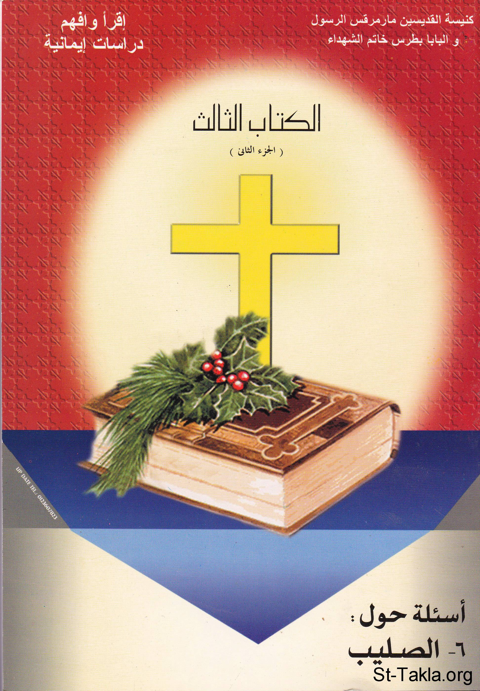

# أسئلة حول الصليب

**المؤلف / Author:** أ. حلمي القمص يعقوب
**المصدر / Source:** [st-takla.org](https://st-takla.org/books/helmy-elkommos/cross/index.html)
**الموضوعات / Topics:** —

📘 **[Download EPUB / تحميل الكتاب](cross.epub)**

## نبذة

نشكر الأستاذ حلمي القمص يعقوب على السماح لنا في موقع الأنبا تكلا هيمانوت بوضع هذا الكتاب هنا. وهو أحد كتب سلسلة اقرأ وأفهم: دراسات إيمانية .

## الفصول / Chapters (95)

1. [تقديم لنيافة الأنبا رافائيل](chapters/01-introduction/)
2. [دعوة للدراسة](chapters/02-study/)
3. [تمهيد](chapters/03-preface/)
4. [ما هي جذور وصورة الصليب في التاريخ؟](chapters/04-origins/)
5. [لماذا تغيَّرت النظرة التشاؤمية للصليب؟](chapters/05-pessimistic-look-changes/)
6. [لماذا تفتخر المسيحية بالصليب إلى هذه الدرجة؟!](chapters/06-pride/)
7. [إلى أي مدى ارتبطت المسيحية بالصليب؟](chapters/07-christianity/)
8. [دروس موضوع الصليب](chapters/08-lessons/)
9. [الدرس السابع: الصليب في العهد القديم](chapters/09-lesson-7/)
10. [هل أشار السيد المسيح إلى نبوات العهد القديم الخاصة بالصليب؟](chapters/10-old-testament-prophesies-jesus/)
11. [هل أشار الآباء الرسل إلى نبوات العهد القديم الخاصة بالصليب؟](chapters/11-old-testament-prophesies-prophets/)
12. [كم عدد النبوَّات التي وردت بالعهد القديم عن الصليب؟ وما هي أهم الملاحظات العامة عليها؟](chapters/12-old-testament-prophesies-number/)
13. [ما هي نبوات العهد القديم التي تصوّر لنا رحلة الصليب؟ وأين تحققت في العهد الجديد؟](chapters/13-old-testament-prophesies-list/)
14. [متى عرف الإنسان طقس تقديم الذبائح؟](chapters/14-sacrifice/)
15. [ما هي أهم الذبائح العامة التي أوصى بها اللَّه شعبه؟](chapters/15-sacrifice-list/)
16. [هل يسرُّ اللَّه بمنظر الدماء، ويتلذذ بذبح وحرق آلاف الثيران والحملان؟](chapters/16-sacrifice-blood-vs-god/)
17. [ما هي صفات الذبائح المقبولة؟ وما معنى تكرار وتنوع الذبائح؟](chapters/17-sacrifice-features/)
18. [ما هي أهم الذبائح الشخصية؟ وكيف تشير كل ذبيحة منها إلى ذبيحة الصليب؟](chapters/18-sacrifice-personal/)
19. [ما هو طقس يوم الكفارة العظيم؟ وما هي الإشارات التي يحملها لذبيحة الصليب؟](chapters/19-sacrifice-day/)
20. [هل تحدّثنا عن رموز العهد القديم التي ترسم لنا صورة الصليب؟](chapters/20-symbols/)
21. [الدرس الثامن: الأدلة التاريخية والأثرية والطبية على صلب المسيح وموته](chapters/21-lesson-8/)
22. [ما هي أهم الأدلة التاريخية التي تحدّثنا عن صلب المسيح؟](chapters/22-historical-evidence/)
23. [الآثار لا يمكن أن يتطرّق إليها الشك، فهل هناك أدلة من هذه الآثار تشهد لصلب المسيح وموته؟](chapters/23-monuments/)
24. [ما هي الأدلة الطبية التي تؤكد لنا موت المسيح؟](chapters/24-medical-evidence/)
25. [الدرس التاسع: معركة الصليب الرهيبة](chapters/25-lesson-9/)
26. [هل أخفى السيد المسيح لاهوته عن الشيطان؟ وما الدليل على ذلك؟](chapters/26-divinity-vs-devil/)
27. [ما دام السيد المسيح هو اللَّه فكيف يحزن ويكتئب ويصلّي بلجاجة حتى صار عرقه كقطرات دم، وهو يقدِّم طلباتٍ وتضرعات بصراخ شديد للقادر أن يُخلّصه من الموت، ويظهر له ملاك لكي يقويه؟](chapters/27-jesus-sadness/)
28. [المعركة الرهيبة على الصليب](chapters/28-fight/)
29. [كيف انتصر السيد المسيح على الشيطان؟](chapters/29-jesus-winning/)
30. [كيف مات السيد المسيح وهو الإله الذي لا يموت؟](chapters/30-jesus-death-how/)
31. [ما هو فكر الآباء في موت المسيح؟](chapters/31-jesus-death-patristic-view/)
32. [لماذا اختار السيد المسيح موت الصليب بالذات؟](chapters/32-jesus-death-way/)
33. [هل حقًا نزل السيد المسيح إلى الجحيم؟](chapters/33-jesus-death-spirits-in-prison/)
34. [الدرس العاشر: حقيقة القيامة](chapters/34-lesson-10/)
35. [ما هي أهم ثمار القيامة اللذيذة، وما هي ثمار الشكوك القاتلة؟](chapters/35-resurrection/)
36. [شهود القيامة](chapters/36-resurrection-witnesses/)
37. [هل هناك نبوات في العهد القديم عن قيامة السيد المسيح قبل حدوثها بمئات السنين؟](chapters/37-resurrection-prophesies/)
38. [من الثابت أن السيد المسيح تحدّث مرارًا وتكرارًا عن آلامه وصلبه قبل وقوعه، فهل تنبأ عن قيامته أيضًا؟](chapters/38-resurrection-prophesies-jesus/)
39. [ما هي أهم ظهورات السيد المسيح التي سجّلها لنا الإنجيل؟ ولماذا لم يظهر لبيلاطس البنطي والجنود الرومان؟ وهل يمكن أن تكون القيامة بالروح فقط؟ أو هل القيامة نوع من الرجعة أو لعلهم رأوا شخصًا يشبهه؟](chapters/39-resurrection-apparitions/)
40. [هل شهد الرسل والآباء القديسون ومشاهير التاريخ لقيامة السيد المسيح؟](chapters/40-resurrection-various-witnesses/)
41. [كيف كان التغيير المفاجئ في حياة الآباء الرسل دليل قاطع على صحة القيامة؟](chapters/41-resurrection-changes-lives/)
42. [هل نجاح الكرازة بالمسيحية يُعد دليلًا على حقيقة القيامة؟](chapters/42-resurrection-preaching/)
43. [لماذا بداية الكرازة في أورشليم تُعدّ دليلًا على حقيقة القيامة؟](chapters/43-resurrection-preaching-jerusalem/)
44. [كيف كانت الحراسة والأختام والقبر الفارغ شهادات قوية على حقيقة القيامة؟](chapters/44-resurrection-proof/)
45. [هل كان من السهل تغيير يوم الرب من السبت للأحد؟](chapters/45-resurrection-day-sunday/)
46. [هل الاحتفال بعيد القيامة منذ القرون الأولى؟](chapters/46-resurrection-festivals/)
47. [ما هي علاقة أسرار الكنيسة الأربعة: المعمودية والميرون والتوبة والإفخارستيا بقيامة السيد المسيح؟](chapters/47-resurrection-sacraments/)
48. [نظريات خاطئة للقيامة](chapters/48-resurrection-wrong-ideas/)
49. [ادَّعى البعض أن التلاميذ سرقوا الجسد، وادَّعى البعض أن يوسف الرامي أو بيلاطس البنطي قام بنقل الجسد، وقال البعض ربما قام بعض اللصوص بسرقة الجسد طمعًا في الأكفان.. فما صحة هذه الادعاءات؟](chapters/49-disciples-stealing-body/)
50. [لماذا لا يكون تعلُّق التلاميذ وحبهم الشديد لسيدهم هو الدافع لاعتقادهم بالقيامة التي لم تحدث في أرض الواقع؟](chapters/50-resurrection-fantasies/)
51. [هل يمكن أن تكون القيامة صدى للأساطير والخرافات الوثنية التي انتشرت في العالم حينذاك؟](chapters/51-resurrection-myths/)
52. [لماذا لا يكون رأي "ليك" بأن النسوة قد أخطئن في تحديد قبر المسيح صحيحًا، ولا سيما أن الظلام كان يُخيم على المكان؟](chapters/52-wrong-tomb/)
53. [نظرية الإغماء على الصليب: هل نجا المسيح من الصلب؟ دحض النظرية الخاطئة](chapters/53-did-jesus-pass-out/)
54. [القاديانية طائفة إسلامية مرفوضة](chapters/54-didnt-die/)
55. [مَن هو غلام ميرزا أحمد مُؤسّس القاديانية الطائفة الإسلامية (الأحمدية)؟ وما هي مبادئها؟](chapters/55-ahmadiyya/)
56. [ما هي الأدلة الدامغة على موت السيد المسيح على الصليب وقيامته؟](chapters/56-proofs-of-jesus-death/)
57. [ما هي الأدلة التي ساقها الغلام ميرزا أحمد القواداني وأحمد ديدات على عدم موت المسيح وقيامته، والرد عليها؟](chapters/57-ghulam-deedat-illusions/)
58. [الدرس الحادي عشر: الصليب في الإسلام](chapters/58-lesson-11/)
59. [لماذا الذبائح في الإسلام؟](chapters/59-sacrifice-in-islam/)
60. [وما قتلوه وما صلبوه ولكن شبه لهم: الرد على هذه الآية القرآنية](chapters/60-didnt-kill-him/)
61. [ما هي جذور نظرية إلقاء الشبه على المسيح وقت الصليب في التاريخ؟](chapters/61-look-alike-origins/)
62. [ما هي الروايات المختلفة المتضاربة في نظرية إلقاء الشبه على يسوع وقت الصلب؟](chapters/62-look-alike-contradictions/)
63. [ما هو حُكم العقل والمنطق في هذه الروايات المختلفة المتضاربة الخاصة بإلقاء الشبه على المسيح وقت الآلام والصلب؟](chapters/63-look-alike-illogic/)
64. [ما هو التفسير الصحيح لـ"شُبِّهَ لَهُمْ" الآية القرآنية حول آلام وصلب المسيح وموته؟](chapters/64-look-alike-verse-explanation/)
65. [هل في الإسلام ما يُثبت أن الذي صُلِب هو السيد المسيح؟](chapters/65-islamic-proofs/)
66. [الدرس الثاني عشر: اعتراضات على حقيقة الصلب والقيامة](chapters/66-lesson-12/)
67. [هل قول الملاك عن السيد المسيح أنه "يملك على بيت يعقوب إلى الأبد" يتنافى مع صلبه وموته؟](chapters/67-jesus-king/)
68. [أليس نجاة إسحق من الموت كانت رمزًا لنجاة المسيح من الصلب؟](chapters/68-isaac/)
69. [كيف يُصلب المسيح بينما المصلوب ملعون من اللَّه؟](chapters/69-damnation/)
70. [ألا يعتبر موت المسيح ضعفًا لا يليق باللَّه؟](chapters/70-weakness/)
71. [ألم يكن السيد المسيح رافضًا فكرة قتله، فكيف نصدّق موته على الصليب؟](chapters/71-idea-of-death/)
72. [هل معنى قول السيد المسيح "كلكم تشكُّون فيَّ في هذه الليلة" أن التلاميذ سيسقطون في الشك والتلبُّس فيظنوا أن الذي صُلِب هو السيد المسيح بينما صُلِب شخص آخَر؟](chapters/72-all-doubt-me-tonight/)
73. [هل قال السيد المسيح أقوال تعني أنه سينجو من موت الصليب؟](chapters/73-did-jesus-say-will-not/)
74. [هل رد يسوع على سؤال "هل أنت المسيح ابن الله" بقوله "أنت قلت" تعني أنه ليس المسيح؟](chapters/74-you-say/)
75. [هل سرق الجنود الرومان جسد المسيح بسبب طمعهم في الأكفان الثمينة؟](chapters/75-shrouds/)
76. [كيف يقول بولس الرسول أن السيد المسيح ظهر للاثنى عشر، بينما يهوذا كان قد انتحر وتوما لم يكن حاضرًا؟](chapters/76-apparition-to-the-12-disciples/)
77. [هل يعود السيد المسيح للأرض لكيما يكسر الصليب ويقتل الخنزير ويأُم الناس في الصلاة؟](chapters/77-kill-the-pig/)
78. [أسئلة متنوعة وإجاباتها](chapters/78-faq/)
79. [كيف يقول السيد المسيح أنه سيمضي بالقبر ثلاثة أيام وثلاث ليالٍ مثل يونان، بينما هذه المدة لم تكتمل؟](chapters/79-three-days/)
80. [أليس صلب المسيح أمر مشكوك فيه، ولا سيما أن هناك اثنين من الإنجيليين الأربعة لم يكونا من شهود العيان؟](chapters/80-not-sure/)
81. [إن كان السيد المسيح مات بناسوت محدود فكيف يفدي كل البشرية من خطايا غير محدودة؟](chapters/81-limited-humanity/)
82. [ما دام السيد المسيح رفع حكم الموت عنا، فلماذا نموت للأبد؟](chapters/82-our-death/)
83. [هل السيد المسيح لأنه رجل كفَّر عن خطايا الرجال فقط؟](chapters/83-not-only-men/)
84. [هل قصة موت المسيح مقتبسة من الأساطير الوثنية؟](chapters/84-heathen-myths/)
85. [ما دام السيد المسيح صُلِب من أجل خطايا العالم، وكان لا بد أن يُصلب، فما ذنب يهوذا واليهود حتى يتحملوا اللعنة والعقاب؟](chapters/85-offense-of-those-around/)
86. [هل تسليم يهوذا للمسيح أمر مستحيل لأن السيد المسيح مدح الرسل وقال عنهم أنهم أطهار؟](chapters/86-was-judas-good/)
87. [هل هناك احتمال أن يهوذا يكون قد ندم وهو يصحب الجمع للقبض على المسيح، ولذلك أرشدهم إلى أحد التلاميذ بدلًا من المسيح؟](chapters/87-did-judas-repent-before/)
88. [قالوا أن متى ذكر أن حقل الدم اشتراه الكهنة، وذكر لوقا أن يهوذا الذي اشتراه، وعلَّل متى تسمية القبر بحقل دم لأنه ثمن دم المسيح، وقال لوقا أنه دُعيَ هكذا لأن دماء يهوذا انسكبت فيه.. فأين الحق؟](chapters/88-blood-tomb/)
89. [هل انتهت حياة يهوذا بأنه خَنَق نفسه أو أنه سَقَط على وجهه فانشق وانسكبت أحشاؤه؟](chapters/89-judas-death-way/)
90. [قال البعض إن الحزن يدفع الإنسان لليقظة، فكيف نام التلاميذ في البستان تحت تأثير الحزن؟](chapters/90-sadness-vs-sleepiness/)
91. [قال البعض عندما حلف بطرس أنه لا يعرف المصلوب كان صادقًا لأن المصلوب لم يكن هو المسيح إنما شخص آخَر.. فهل قولهم هذا صحيح؟](chapters/91-peter-denial/)
92. [يقول البعض أن تربية الدواجن كانت ممنوعة في أورشليم، فمن أين جاء الديك الذي صاح وقت إنكار بطرس؟](chapters/92-chicken-cock/)
93. [هل قول الإنجيل: "أنتم الذين أمام عيونكم قد رُسِم يسوع المسيح بينكم مصلوبًا" دليل على أن عملية الصلب لم تكن حقيقة، إنما كانت رسم وتصوُّر وخيال؟](chapters/93-portrayed-among-you/)
94. [الخاتمة](chapters/94-epilogue/)
95. [المراجع](chapters/95-references/)

---
*هذا الكتاب مجاني للنشر والتوزيع لخلاص كل نفس. This book is free to share and distribute for the salvation of every soul.*
