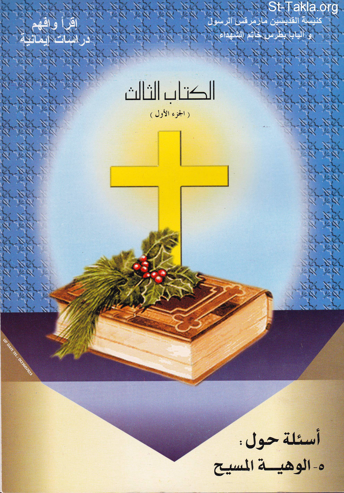

# أسئلة حول ألوهية المسيح

**المؤلف / Author:** أ. حلمي القمص يعقوب
**المصدر / Source:** [st-takla.org](https://st-takla.org/books/helmy-elkommos/divinity-of-christ/index.html)
**الموضوعات / Topics:** —

📘 **[Download EPUB / تحميل الكتاب](divinity-of-christ.epub)**

## نبذة

نشكر الأستاذ حلمي القمص يعقوب على السماح لنا في موقع الأنبا تكلا هيمانوت بوضع هذا الكتاب هنا. وهو أحد كتب سلسلة اقرأ وأفهم: دراسات إيمانية .

## الفصول / Chapters (131)

1. [مقدمة](chapters/01-intro/)
2. [دعوة للدراسة](chapters/02-study/)
3. [تمهيد](chapters/03-preface/)
4. [ما أهمية الإيمان بلاهوت السيد المسيح؟](chapters/04-believe/)
5. [هل السيد المسيح نبي، ورسول، وعبد الله؟](chapters/05-prophet-messenger/)
6. [هل يمكن أن يكون السيد المسيح قد ادَّعى الألوهية؟](chapters/06-is-he-fake/)
7. [هل يمكن أن يكون التلاميذ والرسل مخدوعين أو مخادعين في عقيدة ألوهية المسيح؟](chapters/07-fake-apostles/)
8. [ماذا قالوا عن السيد المسيح؟](chapters/08-quotes/)
9. [أبواب الكتاب](chapters/09-sections/)
10. [الباب الأول: السيد المسيح له الصفات الإلهية](chapters/10-sec1/)
11. [الفصل الأول من الباب الأول: السرمدية](chapters/11-sec1-ch1/)
12. [ما معنى إن الله سرمدي؟ وهل السيد المسيح أزلي بأزلية الآب؟](chapters/12-perpetual/)
13. [هل أعلن السيد المسيح عن سرمديته؟](chapters/13-jesus-eternal/)
14. [هل تحدث التلاميذ عن سرمدية السيد المسيح؟](chapters/14-eternity-disciples/)
15. [الفصل الثاني من الباب الأول: المساواة للآب](chapters/15-sec1-ch2/)
16. [كيف نستطيع أن نلمس مساواة السيد المسيح لله الآب؟](chapters/16-equal/)
17. [الفصل الثالث من الباب الأول: مالئ كل مكان وزمان (غير محدود)](chapters/17-sec1-ch3/)
18. [لا يوجد أي كائن غير الله وحده الغير محدود، فهل السيد المسيح غير محدود؟](chapters/18-unlimited/)
19. [الفصل الرابع من الباب الأول: عدم التغيُّر](chapters/19-sec1-ch4/)
20. [قال الأريوسيين أن السيد المسيح كان خاضعًا للتغيُّر.. فهل كلامهم حق؟](chapters/20-change/)
21. [الفصل الخامس من الباب الأول: القداسة الفائقة](chapters/21-sec1-ch5/)
22. [ما هو الفرق بين قداسة الله وقداسة الإنسان؟ وهل شهد أحد لقداسة السيد المسيح الفائقة؟](chapters/22-holy-god-vs-man/)
23. [الفصل السادس من الباب الأول: القدرة الكلية](chapters/23-sec1-ch6/)
24. [الله هو القادر على كل شيء.. هل أثبت السيد المسيح قدرته على كل شيء؟](chapters/24-almighty/)
25. [الفصل السابع من الباب الأول: المعرفة الكاملة للمسيح](chapters/25-sec1-ch7/)
26. [قال الأريوسيون إن معرفة السيد المسيح لم تكن تامة ولا كاملة.. فهل قولهم هذا حق؟](chapters/26-knowledge/)
27. [كيف وهو العالم بكل شيء يسأل المسيح بعض الأسئلة للناس؟](chapters/27-questions/)
28. [هل عِلم الله بكل شيء يعني إن كل ما يحدث من خير أو شر يتم بإرادة الله؟](chapters/28-evil-good-will/)
29. [الباب الثاني: السيد المسيح له الألقاب الإلهية](chapters/29-sec2/)
30. [الفصل الأول من الباب الثاني: المسيح هو "الله"](chapters/30-sec2-ch1/)
31. [هل نجد في الإنجيل ما يثبت أن السيد المسيح هو هو الله؟](chapters/31-jesus-is-god/)
32. [هل نجد تطابق بين أسماء الله في العهد القديم وبين السيد المسيح؟](chapters/32-names/)
33. [الفصل الثاني من الباب الثاني: المسيح هو "ابن الله"](chapters/33-sec2-ch2/)
34. [هل بنوة السيد المسيح لله تشبه بنوتنا نحن لله بالخلقة أو بالتبني أو غير هذا؟](chapters/34-son/)
35. [ما الذي يميز ولادة السيد المسيح من الآب عن أي ولادة أخرى جسدية أو غير جسدية؟](chapters/35-jesus-son/)
36. [هل ذكر الإنجيل عن المسيح أنه ابن الله؟](chapters/36-son-of-god/)
37. [لماذا سُمي السيد المسيح بالابن؟](chapters/37-the-son/)
38. [لماذا لم يدعو الإنجيل السيد المسيح بولد الله؟](chapters/38-bible-calling/)
39. [الفصل الثالث من الباب الثاني: المسيح هو "كلمة الله"](chapters/39-sec2-ch3/)
40. [هل السيد المسيح كلمة الله مثله مثل أي كلمة نطق بها الله؟](chapters/40-word-of-god/)
41. [هل نجد تشابهًا بين عمل كلمة الله في العهد القديم وفي العهد الجديد؟](chapters/41-works/)
42. [لماذا دُعي السيد المسيح بكلمة الله؟](chapters/42-jesus-word-of-god/)
43. [هل دُعي السيد المسيح كلمة الله لأنه خُلِق بكلمة من الله مثله مثل آدم؟](chapters/43-creation-word/)
44. [الفصل الرابع من الباب الثاني: المسيح هو "الرب"](chapters/44-sec2-ch4/)
45. [ما هو ارتباط اسم "الرب" باسم "يهوه" في العهد القديم؟ وكم مرة دُعي السيد المسيح باسم "الرب"؟](chapters/45-lord-vs-jehova/)
46. [ما هو الدليل على إن المقصود بدعوة السيد المسيح بالرب أنه الله؟](chapters/46-the-lord-god/)
47. [الفصل الخامس من الباب الثاني: المسيح هو "عمَّانوئيل"](chapters/47-sec2-ch5/)
48. [في أي مناسبة ورد اسم عمانوئيل في العهد القديم؟ وما الدليل على أن هذا الاسم ينطبق على السيد المسيح؟](chapters/48-emmanuel/)
49. [الفصل السادس من الباب الثاني: المسيح هو "ملك الملوك ورب الأرباب"](chapters/49-sec2-ch6/)
50. [هل هناك من دليل يثبت أن السيد المسيح هو الله ملك الملوك ورب الأرباب؟](chapters/50-king-of-kings/)
51. [الفصل السابع من الباب الثاني: المسيح هو "الطريق والحق والحياة"](chapters/51-sec2-ch7/)
52. [كان الناموس هو الطريق لله قديمًا، فهل السيد المسيح الآن هو الطريق الوحيد لله الآب؟](chapters/52-law/)
53. [الله هو الحق والحق هو الله، فهل السيد المسيح هو الحق؟](chapters/53-right/)
54. [ما هو الدليل على إن السيد المسيح هو الحياة بعينها مثله مثل الله؟](chapters/54-life/)
55. [الفصل الثامن من الباب الثاني: المسيح هو "نور العالم"](chapters/55-sec2-ch8/)
56. [الله نور خالق النور، فهل السيد المسيح هو النور الحقيقي؟](chapters/56-light/)
57. [الفصل التاسع من الباب الثاني: للسيد المسيح ألقاب أخرى](chapters/57-sec2-ch9/)
58. [ما هي الألقاب التي أُطلقت على الله وحده، وفي ذات الوقت أُطلقت على السيد المسيح؟](chapters/58-god-jesus-titles/)
59. [الباب الثالث: السيد المسيح له الأعمال الإلهيَّة](chapters/59-sec3/)
60. [الفصل الأول من الباب الثالث: الخلقة من أعمال المسيح الإلهية](chapters/60-sec3-ch1/)
61. [الله وحده هو الخالق.. هذه حقيقة مُسَلَّم بها، فهل قام السيد المسيح بعملية الخلق؟](chapters/61-creator/)
62. [الفصل الثاني من الباب الثالث: الخلاص من أعمال المسيح الإلهية](chapters/62-sec3-ch2/)
63. [من هو المخلص الحقيقي للإنسان من قبضة الشيطان وسجن الخطية؟](chapters/63-savior/)
64. [ما معنى اسم يسوع المسيح؟](chapters/64-jesus-christ-name/)
65. [من هم الأشخاص الذين كانوا يقومون بعمل المسيا في العهد القديم في إشارة له؟](chapters/65-messiah-works/)
66. [الفصل الثالث من الباب الثالث: غفران الخطايا من أعمال المسيح الإلهية](chapters/66-sec3-ch3/)
67. [كيف يتضح من غفران السيد المسيح للخطايا أنه هو الله المتأنس؟](chapters/67-forgiving-sins/)
68. [لماذا قال المسيح "يا أبتاه اغفر لهم" ولم يغفر لهم مباشرة؟](chapters/68-forgiving-on-cross/)
69. [إن كان السيد المسيح وحده الذي يغفر الخطايا.. فكيف يغفر الآباء الكهنة خطايا المعترفين؟](chapters/69-forgiving-priests/)
70. [الفصل الرابع من الباب الثالث: قبول الإكرام الإلهي من المسيح](chapters/70-sec3-ch4/)
71. [هل قَبِل السيد المسيح الإكرام الإلهي؟ وما مظاهر هذا الإكرام؟](chapters/71-adoration/)
72. [الفصل الخامس من الباب الثالث: الدينونة من أعمال المسيح الإلهية](chapters/72-sec3-ch5/)
73. [كيف يظهر واضحًا جليًا من خلال الدينونة أن السيد المسيح هو هو الله الديان؟](chapters/73-judgement/)
74. [مَنْ الذي سيدين أسباط إسرائيل، هل المسيح كإله أم التلاميذ كقول المسيح؟](chapters/74-judging-others/)
75. [إن كان السيد المسيح هو الديان فكيف يقول أنه لا يعرف اليوم ولا الساعة التي سينتهي فيها العالم؟](chapters/75-knowing-the-final-hour/)
76. [الباب الرابع: ماذا يقول الإسلام عن السيد المسيح؟](chapters/76-sec4/)
77. [الفصل الأول من الباب الرابع: ولادة المسيح العجيبة في الإسلام](chapters/77-sec4-ch1/)
78. [الله في تجسده اهتم بجدته بالجسد حنة، وأمه مريم.. هل يمكن توضيح ذلك من خلال القرآن؟](chapters/78-incarnation/)
79. [الفصل الثاني من الباب الرابع: المسيح مولود من الله (ابن الله) حسب وجهة نظر الإسلام](chapters/79-sec4-ch2/)
80. [المسيح ابن مريم التي ولدته بدون زرع بشر.. مَنْ يكون أباه؟](chapters/80-his-father/)
81. [الفصل الثالث: المسيح كلمة الله حسب وجهة نظر الإسلام](chapters/81-sec4-ch3/)
82. [ما الدليل على إن كلمة الله المقصود به في القرآن أقنوم الكلمة، وليس أي كلمة ينطق بها الله؟](chapters/82-the-word-vs-quran/)
83. [الفصل الرابع من الباب الرابع: المسيح القدوس حسب وجهة نظر الإسلام](chapters/83-sec4-ch4/)
84. [هل أخطأ الأنبياء جميعًا حسب وجهة نظر القرآن؟](chapters/84-prohets-sin/)
85. [هل السيد المسيح أخطأ كما أخطأ سائر الأنبياء حسب وجهة نظر الإسلام؟](chapters/85-did-jesus-sin/)
86. [الفصل الخامس من الباب الرابع: المسيح الخالق حسب وجهة نظر الإسلام](chapters/86-sec4-ch5/)
87. [الخلق من عمل الله واحده، فهل قام السيد المسيح بعملية الخلق في القرآن؟](chapters/87-jesus-creator/)
88. [هل السيد المسيح مجرد نبي لأنه قام بعمل الخلق بإذن الله حسب وجهة نظر الإسلام؟](chapters/88-os-jesus-prophet/)
89. [الفصل السادس من الباب الرابع: المسيح واهب الحياة حسب وجهة نظر القرآن](chapters/89-sec4-ch6/)
90. [الله لوحده هو واهب الحياة، فهل السيد المسيح هو الله واهب الحياة حسب وجهة نظر القرآن؟](chapters/90-giving-life/)
91. [الفصل السابع من الباب الرابع: المسيح علام الغيوب في القرآن](chapters/91-sec4-ch7/)
92. [الله هو العالم بكل شيء من الخفيات والظاهرات، فهل السيد المسيح يعلم الغيب أيضًا حسب القرآن؟](chapters/92-known-everything/)
93. [الفصل الثامن من الباب الرابع: المسيح الشفيع حسب وجهة النظر الإسلامية](chapters/93-sec4-ch8/)
94. [إن كان الله وحده هو الشفيع، فما معنى قول القرآن عن السيد المسيح "وجيهًا في الدنيا والآخرة"؟](chapters/94-intercession/)
95. [الفصل التاسع من الباب الرابع: المسيح الديان حسب وجهة النظر الإسلامية](chapters/95-sec4-ch9/)
96. [كيف يظهر واضحًا جليًا من خلال الدينونة في الإسلام أن السيد المسيح هو هو الله الديان؟](chapters/96-judgement-day-islam/)
97. [الله خلق آدم بدون أب وبدون أم، وخلق حواء من أب بدون أم، هل قول أنه خلق المسيح من أم بلا أب صحيح؟](chapters/97-no-father-mother/)
98. [هل المسيحيون كفرة لأن القرآن قال "لقد كفر الذين قالوا إن الله هو المسيح ابن مريم"؟](chapters/98-are-christians-infidela/)
99. [لماذا لم يقل المسيح أنا ربكم فاعبدوني؟ ولماذا لم يصرح أنه الله؟](chapters/99-e3bodny/)
100. [الباب الخامس: اعتراضات على ألوهية السيد المسيح](chapters/100-sec5/)
101. [ما هي أهم الأخطاء التي سقط فيها منكرو ألوهية المسيح؟](chapters/101-wrongs/)
102. [ما هو تأثير مدرسة أنطاكية على أريوس؟](chapters/102-arius/)
103. [ما هي فلسفة عقيدة أريوس؟](chapters/103-arius-philosophy/)
104. [هل الآب ولد الابن بالإرادة أو بدون الإرادة أي قهرًا؟](chapters/104-begot-son/)
105. [هل السيد المسيح نال الترقية والمجد من الله الآب بعد موته على الصليب؟](chapters/105-better-level/)
106. [إن كان السيد المسيح أزلي بأزلية الآب فهو أخ وليس ابنًا؟](chapters/106-is-he-brother/)
107. [هل تشبَّه الأريوسيين باليهود؟](chapters/107-jews-arius/)
108. [الباب السادس: أسئلة متنوعة حول لاهوت المسيح](chapters/108-sec6/)
109. [هل كلمة الله ذاته خُلِق من العدم.. وكان هناك وقت ما حينما لم يكن موجودًا؟](chapters/109-beginning/)
110. [هل آية "الذي هو صورة الله غير المنظور. بكر كل خليقة" تعني أن المسيح مخلوق؟](chapters/110-gods-image/)
111. [هل قول الإنجيل عن السيد المسيح "بداءة خليقة الله" تعني أنه مخلوق؟](chapters/111-start-of-creation/)
112. [هل تعني آية "الذي وهو بهاء مجده ورسم جوهره" أن الآب قبل المسيح في الوجود؟](chapters/112-draw/)
113. [كيف يكون المسيح هو الله ويجهل يوم القيامة كما قال "أما ذلك اليوم وتلك الساعة فلا يعلم بها أحد ولا الملائكة الذين في السماء. ولا الابن إلاَّ الآب"؟](chapters/113-doesnt-know-day/)
114. [كيف يكون السيد المسيح هو الله ويقول للشاب الغني لا تدعوني صالحًا لأن ليس أحد صالحًا إلاَّ الله وحده؟](chapters/114-dont-call-me-good/)
115. [هل آية "ليعرفوك أنت الإله الحقيقي وحدك" تعني تحصر الألوهية على الآب فقط؟](chapters/115-only-you/)
116. [كيف يكون المسيح هو الله ويصلي؟ ولمن كان يصلي؟](chapters/116-praying/)
117. [كيف يكون السيد المسيح مساوٍ للآب، ثم يقول "أبي أعظم مني"؟](chapters/117-equal-to-the-father/)
118. [لو كان الابن مساويًا للآب فكيف يطلب المجد من الآب: "مجّدني أنت أيها الآب عند ذاتك"؟](chapters/118-glorify-me/)
119. [كيف يكون السيد المسيح هو الله، والإنجيل يقول عنه أن الله جعله ربًا ومسيحًا؟](chapters/119-lord-and-christ/)
120. [كيف يكون السيد المسيح هو الله، وقد قال عنه الإنجيل أنه رسول، وأمين لله الذي أقامه رئيس كهنة؟](chapters/120-apostle/)
121. [كيف يكون السيد المسيح هو الله ويغير رأيه فيقول لا أصعد إلى أورشليم في العيد. ثم يعود ويصعد؟](chapters/121-jerusalem/)
122. [كيف يكون السيد المسيح هو الله ويقول لا أقدر في آيتان من الكتاب المقدس](chapters/122-cant/)
123. [سلطان المسيح كإله وقوله: "وأما الجلوس عن يميني وعن يساري فليس لي أن أعطيه إلاَّ للذين أُعدَّ لهم من أبي"](chapters/123-sitting-beside-me/)
124. [هل قول المسيح عن نفسه أنه "ابن الإنسان" هو نفسه قول حزقيال عن نفسه "ابن آدم"؟](chapters/124-son-of-man/)
125. [ما الداعي لذكر سلسلة أنساب المسيح التي تبدأ وتنتهي بيوسف النجار وهو ليس أبًا للسيد المسيح بالجسد؟](chapters/125-lineage/)
126. [صرخ السيد المسيح على الصليب قائلًا "إلهي إلهي لماذا تركتني" فكيف يتمشى هذا مع كونه إلهًا؟ ولمن يصرخ وهو الله؟](chapters/126-left-me/)
127. [لاهوت المسيح وآيات: "إني أصعد إلى أبي وأبيكم وإلهي وإلهكم" و"إله ربنا يسوع المسيح"](chapters/127-give-glory/)
128. [لاهوت المسيح وآية: "أعطيهم المجد الذي أعطيتني ليكونوا واحدًا كما إننا نحن واحد"](chapters/128-like-us/)
129. [لاهوت المسيح وآيات: الآب يحبُّ الابن. وقد دفع كل شيء في يده"، "كل شيء قد دُفِع إليَّ من أبي"](chapters/129-love-the-son/)
130. [هل بولس الرسول اخترع مسيحية بولسية تعتقد بألوهية المسيح، وتخالف المسيحية الأصلية التي أقرها المسيح](chapters/130-did-paul-create-christianity/)
131. [المراجع](chapters/131-references/)

---
*هذا الكتاب مجاني للنشر والتوزيع لخلاص كل نفس. This book is free to share and distribute for the salvation of every soul.*
