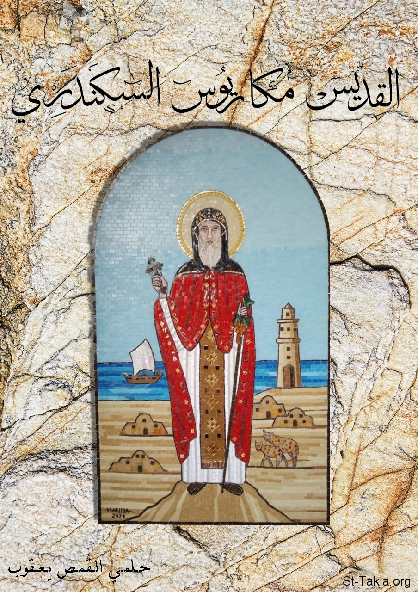

# القديس مكاريوس السكندري

**المؤلف / Author:** أ. حلمي القمص يعقوب
**المصدر / Source:** [st-takla.org](https://st-takla.org/books/helmy-elkommos/macarius/index.html)
**الموضوعات / Topics:** —

📘 **[Download EPUB / تحميل الكتاب](macarius.epub)**

## نبذة

نشكر الأستاذ حلمي القمص يعقوب على السماح لنا في موقع الأنبا تكلا هيمانوت بوضع هذا الكتاب هنا. وهو نشر إليكتروني لكتاب غير مطبوع.

## الفصول / Chapters (9)

1. [المراكز الرهبانية الثلاث: الإسقيط - نتريا - القلالي](chapters/01-monastic-centers/)
2. [الأنبا آمون](chapters/02-st-amun/)
3. [الأنبا بامو](chapters/03-st-bamo/)
4. [نشأة منطقة القلالي](chapters/04-kellia/)
5. [الطريق إلى منطقة القلالي](chapters/05-road/)
6. [القديس الأنبا مقار الإسكندري](chapters/06-st-maqar/)
7. [آثار منطقة القلالي](chapters/07-ruins/)
8. [التنقيب في منطقة القلالي](chapters/08-excavation/)
9. [إحياء الرهبنة في منقطة القلالي بالبحيرة](chapters/09-monks/)

---
*هذا الكتاب مجاني للنشر والتوزيع لخلاص كل نفس. This book is free to share and distribute for the salvation of every soul.*
