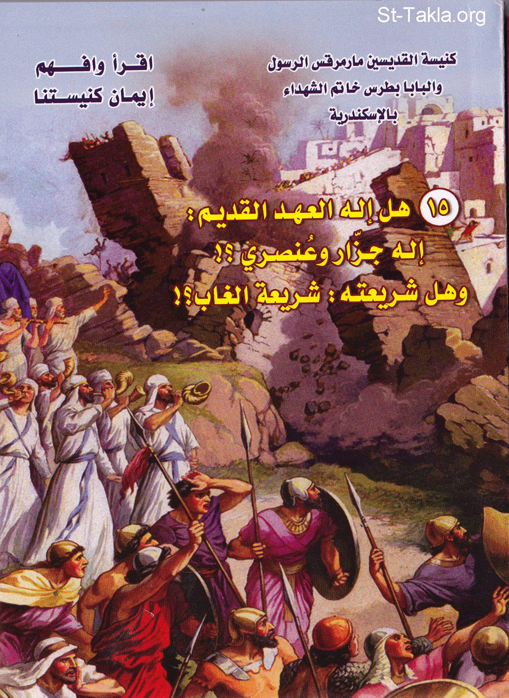

# هل إله العهد القديم إله جزار عنصري؟! وهل شريعته شريعة الغاب؟!

**المؤلف / Author:** أ. حلمي القمص يعقوب
**المصدر / Source:** [st-takla.org](https://st-takla.org/books/helmy-elkommos/ot-god/index.html)
**الموضوعات / Topics:** —

📘 **[Download EPUB / تحميل الكتاب](ot-god.epub)**

## نبذة

نشكر الأستاذ حلمي القمص يعقوب على السماح لنا في موقع الأنبا تكلا هيمانوت بوضع هذا الكتاب هنا. وهو أحد كتب سلسلة " أقرأ وافهم إيمان كنيستنا ".

## الفصول / Chapters (15)

1. [تقديم](chapters/01-introduction/)
2. [هل الله في العهد القديم.. إله جزار؟](chapters/02-ch1/)
3. [كيف كانت حياة تلك الشعوب الكنعانية، وإلى أي مدى بلغت شرورهم وانحطاطهم الخُلقي؟](chapters/03-canaan/)
4. [كيف يأمر الله يشوع بذبح الأطفال والنساء والشيوخ، وحرق المدن والديار، وقتل الحيوانات؟ أم أن تدمير المدن كان رغبةً من يشوع وهو جعلها رغبة يهوه؟](chapters/04-slaughter/)
5. [ردود على نقاد الكتاب المقدس](chapters/05-reply/)
6. [الرد السريع المختصر على أهم الافتراءات السابقة](chapters/06-answer/)
7. [الشر يأكل نفسه](chapters/07-evil/)
8. [الغزوات في الإسلام](chapters/08-invasion/)
9. [هل الله في العهد القديم.. إله عنصري؟](chapters/09-ch2/)
10. [اختيار الله لشعبه: كيف يُميّز الله شعب بني إسرائيل عن سائر شعوب الأرض؟](chapters/10-choice/)
11. [معاملات الله مع الأمم: لماذا يظهر الله في العهد القديم على أنه إله إسرائيل، يدافع عن شعبه بيد قوية وذراع رفيعة، بينما يقف ضد الشعوب الأخرى بقسوة وجبروت](chapters/11-gentiles/)
12. [ليس لدى الله محاباة: هل يهوه إله متحيز لليهود؟](chapters/12-prejudice/)
13. [ليس لدى الله تغيّير: قالوا إن إله العهد الجديد هو الإله الجدير بالعبادة لأنه لا ينتقم من الإنسان كما كان يفعل إله العهد القديم.. فهل الله يغير من سياساته تجاه الإنسان؟](chapters/13-change/)
14. [لماذا نتمسك بالعهد القديم.. شريعة الغاب؟!](chapters/14-ch3/)
15. [كيف أرسى العهد القديم دعائم العلاقات الإنسانية؟](chapters/15-relations/)

---
*هذا الكتاب مجاني للنشر والتوزيع لخلاص كل نفس. This book is free to share and distribute for the salvation of every soul.*
