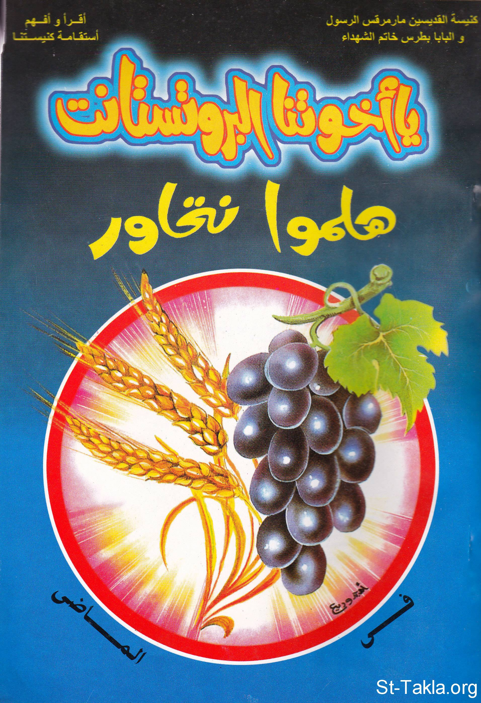

# يا أخوتنا البروتستانت، هلموا نتحاور (جزءان)

**المؤلف / Author:** أ. حلمي القمص يعقوب
**المصدر / Source:** [st-takla.org](https://st-takla.org/books/helmy-elkommos/protestant/index.html)
**الموضوعات / Topics:** —

📘 **[Download EPUB / تحميل الكتاب](protestant.epub)**

## نبذة

نشكر الأستاذ حلمي القمص يعقوب على السماح لنا في موقع الأنبا تكلا هيمانوت بوضع هذا الكتاب هنا. وهو أحد كتب سلسلة اقرأ وأفهم استقامة كنيستنا . وهذا الكتاب ثلاثة أجزاء، آثرنا وضعهما هنا معًا في نفس المكان حتى تكتمل الفائدة...

## الفصول / Chapters (50)

1. [مقدمة - كتاب يا أخوتنا البروتستانت، هلموا نتحاور -1- في الماضي](chapters/01-intro/)
2. [الوسط الذي ظهرت فيه حركة البروتستانت - كتاب يا أخوتنا البروتستانت، هلموا نتحاور -1- في الماضي](chapters/02-protostant/)
3. [مؤسسي حركة البروتستانت - كتاب يا أخوتنا البروتستانت، هلموا نتحاور -1- في الماضي](chapters/03-founders/)
4. [مارتن لوثر وبحور الدماء - كتاب يا أخوتنا البروتستانت، هلموا نتحاور -1- في الماضي](chapters/04-martin-luther/)
5. [هولدريخ زوينكلي: زونكلي الراعي المقاتل - كتاب يا أخوتنا البروتستانت، هلموا نتحاور -1- في الماضي](chapters/05-huldrych-zwingli/)
6. [جان كالفن: جون كلفن.. الحاكم بأمر الله - كتاب يا أخوتنا البروتستانت، هلموا نتحاور -1- في الماضي](chapters/06-john-calvin/)
7. [فيليب ملانكتون: فيليب ميلنكثون.. لاهوتي المحتجين - كتاب يا أخوتنا البروتستانت، هلموا نتحاور -1- في الماضي](chapters/07-philipp-melanchthon/)
8. [العوامل التي حدَّت من انتشار البروتستانتية - كتاب يا أخوتنا البروتستانت، هلموا نتحاور -1- في الماضي](chapters/08-limit/)
9. [جماعة المحبة الإلهية - كتاب يا أخوتنا البروتستانت، هلموا نتحاور -1- في الماضي](chapters/09-divine-love/)
10. [حركة الجزويت](chapters/10-jesuit/)
11. [الكنيسة الإنجيلية المشيخية في مصر - كتاب يا أخوتنا البروتستانت، هلموا نتحاور -1- في الماضي](chapters/11-engileya/)
12. [وكيل الطائفة الإنجيلية المعترضة - كتاب يا أخوتنا البروتستانت، هلموا نتحاور -1- في الماضي](chapters/12-vicar/)
13. [سنودس النيل الإنجيلي - كتاب يا أخوتنا البروتستانت، هلموا نتحاور -1- في الماضي](chapters/13-synodes/)
14. [المجلس الملّي الإنجيلي العام - كتاب يا أخوتنا البروتستانت، هلموا نتحاور -1- في الماضي](chapters/14-sect/)
15. [هيئات إنجيلية أخرى - كتاب يا أخوتنا البروتستانت، هلموا نتحاور -1- في الماضي](chapters/15-other/)
16. [مقدمة الجزء الثاني - كتاب يا أخوتنا البروتستانت، هلموا نتحاور -2- طوائف شتى محتجة](chapters/16-intro-2/)
17. [الخلافات بين الطوائف الإنجيلية - كتاب يا أخوتنا البروتستانت، هلموا نتحاور -2- طوائف شتى محتجة](chapters/17-differences/)
18. [الكنيسة المشيخية والمجلس الملي العام - كتاب يا أخوتنا البروتستانت، هلموا نتحاور -2- طوائف شتى محتجة](chapters/18-presbyterian-church/)
19. [دستور الكنيسة الإنجيلية - كتاب يا أخوتنا البروتستانت، هلموا نتحاور -2- طوائف شتى محتجة](chapters/19-constitution/)
20. [تغيير اسم الكنيسة المشيخية والمجلس الملي العام - كتاب يا أخوتنا البروتستانت، هلموا نتحاور -2- طوائف شتى محتجة](chapters/20-name/)
21. [الكنيسة الأسقفية - كتاب يا أخوتنا البروتستانت، هلموا نتحاور -2- طوائف شتى محتجة](chapters/21-episcopal-church/)
22. [كنيسة الله الخمسينية - كتاب يا أخوتنا البروتستانت، هلموا نتحاور -2- طوائف شتى محتجة](chapters/22-pentecostal-church/)
23. [الكنيسة الخمسينية في الخارج: الخمسينيين - كتاب يا أخوتنا البروتستانت، هلموا نتحاور -2- طوائف شتى محتجة](chapters/23-pentecostalism/)
24. [نشأة كنيسة الله الخمسينية في مصر: الخمسينيون - كتاب يا أخوتنا البروتستانت، هلموا نتحاور -2- طوائف شتى محتجة](chapters/24-khamsineya/)
25. [الكنيسة المعمدانية الكتابية الأولى: المعمدانيون - كتاب يا أخوتنا البروتستانت، هلموا نتحاور -2- طوائف شتى محتجة](chapters/25-baptist-church/)
26. [الكنيسة المعمدانية في الخارج: المعمدانيين - كتاب يا أخوتنا البروتستانت، هلموا نتحاور -2- طوائف شتى محتجة](chapters/26-baptists/)
27. [الكنيسة المعمدانية للأقباط الإنجيليين - كتاب يا أخوتنا البروتستانت، هلموا نتحاور -2- طوائف شتى محتجة](chapters/27-meamedaneya/)
28. [الكنيسة الرسولية - كتاب يا أخوتنا البروتستانت، هلموا نتحاور -2- طوائف شتى محتجة](chapters/28-assembly-of-god/)
29. [لقطات من الكنيسة الرسولية - كتاب يا أخوتنا البروتستانت، هلموا نتحاور -2- طوائف شتى محتجة](chapters/29-rasoleya/)
30. [الكنيسة الرسولية في الخارج وفي مصر - كتاب يا أخوتنا البروتستانت، هلموا نتحاور -2- طوائف شتى محتجة](chapters/30-apostolic/)
31. [تحية البلاميث للمتكلمين بالألسنة - كتاب يا أخوتنا البروتستانت، هلموا نتحاور -2- طوائف شتى محتجة](chapters/31-balamees/)
32. [كنيسة المسيح - كتاب يا أخوتنا البروتستانت، هلموا نتحاور -2- طوائف شتى محتجة](chapters/32-christ-church/)
33. [لقطات من كنيسة المسيح - كتاب يا أخوتنا البروتستانت، هلموا نتحاور -2- طوائف شتى محتجة](chapters/33-masih/)
34. [كنيسة النعمة الرسولية](chapters/34-cogopeg/)
35. [كنيسة نهضة القداسة](chapters/35-reform-church/)
36. [لقطات من كنيسة الإصلاح](chapters/36-eslah/)
37. [الميثودست](chapters/37-methodist/)
38. [كنيسة المثال المسيحي - كتاب يا أخوتنا البروتستانت، هلموا نتحاور -2- طوائف شتى محتجة](chapters/38-christian-model/)
39. [كنيسة الإيمان - كتاب يا أخوتنا البروتستانت، هلموا نتحاور -2- طوائف شتى محتجة](chapters/39-faith-church/)
40. [كنيسة الله - كتاب يا أخوتنا البروتستانت، هلموا نتحاور -2- طوائف شتى محتجة](chapters/40-church-of-god/)
41. [كنيسة الله في الخارج وفي مصر - كتاب يا أخوتنا البروتستانت، هلموا نتحاور -2- طوائف شتى محتجة](chapters/41-allah/)
42. [كنيسة الأخوة البلاميث](chapters/42-plymouth-brethren/)
43. [لقطات من كنائس البلاميس - كتاب يا أخوتنا البروتستانت، هلموا نتحاور -2- طوائف شتى محتجة](chapters/43-plymouth/)
44. [كنيسة الأخوة في الخارج - كتاب يا أخوتنا البروتستانت، هلموا نتحاور -2- طوائف شتى محتجة](chapters/44-brethren/)
45. [كنيسة الأخوة في مصر - كتاب يا أخوتنا البروتستانت، هلموا نتحاور -2- طوائف شتى محتجة](chapters/45-okhwa/)
46. [كنيسة الأخوة المرحبين - كتاب يا أخوتنا البروتستانت، هلموا نتحاور -2- طوائف شتى محتجة](chapters/46-open-brethren/)
47. [جمعية خلاص النفوس - كتاب يا أخوتنا البروتستانت، هلموا نتحاور -2- طوائف شتى محتجة](chapters/47-salvation-of-souls/)
48. [ظاهرة السقوط على الأرض - كتاب يا أخوتنا البروتستانت، هلموا نتحاور -2- طوائف شتى محتجة](chapters/48-floor/)
49. [عودة إلى الراهب الذي نقض نذره](chapters/49-danial-elbaramosy/)
50. [تحية الخمسينيين للمنطرحين أرضًا - كتاب يا أخوتنا البروتستانت، هلموا نتحاور -2- طوائف شتى محتجة](chapters/50-falling/)

---
*هذا الكتاب مجاني للنشر والتوزيع لخلاص كل نفس. This book is free to share and distribute for the salvation of every soul.*
