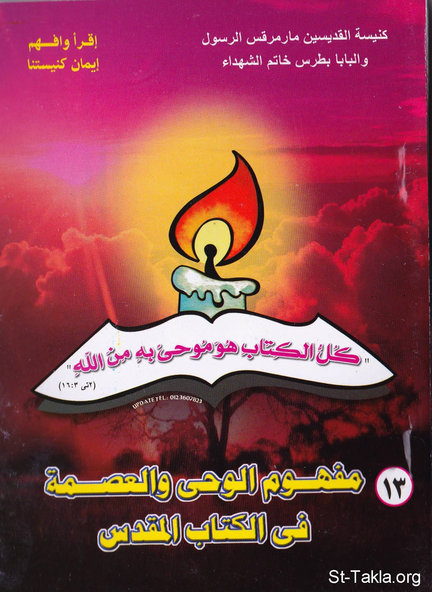

# مفهوم الوحي والعصمة في الكتاب المقدس

**المؤلف / Author:** أ. حلمي القمص يعقوب
**المصدر / Source:** [st-takla.org](https://st-takla.org/books/helmy-elkommos/revelation/index.html)
**الموضوعات / Topics:** —

📘 **[Download EPUB / تحميل الكتاب](revelation.epub)**

## نبذة

نشكر الأستاذ حلمي القمص يعقوب على السماح لنا في موقع الأنبا تكلا هيمانوت بوضع هذا الكتاب هنا. وهو أحد كتب سلسلة " أقرأ وافهم إيمان كنيستنا ". وهو يتناول موضوع مفهوم الوحي في المسيحية، ويتعرض لأفكار التنزيل - الإملاء النصي... إلخ.

## الفصول / Chapters (20)

1. [تصدير](chapters/01-intro/)
2. [ما هو النقد الكتابي؟](chapters/02-biblical-criticism/)
3. [النقد الأدنى والنقد الأعلى](chapters/03-low-high/)
4. [الأسفار القانونية وكيف قررت الكنيسة قانونيتها](chapters/04-canon/)
5. [الأسفار المقدسة في فكر الآباء](chapters/05-fathers/)
6. [مفهوم الوحي الإلهي في المسيحية](chapters/06-revelation/)
7. [موحى به من الله](chapters/07-god/)
8. [آراء خاطئة في فهم الوحي](chapters/08-wrong/)
9. [دور الجانب الإلهي ودور الجانب البشري في تدوين الأسفار المقدسة](chapters/09-divine/)
10. [هل هناك أمور معصومة وأخرى غير معصومة في الكتاب المقدس؟](chapters/10-infallible/)
11. [هل أخطاء الأنبياء تسقط عنهم العصمة عند كتابة الأسفار؟ وماذا عن أخطائهم؟](chapters/11-prophets-sins/)
12. [هل عصمة الكتاب المقدس هي في بلاغته أو أسلوبه؟](chapters/12-style/)
13. [أي كلام يتم التفاعل معه في الكتاب المقدس؟](chapters/13-react/)
14. [تكرار فقرات في الأسفار المقدسة](chapters/14-repetition/)
15. [تمايز كُتَّاب الأسفار المقدسة في رواية نفس الحدث](chapters/15-difference/)
16. [اختلاف ترجمات الكتاب المقدس وألفاظها](chapters/16-translations/)
17. [اختلاف الترجمة بين المزامير وكتاب الأجبية](chapters/17-agpeya/)
18. [اللغة العبرية للتوراة كُتِبَت بدون تشكيل، فهل حدث بها تحريف؟](chapters/18-hebrew/)
19. [هل فقدان نسخ أصلية من الأسفار المقدسة يعني اختلافها عن الحالية؟](chapters/19-manuscripts/)
20. [كيفية التعامل مع الصعوبات التي قد تواجهنا في الكتاب المقدس](chapters/20-difficulties/)

---
*هذا الكتاب مجاني للنشر والتوزيع لخلاص كل نفس. This book is free to share and distribute for the salvation of every soul.*
