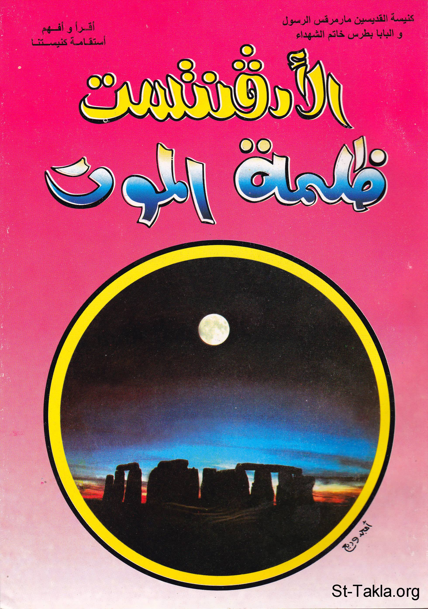

# الأدفنتست.. ظلمة الموت

**المؤلف / Author:** أ. حلمي القمص يعقوب
**المصدر / Source:** [st-takla.org](https://st-takla.org/books/helmy-elkommos/seventh-day-adventist/index.html)
**الموضوعات / Topics:** —

📘 **[Download EPUB / تحميل الكتاب](seventh-day-adventist.epub)**

## نبذة

نشكر الأستاذ حلمي القمص يعقوب على السماح لنا في موقع الأنبا تكلا هيمانوت بوضع هذا الكتاب هنا.

## الفصول / Chapters (39)

1. [مقدمة](chapters/01-introduction/)
2. [تأسيس جماعة الأدفنتيست](chapters/02-founding/)
3. [المجيئيين](chapters/03-adventists/)
4. [وليم ميللر](chapters/04-william-miller/)
5. [صموئيل سنو](chapters/05-samuel-snow/)
6. [حيرام إدسون](chapters/06-hiram-edson/)
7. [إلن جيمس هوايت](chapters/07-ellen-white/)
8. [تزايد أعداد السبتيين](chapters/08-numbers/)
9. [الأدفنتست السبتيين في مصر](chapters/09-egypt/)
10. [تعليق حول نشأة السبتيين](chapters/10-notes/)
11. [نظرة الأدفنتست للسيد المسيح](chapters/11-christ/)
12. [مقدمة حول نظرة الأدفنتيست للسيد المسيح](chapters/12-christ-introduction/)
13. [السيد المسيح هو الملاك ميخائيل](chapters/13-christ-michael/)
14. [السيد المسيح وُلِدَ بالخطية الجدية](chapters/14-christ-sin/)
15. [السيد المسيح معرفته ناقصة ومكتسبة](chapters/15-christ-knowledge/)
16. [السيد المسيح كان عُرضَة للسقوط](chapters/16-christ-fall/)
17. [السيد المسيح ذبيحته على الصليب غير كافية](chapters/17-christ-insufficient/)
18. [السيد المسيح انفصل عن الآب](chapters/18-christ-father/)
19. [السيد المسيح البائس اليائس](chapters/19-christ-poor/)
20. [الروح القدس نائب للمسيح على الأرض](chapters/20-holy-spirit/)
21. [فناء الإنسان](chapters/21-man/)
22. [لا فرق بين الإنسان والحيوان](chapters/22-animal/)
23. [الخلود لله وحده](chapters/23-immortality/)
24. [الشيطان صاحب فكرة الخلود](chapters/24-devil/)
25. [الأعمال الصالحة هي طريق الخلود](chapters/25-works/)
26. [الحصول على الخلود يوم القيامة](chapters/26-resurrection/)
27. [رقاد الأنفس](chapters/27-soul/)
28. [فناء الأشرار والشيطان](chapters/28-evil-ones/)
29. [تقديس يوم السبت](chapters/29-sabbath-saturday/)
30. [تقسيم الناموس: الأدبي، الطقسي، المدني](chapters/30-sabbath-law/)
31. [حفظ السبت](chapters/31-sabbath-day/)
32. [تغيير السبت إلى الأحد بالقوة](chapters/32-sabbath-sunday/)
33. [السبت هو ختم الله وسيحُفظ في الأبدية](chapters/33-sabbath-seal/)
34. [الأدفنتستية عودة لليهودية](chapters/34-judaism/)
35. [علامات المجيء الثاني عندهم](chapters/35-second-coming/)
36. [المجيء الثاني والثالث وما بينهما](chapters/36-two-comings/)
37. [أحداث المجيء الثاني والمُلك الألفي](chapters/37-millennial-reign/)
38. [أحداث المجيء الثالث](chapters/38-third-coming/)
39. [ثلاث جلسات للدينونة](chapters/39-three-judgments/)

---
*هذا الكتاب مجاني للنشر والتوزيع لخلاص كل نفس. This book is free to share and distribute for the salvation of every soul.*
