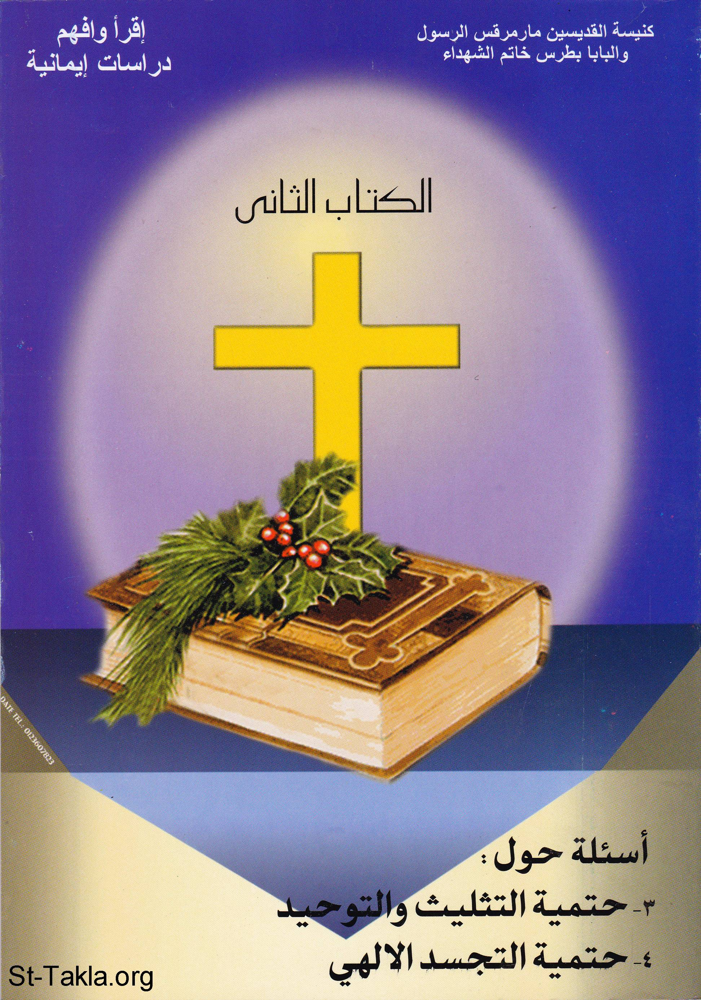

# أسئلة حول حتمية التثليث والتوحيد

**المؤلف / Author:** أ. حلمي القمص يعقوب
**المصدر / Source:** [st-takla.org](https://st-takla.org/books/helmy-elkommos/trinity-and-unity/index.html)
**الموضوعات / Topics:** —

📘 **[Download EPUB / تحميل الكتاب](trinity-and-unity.epub)**

## نبذة

نشكر الأستاذ حلمي القمص يعقوب على السماح لنا في موقع الأنبا تكلا هيمانوت بوضع هذا الكتاب هنا. وهو أحد كتب سلسلة اقرأ وأفهم: دراسات إيمانية .

## الفصول / Chapters (96)

1. [تقديم الطبعة الأولى لنيافة الأنبا تواضروس](chapters/01-introduction/)
2. [دعوة للدراسة](chapters/02-study/)
3. [تمهيد](chapters/03-preface/)
4. [وحدانية الله (1)](chapters/04-unity-1/)
5. [محدودية العقل البشري](chapters/05-human-mind/)
6. [هل يستطيع العقل المحدود أن يحوي الله غير المحدود؟](chapters/06-limited-mind/)
7. [هل عدم إدراك الحقائق العلمية بالعقل يعني عدم حقيقتها؟](chapters/07-science/)
8. [هل الحقائق الإيمانية ضد العقل؟](chapters/08-faith/)
9. [هل نتعامل مع الحقائق الإيمانية كما نتعامل مع الحقائق العلمية؟](chapters/09-faith-vs-science/)
10. [صفات الله الواحد](chapters/10-god-attributes/)
11. [ما هيَ الصفات التي يتميز بها الله دون سواه؟](chapters/11-god-attributes-list/)
12. [نقاط للتذكر حول وحدانية الله وصفاته](chapters/12-notes-1/)
13. [وحدانية الله (2)](chapters/13-unity-2/)
14. [وحدانية الله كتابيًا وكنسيًا](chapters/14-bible-church/)
15. [هل هناك آيات في الكتاب المقدس تشهد بوحدانية الله؟ وهل كرزت الكنيسة بهذه الوحدانية؟](chapters/15-verses/)
16. [شهادة الآخرين لنا](chapters/16-others-testimony/)
17. [يظن بعض الإخوة المسلمين أننا نؤمن بأكثر من إله.. هل هذا صحيح؟](chapters/17-muslim-multigod/)
18. [شهادة العقل لوحدانية الله](chapters/18-mind-testimony/)
19. [هل يقبل العقل فكرة وجود أكثر من إله واحد؟](chapters/19-more-than-one-god/)
20. [الجوهر الإلهي والأقنوم الإلهي](chapters/20-god-essence/)
21. [مفهوم الجوهر الإلهي](chapters/21-god-essence-concept/)
22. [ما هو مفهوم الجوهر الإلهي؟](chapters/22-concept/)
23. [مفهوم الأقنوم الإلهي](chapters/23-god-hypostasis/)
24. [ما هو مفهوم الأقنوم؟](chapters/24-hypostasis/)
25. [الخواص الأقنومية](chapters/25-hypostasis-attributes/)
26. [ما هيَ الخواص الأقنومية؟ وهل كل أقنوم يتمايز بخاصيته الأقنومية عن الأقنومين الآخرين؟](chapters/26-different-attributes/)
27. [ما رأيك في نسبة الكينونة للآب فقط، ونسبة العقل للابن فقط، ونسبة الحياة للروح القدس فقط؟](chapters/27-father-son-spirit/)
28. [وحدانية الثالوث القدوس](chapters/28-trinity-unity/)
29. [الأقانيم ليسوا أجزاءً في الجوهر الإلهي](chapters/29-hypostasis-not-parts/)
30. [هل الأقانيم الثلاثة تعتبر أجزاءً أو أقسامًا في الجوهر الإلهي؟](chapters/30-no-parts/)
31. [هل الله مركَّب من ثلاثة عناصر أو أقانيم، فيقول البعض: "ولكن قد يقول بعض أصحاب الثالوث أننا لا نقول بوجود ثلاثة آلهة، وإنما نقول بوجود إله واحد مركَّب أو مكوَّن من ثلاثة عناصر أو أقانيم"](chapters/31-three/)
32. [هل الأقانيم الثلاثة يمثلون ثلاثة أشخاص منفصلين مثلنا؟](chapters/32-persons/)
33. [ما هيَ علاقة الأقانيم الثلاثة معًا؟](chapters/33-three-hypostasis-together/)
34. [الأقانيم الثلاثة (1)](chapters/34-three-persons-1/)
35. [أقنوم الآب](chapters/35-father/)
36. [هل تحدثنا قليلًا عن أقنوم الآب؟](chapters/36-the-father/)
37. [لماذا دُعي الأقنوم الأول بالآب؟](chapters/37-one-father/)
38. [هل الآب دُعِي أبًا بعد الخلقة لأنه هو أب لكل الخليقة؟](chapters/38-father-of-creation/)
39. [هل ولادة الابن من الآب ولادة جسدية؟](chapters/39-father-birth-son/)
40. [هل بنوة السيد المسيح للآب هيَ بنوة مجازية مثل كثير من البنوات التي ذكرها الكتاب المقدس كبنوة الملائكة لله؟](chapters/40-christ-son-of-father/)
41. [أقنوم الابن](chapters/41-son/)
42. [هل تحدثنا قليلًا عن أقنوم الابن؟](chapters/42-the-son/)
43. [لماذا دُعي الأقنوم الثاني بالابن؟](chapters/43-two-son/)
44. [لماذا دُعيَ الأقنوم الثاني بالكلمة؟](chapters/44-son-word/)
45. [ما هيَ نظرة بعض المفسرين والمفكرين المسلمين لأقنوم الكلمة؟](chapters/45-word-muslims/)
46. [هل السيد المسيح هو ابن الله أم إنه الله؟](chapters/46-jesus-son-or-god/)
47. [الأقانيم الثلاثة (2): أقنوم الروح القدس](chapters/47-three-persons-2/)
48. [هل تحدثنا قليلًا عن أقنوم الروح القدس؟](chapters/48-holy-spirit/)
49. [هل الروح القدس له الألقاب الإلهية؟](chapters/49-holy-spirit-titles/)
50. [هل الروح القدس له الصفات الإلهية؟](chapters/50-holy-spirit-attributes/)
51. [هل الروح القدس له الأعمال الإلهية والإكرام الإلهي؟](chapters/51-holy-spirit-divine/)
52. [يعتبر شهود يهوه أن الروح القدس ليس أقنومًا، إنما هو عبارة عن قوة قدوسة فعَّالة، فهو مثل المعمودية وليس شخصًا، ومثل المغناطيس، والكهرباء، وأمواج الراديو، وما هو إلاَّ نسمة أو ريح أو نسيم.. فهل هذا صحيح؟](chapters/52-jw-org/)
53. [مفهوم الروح القدس في الإسلام](chapters/53-holy-spirit-islam/)
54. [كلمات مضيئة للتأمل](chapters/54-notes-2/)
55. [التثليث والتوحيد كتابيًا وكنسيًا](chapters/55-in-bible-and-church/)
56. [عقيدة التثليث والتوحيد في العهد القديم](chapters/56-old-testament/)
57. [يقول البعض إن كان التثليث عقيدة كتابية، فلماذا لم تكن واضحة في العهد القديم، ولماذا لم يعتنقها رجال العهد القديم؟](chapters/57-old-testament-vague/)
58. [لماذا لا يكون المقصود من أسلوب الجمع في العهد القديم "التعظيم"؟](chapters/58-us/)
59. [عقيدة التثليث والتوحيد في العهد الجديد](chapters/59-new-testament/)
60. [إن كانت عقيدة التثليث مخفية في طيات العهد القديم، فما هو الحال في العهد الجديد؟](chapters/60-new-testament-verses/)
61. [عقيدة التثليث والتوحيد من خلال الكنيسة](chapters/61-in-church/)
62. [يقول شهود يهوه إن عقيدة التثليث اخترعها ترتليانوس وثاؤفيلس الأنطاكي في القرن الثاني الميلادي، وهيَ مستمدة من العبادات الوثنية. بل أنها من زرع الشيطان.. فهل هذا القول صحيح؟](chapters/62-jworg/)
63. [يقول شهود يهوه إن عقيدة التثليث بلوَّرها مجمع نقية، وفرضها الإمبراطور قسطنطين على الشعب المسيحي بالقوة، هل هذا سليم؟](chapters/63-jehovah-witnesses/)
64. [التثليث والتوحيد عقليًا](chapters/64-in-mind/)
65. [توافُق عقيدة التثليث مع العقل](chapters/65-trinity-mind/)
66. [هل التثليث والتوحيد يتمشى مع العقل أم إنه ضد العقل؟](chapters/66-with-or-without-mind/)
67. [ألاّ يكفي الاعتقاد بوحدانية الله بدون التثليث؟ ويقول البعض: "لماذا هذا السرَّ وهو لغز مُعقَّد.. أنه انزلاق إلى الشِّرك" ويتهمنا شهود يهوه بأننا نعبد إله معقد شاذ التركيب.. فلماذا التمسك بعقيدة التثليث؟](chapters/67-unity-without-trinity/)
68. [يعتبر البعض أن التثليث يناقض التوحيد، والجمع بينهما ضد العقل، هل هذا صحيح؟](chapters/68-is-trinity-against-unity/)
69. [تشبيهات التوحيد والتثليث](chapters/69-examples/)
70. [ما هيَ تشبيهات الثالوث التي تُقرب المعنى إلى أذهاننا؟](chapters/70-eg/)
71. [القرآن لم يهاجم الثالوث المسيحي](chapters/71-quran-didnt/)
72. [هل الثالوث الذي هاجمه القرآن هو الثالوث المسيحي؟](chapters/72-quran-trinity/)
73. [هل نجد صدى للثالوث المسيحي في الإسلام؟](chapters/73-trinity-in-quran/)
74. [منوعات: أسئلة وإجابات متنوعة](chapters/74-faq/)
75. [هل الثالوث المسيحي مستمد من الثالوث الوثني؟](chapters/75-heathen/)
76. [هل الثالوث المسيحي مستمد من الثالوث الهندي؟](chapters/76-indian/)
77. [هل عقيدة التثليث عقيدة فلسفية وثنية ابتدعها التلاميذ لتجد كرازتهم قبولًا لدى الشعوب المختلفة؟](chapters/77-philosophy/)
78. [لماذا نقول عن "المعقولية والحياة" أقنومين ولا نقول عن "السمع والقوة والكمال والجمال والعظمة والمجد واللامحدودية.. إلخ. أنهم أقانيم"؟ ولماذا لا يكون في الله أقانيم بعدد صفاته التي لا تُحصى؟](chapters/78-other-persons/)
79. [كيف يكون الآب إلهًا، والابن إلهًا، والروح القدس إلهًا، ولا يكون الثلاثة ثلاثة آلهة؟](chapters/79-three-gods/)
80. [هل قولنا عن عقيدة التثليث والتوحيد أنها سرّ يعني غموضها أمام العقول؟](chapters/80-secret/)
81. [ما هو الفرق بين الولادة والانبثاق؟](chapters/81-birth-or-procession/)
82. [إن كان الابن وُلِد من الآب فلماذا لا يلد الابن بدوره؟](chapters/82-giving-birth/)
83. [إن كان الابن رسم جوهر الآب، فهل معنى هذا أنه إله آخر غير الآب؟](chapters/83-express-image/)
84. [إن كان الابن هو صورة الآب، فهل معنى هذا أنه إله آخر غير الآب؟](chapters/84-son-express-image/)
85. [ما رأيك في أيقونة الثالوث؟](chapters/85-trinity-wrong-icon/)
86. [ما هيَ الثاليا؟ ومَنْ الذي ألّفها؟ ولماذا؟](chapters/86-thaleia/)
87. [إذا دعونا السيد المسيح بالأب الحنون ألاّ يعتبر هذا خطأ لاهوتيًا لأننا نسبغ عليه صفة من صفات الآب؟](chapters/87-similar-attributes/)
88. [عندما قال الإنجيل عن السيد المسيح أنه جلس عن يمين الآب، وأنه سيظهر في اليوم الأخير ليدين المسكونة بتشخيص مميز.. ألاّ يعتبر هذا انفصالًا عن الآب؟](chapters/88-sat-right-hand-of-god/)
89. [ما هيَ جذور بدعة إنكار ألوهية الروح القدس؟](chapters/89-heterodoxies/)
90. [ما الفارق بين بدعتي ماني ومقدونيوس بخصوص الروح القدس؟](chapters/90-two-heterodoxy/)
91. [ما هو الفارق بين إرسال الآب للروح القدس عن إرساله لأحد الملائكة؟](chapters/91-sending/)
92. [هل انبثاق الروح القدس تم من الآب والابن؟](chapters/92-holy-spirit-procession/)
93. [الله خلق الروح، فهل معنى هذا أن الروح القدس مخلوق؟](chapters/93-spirit-creation/)
94. [عندما قال الكتاب أن الروح القدس "يشفع فينا"، فهل معنى هذا أنه أقل من الآب؟](chapters/94-intercession/)
95. [ما هو مفهوم الروح القدس في الإسلام؟](chapters/95-holy-spirit-in-islam/)
96. [المراجع](chapters/96-references/)

---
*هذا الكتاب مجاني للنشر والتوزيع لخلاص كل نفس. This book is free to share and distribute for the salvation of every soul.*
