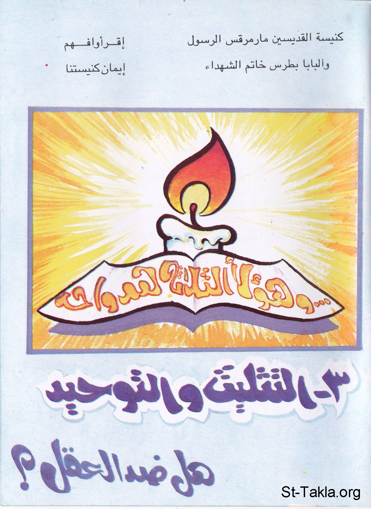

# التثليث والتوحيد: هل ضد العقل؟

**المؤلف / Author:** أ. حلمي القمص يعقوب
**المصدر / Source:** [st-takla.org](https://st-takla.org/books/helmy-elkommos/trinity/index.html)
**الموضوعات / Topics:** —

📘 **[Download EPUB / تحميل الكتاب](trinity.epub)**

## نبذة

نشكر الأستاذ حلمي القمص يعقوب على السماح لنا في موقع الأنبا تكلا هيمانوت بوضع هذا الكتاب هنا. وهو أحد كتب سلسلة " أقرأ وافهم إيمان كنيستنا ".

## الفصول / Chapters (22)

1. [الدراسة لا تكفي](chapters/01-study/)
2. [وحدانية الله](chapters/02-one/)
3. [نجاة الصبي](chapters/03-boy/)
4. [الجوهر والأقنوم](chapters/04-essence/)
5. [الجوهر الإلهي](chapters/05-divine/)
6. [الأقنوم الإلهي](chapters/06-hypostasis/)
7. [تساؤلات](chapters/07-in/)
8. [أقنوم الآب](chapters/08-father/)
9. [أقنوم الابن](chapters/09-son/)
10. [أقنوم الروح القدس: أقنوم الحياة](chapters/10-spirit/)
11. [علاقة الأقانيم الثلاثة معًا](chapters/11-three/)
12. [شجرة الدوم](chapters/12-doum/)
13. [عقيدة التثليث والتوحيد كتابيًا](chapters/13-bible/)
14. [عقيدة التثليث والتوحيد كنسيًا](chapters/14-church/)
15. [عقيدة التثليث و التوحيد عقليًا](chapters/15-mind/)
16. [شجرة النبق](chapters/16-nabk/)
17. [تشبيهات التثليث والتوحيد](chapters/17-examples/)
18. [عقيدة الثالوث الوثنية والتثليث المسيحية](chapters/18-heathen/)
19. [ثالوث القرآن والثالوث المسيحي](chapters/19-quran/)
20. [هل عقيدة التثليث عقيدة فلسفية وثنية من ابتداع التلاميذ؟](chapters/20-disciples/)
21. [أيقونات تظهر الثالوث في شكل ثلاثة أشخاص](chapters/21-icons/)
22. [مفهوم الروح القدس في الإسلام](chapters/22-islam/)

---
*هذا الكتاب مجاني للنشر والتوزيع لخلاص كل نفس. This book is free to share and distribute for the salvation of every soul.*
