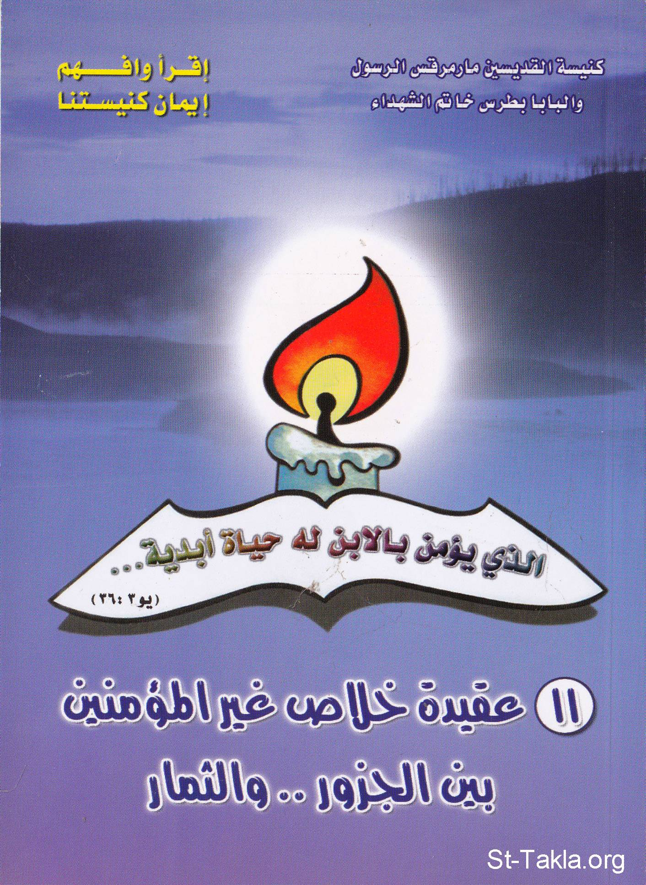

# عقيدة خلاص غير المؤمنين: بين الجذور والثمار

**المؤلف / Author:** أ. حلمي القمص يعقوب
**المصدر / Source:** [st-takla.org](https://st-takla.org/books/helmy-elkommos/unbelievers/index.html)
**الموضوعات / Topics:** —

📘 **[Download EPUB / تحميل الكتاب](unbelievers.epub)**

## نبذة

نشكر الأستاذ حلمي القمص يعقوب على السماح لنا في موقع الأنبا تكلا هيمانوت بوضع هذا الكتاب هنا. وهو أحد كتب سلسلة " أقرأ وافهم إيمان كنيستنا ".

## الفصول / Chapters (9)

1. [مقدمة](chapters/01-intro/)
2. [ضرورة طرح هذه العقيدة للبحث](chapters/02-research/)
3. [قبول معمودية الهراطقة كجذور لهذه العقيدة الخاطئة](chapters/03-baptism/)
4. [لاهوت الأديان كجذور لهذه العقيدة الخاطئة](chapters/04-theology/)
5. [دور باباوات روما في دعم وإقرار هذه العقيدة الخاطئة](chapters/05-popes/)
6. [قرارا المجمع الفاتيكاني الثاني](chapters/06-council/)
7. [الرد على قرارات المجمع الفاتيكاني الثاني](chapters/07-vatican/)
8. [تفنيد الحجج والأسانيد](chapters/08-refutation/)
9. [عقيدة الزواج بغير المؤمنين عند الكاثوليك](chapters/09-marriage/)

---
*هذا الكتاب مجاني للنشر والتوزيع لخلاص كل نفس. This book is free to share and distribute for the salvation of every soul.*
