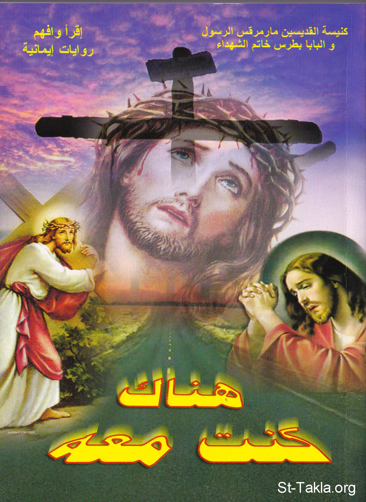

# هناك كنت معه

**المؤلف / Author:** أ. حلمي القمص يعقوب
**المصدر / Source:** [st-takla.org](https://st-takla.org/books/helmy-elkommos/with-him/index.html)
**الموضوعات / Topics:** —

📘 **[Download EPUB / تحميل الكتاب](with-him.epub)**

## نبذة

نشكر الأستاذ حلمي القمص يعقوب على السماح لنا في موقع الأنبا تكلا هيمانوت بوضع هذا الكتاب هنا. وهو أحد كتب سلسلة اقرأ وأفهم: روايات إيمانية . وهو عن "الأربعة والعشرون ساعة الأخيرة من حياة السيد المسيح على الأرض".

## الفصول / Chapters (25)

1. [لقاء وإهداء](chapters/01-dedication/)
2. [تقديم القس مقار فوزي](chapters/02-intro/)
3. [إلى المنتهى](chapters/03-utmost/)
4. [وكان الوقت ليلًا](chapters/04-night/)
5. [مشروع المياه النقيَّة](chapters/05-water/)
6. [سر التقوى](chapters/06-religiousness/)
7. [صراع البستان](chapters/07-struggle/)
8. [غوغاء وعبيد](chapters/08-mob/)
9. [من يطلق حنان من سجنه؟](chapters/09-prison/)
10. [شهود الزور](chapters/10-perjury/)
11. [التمثيلية الهزلية](chapters/11-act/)
12. [وصاح الديك](chapters/12-cock/)
13. [ورأيتُ الجور في بيت العدل](chapters/13-injustice/)
14. [إيه يا سنهدريم!!](chapters/14-council/)
15. [الخسارة الفادحة](chapters/15-loss/)
16. [أية شكاية](chapters/16-claim/)
17. [الثعلب ابن السفاح والأفعى بنت الحيَّة](chapters/17-fox/)
18. [إني أحتج صارخًا](chapters/18-protest/)
19. [من العدالة إلى السياسة](chapters/19-politics/)
20. [دماء على الطريق](chapters/20-blood/)
21. [تل الجمجمة](chapters/21-skull/)
22. [وملك على عرشه](chapters/22-throne/)
23. [ثوب الحداد](chapters/23-mourning/)
24. [المعركة الرهيبة](chapters/24-battle/)
25. [جسارة الحب](chapters/25-love/)

---
*هذا الكتاب مجاني للنشر والتوزيع لخلاص كل نفس. This book is free to share and distribute for the salvation of every soul.*
