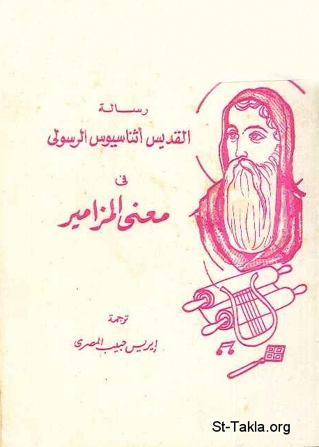

# رسالة القديس أثناسيوس الرسولي في معنى المزامير

**المؤلف / Author:** ترجمة أ. إيريس حبيب المصري
**المصدر / Source:** [st-takla.org](https://st-takla.org/books/iris-habib-elmasry/athanasius-psalms/index.html)
**الموضوعات / Topics:** —

📘 **[Download EPUB / تحميل الكتاب](athanasius-psalms.epub)**

## نبذة

نشكر أسرة الأستاذة إيريس حبيب المصري على السماح لنا في موقع الأنبا تكلا هيمانوت بوضع هذا الكتاب هنا (من خلال د. آمون كامل غبريال).

## الفصول / Chapters (35)

1. [تمهيد](chapters/01-introduction/)
2. [مقدمة خطاب أثناسيوس إلى مارسللينوس](chapters/02-marcellinus/)
3. [ميزة سفر المزامير في تعليم راغبي الصلاة](chapters/03-advantage/)
4. [تنوُّع موضوعات سفر المزامير](chapters/04-diversity/)
5. [أحداث أسفار يشوع والقضاة وعزرا في المزامير](chapters/05-events/)
6. [الله الكلمة في سفر المزامير](chapters/06-god/)
7. [التجسد والبشارة والقديسة مريم في المزامير](chapters/07-jesus/)
8. [حقيقة تأنُّس المسيح وطريقة موته وتألمه من أجلنا في المزامير](chapters/08-christ/)
9. [صعود المسيح وجلوسه عن يمين الآب، وأنه الديان العادل، ونداء الله للأمم في سفر المزامير](chapters/09-ascension/)
10. [سفر المزامير موحى به من الروح القدس، ويتناغم مع باقي الأسفار المقدسة](chapters/10-inspired/)
11. [المشاعر والانفعالات الشخصية التي تثيرها المزامير لكل شخص منفردًا](chapters/11-feelings/)
12. [المزامير من الممكن أن يعتبرها كل شخص صلواته الخاصة](chapters/12-prayers/)
13. [المزامير مرآة الإنسان وانعكاسًا لمشاعره الشخصية](chapters/13-mirror/)
14. [المزامير نعمة وهبة من المخلص: السيد المسيح](chapters/14-blessing/)
15. [تقسيم المزامير حسب الموضوع، تعبيرًا عن مسار النفس في الحياة](chapters/15-expression/)
16. [تقسيم المزامير حسب الاهتزازات والتوازنات المتناغمة مع النفس](chapters/16-harmony/)
17. [تابع: أنواع المزامير](chapters/17-types/)
18. [تابع: تقسيم المزامير حسب الموضوع](chapters/18-topics/)
19. [استخدام المزامير حسب الحاجة](chapters/19-as-needed/)
20. [الترنم بالمزامير حسب نوعية الاحتياج](chapters/20-singing/)
21. [المزامير عون للمصلي في كل وقت](chapters/21-help-worshiper/)
22. [التسبيح بالمزامير حسب الحاجة](chapters/22-praising/)
23. [مناسبات التسبيح المختلفة لله بالمزامير](chapters/23-occasions/)
24. [التغني بالمزامير حسب الظروف](chapters/24-circumstances/)
25. [الترتيل بالمزامير في كافة الأوقات](chapters/25-at-all-times/)
26. [إنشاد المزامير حسب المشاعر الإنسانية](chapters/26-emotions/)
27. [المزامير المسيانية: الخاصة بالسيد المسيح المخلص](chapters/27-messianic-psalms/)
28. [ترنيم المزامير بالنغم والألحان مفيد](chapters/28-melody/)
29. [ترتيل المزامير بالألحان](chapters/29-melodies/)
30. [ترتيل المزامير لا بهدف التلذذ، ولكن يجب أن تصدر عن أعماق صالحة](chapters/30-from-heart/)
31. [أهمية قراءة كل سفر المزامير](chapters/31-reading-importance/)
32. [الاحتفاظ بنصوص المزامير كما هي](chapters/32-as-it-is/)
33. [التسبيح بالمزامير حصنًا للنفس](chapters/33-fortress-for-soul/)
34. [قراءة المزامير حماية للنفس وللآخرين إن كانت من قلب نقي](chapters/34-protection/)
35. [خاتمة](chapters/35-conclusion/)

---
*هذا الكتاب مجاني للنشر والتوزيع لخلاص كل نفس. This book is free to share and distribute for the salvation of every soul.*
