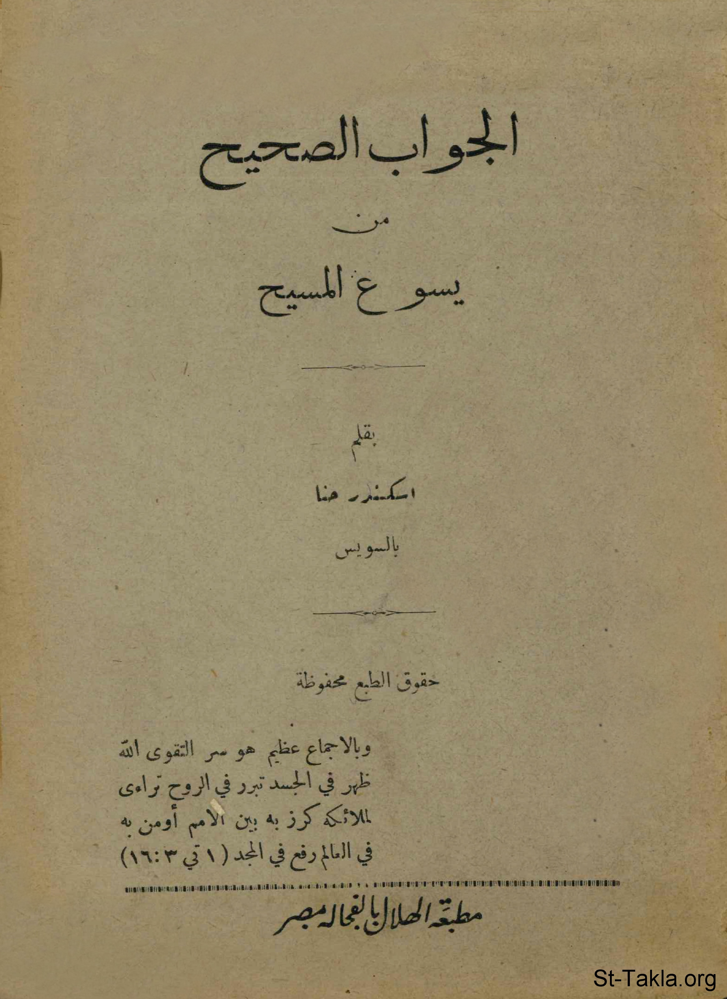

# الجواب الصحيح من يسوع المسيح

**المؤلف / Author:** أ. إسكندر حنا
**المصدر / Source:** [st-takla.org](https://st-takla.org/books/iskander-hanna/christ-answer/index.html)
**الموضوعات / Topics:** —

📘 **[Download EPUB / تحميل الكتاب](christ-answer.epub)**

## نبذة

* تم وضع بعض العنوان الداخلية من قبل الموقع، بما لا يخل بالمعنى.

## الفصول / Chapters (12)

1. [مقدمة](chapters/01-introduction/)
2. [تمهيد](chapters/02-preface/)
3. [التثليث والتوحيد](chapters/03-trinity/)
4. [التجسد الإلهي المجيد](chapters/04-incarnation/)
5. [شهادة التوراة والإنجيل والقرآن عن سر التجسد الإلهي](chapters/05-books/)
6. [الجواب الصحيح: سؤال وجواب بالآيات والشواهد](chapters/06-questions/)
7. [المسيح هو المعلم الصالح](chapters/07-who/)
8. [المسيح هو الله وملك الملوك](chapters/08-god/)
9. [المسيح هو الرب الخالق والقادر وحده والعالم بكل شيء](chapters/09-creator/)
10. [المسيح ذو مشيئة نافذة، وهو الديان العادل والغافر والرازق](chapters/10-judge/)
11. [المسيح هو الوهاب ومستوجب العبادة وهو الله الظاهر في الجسد](chapters/11-worship/)
12. [الخاتمة](chapters/12-epilogue/)

---
*هذا الكتاب مجاني للنشر والتوزيع لخلاص كل نفس. This book is free to share and distribute for the salvation of every soul.*
