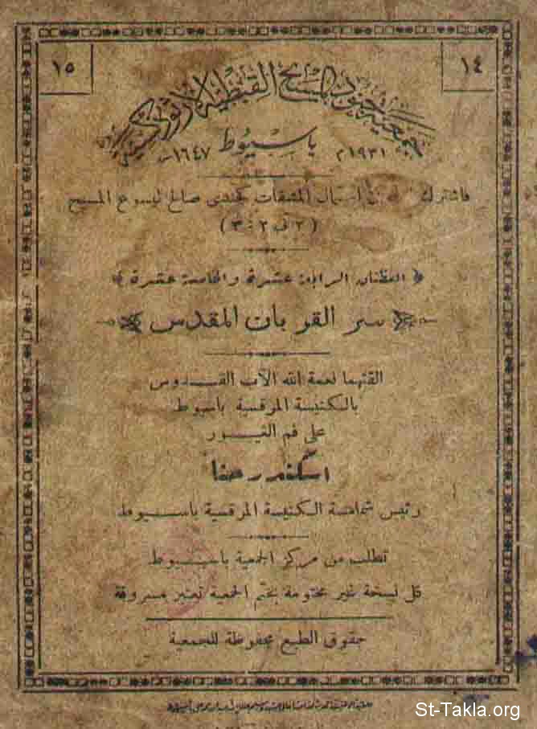

# سر القربان المقدس

**المؤلف / Author:** أ. إسكندر حنا
**المصدر / Source:** [st-takla.org](https://st-takla.org/books/iskander-hanna/eucharist/index.html)
**الموضوعات / Topics:** —

📘 **[Download EPUB / تحميل الكتاب](eucharist.epub)**

## نبذة

تم وضع بعض علامات الترقيم (، . وخلافه) من قِبَل الموقع، في بعض الجمل التي احتاجت ذلك.

## الفصول / Chapters (24)

1. [العظة الرابعة عشرة: من يأكل جسدي ويشرب دمي يثبت في وأنا فيه](chapters/01-sermon-14/)
2. [مقدمة عن الخصومة بين الله وشعب بني إسرائيل، ثم التصالح معهم](chapters/02-reconciliation/)
3. [العهد المقدس بين الله والشعب، وتقديم ذبيحة، وإرسال المخلص](chapters/03-holy-covenant/)
4. [قصة تعطي مِثالًا لذبيحة المُصالحة وكفارة المسيح لأجلنا](chapters/04-atonement-of-christ/)
5. [بدون سفك دم لا تحدث مغفرة](chapters/05-blood/)
6. [المسيح واضِع سر الإفخارستيا وباقي الأسرار المقدسة في الكنيسة](chapters/06-holy-sacraments/)
7. [أدلة وبراهين على حقيقة وعظمة سر التناول في المسيحية](chapters/07-communion/)
8. [تعاليم السيد المسيح تبين أن سر التناول حقيقة وليس رمز](chapters/08-teachings-of-christ/)
9. [كسر المسيح الخبز يوم خميس العهد، وكلام بولس الرسول عن الإفخارستيا دليل على صحتها حرفيًّا](chapters/09-bread/)
10. [إيمان المسيحيون بصحة سر التناول منذ بداية المسيحية](chapters/10-deep-rooted-faith/)
11. [العظة الخامسة عشرة: الذي يأكل ويشرب بدون استحقاق يأكل ويشرب دينونة لنفسه، غير مميز جسد الرب](chapters/11-sermon-15/)
12. [مقدمة حول اتهام المؤمنون بسر الإفخارستيا بأنهم قوم لفظيون](chapters/12-are-we-literal/)
13. [الفرق بين أقوال المسيح المجازية والحرفية، وشرح المجاز في آيات: أنا هو الباب - الطريق - الكرمة](chapters/13-figurative-vs-literal/)
14. [السيد المسيح لم يعطي مجازًا في كلامه عن تناول جسده ودمه](chapters/14-no-metaphor/)
15. [السيد المسيح قال ما كان يقصد بوضوح بخصوص التناول من الجسد والدم](chapters/15-body-and-blood/)
16. [هل التناول تذكار فقط حسب الآية: "اصنعوا هذا لذكري"؟](chapters/16-not-a-memorial/)
17. [بركات سر الإفخارستيا المقدس: قوت للنفس، حياة أبدية، الثبات في المسيح](chapters/17-blessings/)
18. [يصلون أثناء طقس مائدة الرب أو كسر الخبز بصورة شكلية، فما فائدة الصلاة للسر؟!](chapters/18-fake-prayers/)
19. [واجبنا إزاء سر عشاء الرب: الإفخارستيا](chapters/19-our-duty/)
20. [التبشير ببشرى الخلاص للآخرين: موت المسيح](chapters/20-preaching-holy-life/)
21. [الإخبار بقيامة الرب](chapters/21-resurrection/)
22. [تذكر المسيح إلى أن يجيء](chapters/22-remembering-christ/)
23. [كيف يتم هذا السر](chapters/23-deviant-sects/)
24. [اتجاهات المؤمنين تجاه سر الإفخارستيا](chapters/24-attitudes/)

---
*هذا الكتاب مجاني للنشر والتوزيع لخلاص كل نفس. This book is free to share and distribute for the salvation of every soul.*
