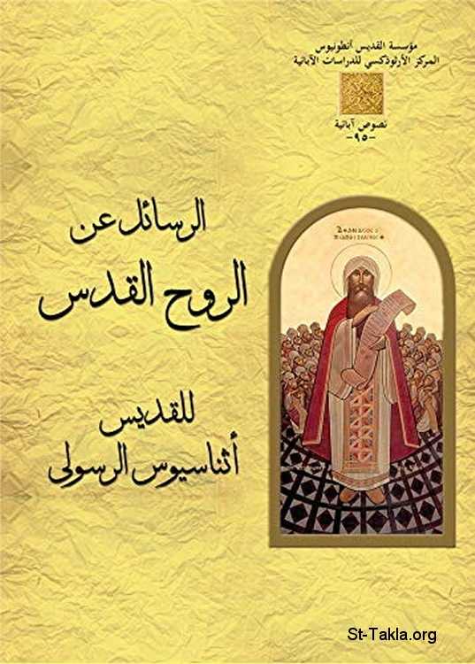

# الرسائل عن الروح القدس إلى الأسقف سرابيون للقديس أثناسيوس الرسولي

**المؤلف / Author:** موريس تاوضروس، نصحي عبد الشهيد
**المصدر / Source:** [st-takla.org](https://st-takla.org/books/maurice-tawadrous/holy-spirit-to-serapion/index.html)
**الموضوعات / Topics:** —

📘 **[Download EPUB / تحميل الكتاب](holy-spirit-to-serapion.epub)**

## نبذة

نشكر د. موريس تواضروس وأسرته على السماح لنا في موقع الأنبا تكلا هيمانوت بوضع هذا الكتاب هنا. وهو من سلسلة نصوص الآباء 95.

## الفصول / Chapters (76)

1. [الرسالة الأولى](chapters/01-message-1/)
2. [سبب كتابة الرسائل هو الرد على الذين يقولون أن الروح القدس مخلوق أو قريب من الملائكة](chapters/02-reason/)
3. [كما أنه لا يجوز أن نفصل الابن عن الآب، كذلك لا يجوز أن نفصل الروح القدس عن الكلمة](chapters/03-not-permissible-to-separate/)
4. [شرح آية: "صنع الجبال وخلق الريح (الروح)" أنها ليست عن الروح القدس](chapters/04-created-the-spirit/)
5. [التعبيرات الخاصة بالروح القدس في الكتاب المقدس، والفرق بينها وبين الروح المخلوقة](chapters/05-bible/)
6. [شواهد كتابية من العهد القديم كيف أن الروح القدس هو روح الله](chapters/06-old-testament/)
7. [شواهد كتابية من العهد الجديد كيف أن الروح القدس هو روح الله](chapters/07-new-testament/)
8. [الروح الأخرى في الكتاب المقدس بخلاف الروح القدس](chapters/08-other-spirit/)
9. [الاختلاف بين الأرواح ومفهومها](chapters/09-spirits-concept/)
10. [الروح القدس غير مخلوق](chapters/10-not-created/)
11. [المحرفون ينادون أن الروح القدس مخلوق كملاك أعظم من باقي الملائكة](chapters/11-not-an-angel/)
12. [الروح القدس لم يُدعى في الكتاب المقدس قط ملاكًا](chapters/12-never-called-an-angel/)
13. [موسى رفض قيادة ملاك للشعب، بل طلب الله نفسه، وبالتالي فالروح القدس ليس ملاكًا](chapters/13-moses/)
14. [هل الملائكة في هذه الآية: "أناشدك أمام الله والرب يسوع المسيح والملائكة" مقصود بهم الروح القدس؟!](chapters/14-god-jesus-angels/)
15. [عدم ذِكر الروح القدس في بعض الآيات لا يعني عدم وجوده في الثالوث القدوس](chapters/15-not-mentioning/)
16. [الله ليس مثل الإنسان حتى يجرؤ أحد أن يسأل عنه أسئلة بشرية](chapters/16-god-is-not-like-man/)
17. [الروح القدس ليس أقنوم ابن آخر للآب](chapters/17-not-another-son/)
18. [الروح القدس هو نفسه روح الثالوث](chapters/18-in-trinity/)
19. [يجب أن تؤمنوا أولًا بالله أنه موجود، والباقي مكتوب بوحي من الروح القدس](chapters/19-god-exists/)
20. [الآب: ينبوع، الابن: مولود، الروح القدس: منبثق](chapters/20-trinity/)
21. [نؤمن بقداسة واحدة مُسْتَمَدَّة من الآب بالابن في الروح القدس](chapters/21-from-through-in/)
22. [الذين ينادون بأن الروح القدس مخلوق، ينكرون لاهوت الابن أيضًا](chapters/22-deny-deity-of-son/)
23. [الروح القدس هو روح الله منذ الأزل](chapters/23-spirit-of-god/)
24. [الروح القدس روح مُحيي، وهو مسحة وختم](chapters/24-life-giving-spirit/)
25. [روح الله القدوس يسكن فينا](chapters/25-dwells-in-us/)
26. [الروح القدس ليس واحدًا من المخلوقات، والثالوث كامل به](chapters/26-not-one-of-the-creatures/)
27. [الروح القدس غير متغير وغير مخلوق، فهو صورة الكلمة ويخص الآب](chapters/27-unchanged-uncreated/)
28. [الروح القدس لا يمكن أن يكون ملاكًا ولا مخلوقًا على الإطلاق](chapters/28-cannot-be-an-angel/)
29. [يوجد ثالوث قدوس وكامل: الآب بالكلمة في الروح القدس يعمل كل الأشياء](chapters/29-holy-perfect-trinity/)
30. [الله لم يَضِف ملاكًا أو كل الملائكة إلى اللاهوت!](chapters/30-not-add-an-angel/)
31. [النعمة والهبة تُعْطَى في الثالوث من الآب بالابن في الروح القدس](chapters/31-grace-gift/)
32. [حينما يُقَال أن الروح صار في أي أحد فهذا يعني أن الكلمة فيه هو الذي يمنح الروح](chapters/32-word-gives-spirit/)
33. [الروح القدس ليس مخلوقًا بل هو خاص بالكلمة وبلاهوت الآب](chapters/33-specific/)
34. [البابا أثناسيوس يقول: "بحسب الإيمان الرسولي المُسَلَّم لنا بالتقليد من الآباء، فإني قد سَلَّمت التقليد بدون ابتداع أي شيء خارجًا عنه"](chapters/34-tradition/)
35. [الرسالة الثانية](chapters/35-message-2/)
36. [يجب الرد على هرطقات الأريوسيين](chapters/36-heresies-of-arians/)
37. [كل ما هو للآب فهو للابن والعكس](chapters/37-all-present/)
38. [الآب ضابط الكل، والابن ضابط الكل أيضًا](chapters/38-father-son-almighty/)
39. [الله واحد: الابن إله حقيقي مثل الآب، لأنه هو في الآب والآب فيه](chapters/39-god-is-one/)
40. [الله واحد: الابن مساوي للآب ومن نفس جوهره](chapters/40-son-equals-father/)
41. [الابن كلمة الله هو من نفس جوهر الآب ومساو له](chapters/41-same-essence/)
42. [الابن الكلمة منذ الأزل، واختار التجسد في شكل إنسان لأجل خلاصنا](chapters/42-incarnate-in-human-form/)
43. [ينبغي أن يتم الفحص والتمييز متى يتكلم الكتاب المقدس عن ألوهة الكلمة، ومتى يتكلم عن أموره الإنسانية](chapters/43-bible-divinity-vs-humanity/)
44. [المسيح يتحدث من جهة بشريته: "ذلك اليوم وتلك الساعة فلا يعلم بهما أحد، ولا الابن"](chapters/44-christ-humanity/)
45. [الرسالة الثالثة](chapters/45-message-3/)
46. [لاهوت الروح القدس: مَنْ يعرف الابن يعرف الروح](chapters/46-theology/)
47. [بما أن الابن من الله، كذلك أيضًا الروح القدس](chapters/47-from-god/)
48. [المخلوقات تُمْسَح وَتُخْتَم في الروح القدس، وبالتالي هو ليس مخلوقًا](chapters/48-creatures-anointed-sealed/)
49. [الخلق وغيره من الأعمال التي يعملها الآب، يعملها الابن وكذلك الروح القدس](chapters/49-creation-father-son-spirit/)
50. [الآب يخلق كل الأشياء بالكلمة في الروح، لأنه حيث يكون الكلمة، فهناك أيضًا الروح](chapters/50-all-three/)
51. [ألوهة الثالوث واحدة: عندما نشترك في الروح القدس تكون لنا نعمة الكلمة (المسيح)، وفي الكلمة تكون لنا محبة الله الآب](chapters/51-divinity-of-trinity/)
52. [إن كان الثالوث أزليًا، فالروح القدس لا يكون مخلوقًا](chapters/52-eternal/)
53. [الرسالة الرابعة](chapters/53-message-4/)
54. [تساؤلات أخرى للهراطقة حول الروح القدس](chapters/54-questions/)
55. [هل الروح القدس ابن آخر للآب، أو من المسيح فيكون الآب جدًّأ؟! حاشا](chapters/55-not-two-sons/)
56. [ألوهة واحدة في الثالوث: الروح القدس روح الله، وهو في الله، وليس غريبًا عن طبيعة الابن ولا عن ألوهة الآب](chapters/56-deity/)
57. [الروح القدس ليس مخلوقًا بل هو خاص بجوهر الكلمة، وخاص بالله وكائن فيه](chapters/57-not-a-creature/)
58. [تجاسر الأونوميون والأودوكسيون واليوسابيون ضد الروح القدس](chapters/58-against/)
59. [لا يحق لأحد تغيير أسماء الآب والابن والروح القدس](chapters/59-fixed-names/)
60. [ألوهة الثالوث واحدة، وإيمان واحد، وتوجد معمودية واحدة تُعْطَى فيه](chapters/60-godhead/)
61. [لماذا يُغْفَر التجديف على الابن؟ ولماذا لا يُغْفَر التجديف على الروح القدس؟](chapters/61-blasphemy/)
62. [رأي غير مقبول لأوريجانوس وثيئوغنوستس في التجديف على الروح القدس، هو العودة للخطية بعد المعمودية](chapters/62-unacceptable-opinions/)
63. [رأي غير مقبول لأورجينوس عن موضوع التجديف على الروح القدس](chapters/63-origen/)
64. [رأي غير مقبول لثيئوغنوستس لشرح موضوع التجديف على الروح القدس](chapters/64-theognostus/)
65. [التجديف على الروح القدس: المغفرة مستحيلة لمن تمادوا إلى حيث لا حدود لخطئهم](chapters/65-blasphemy-against/)
66. [خطية التجديف على الروح القدس في مقابل باب التوبة المفتوح](chapters/66-sin-of-blasphemy/)
67. [لم تكن أعمال الجسد تتم بدون اللاهوت، أو أعمال اللاهوت تتم بدون الجسد، بل على العكس كل أعماله صنعها الرب الواحد](chapters/67-all-deeds-done-by-the-one-lord/)
68. [لا ينبغي أن يخلط أحد في نسب أحداث حياة السيد المسيح للناسوت أو اللاهوت حسب الحالة](chapters/68-do-not-confuse/)
69. [خطية عدم فهم اللاهوت والناسوت للكلمة المتجسد](chapters/69-not-understanding/)
70. [التجديف على الابن والروح القدس](chapters/70-blasphemy-both/)
71. [ما بين خطأين: الظن بأن المسيح مجرد إنسان، والظن بأن أعماله الإلهية منسوبة للشيطان](chapters/71-humanity-and-divinity/)
72. [اتحاد اللاهوت بالناسوت في شخص السيد المسيح](chapters/72-union/)
73. [أعمال المسيح تجعل أي إنسان يؤمن أنه بالحقيقة الله، ولكن موته يؤكد أيضًا أنه بالحقيقة تجسد](chapters/73-christ-is-truly-god/)
74. [الفريسيين ونسبة أعمال السيد المسيح المعجزية لبعلزبول!](chapters/74-beelzebub/)
75. [ما بين أخطاء الفريسيين والأريوسيين ضد السيد المسيح](chapters/75-pharisees-arians-against-christ/)
76. [ختام الرسائل: عقوبة المجدفين الأبدية، وثواب المؤمنين الأبدي](chapters/76-conclusion/)

---
*هذا الكتاب مجاني للنشر والتوزيع لخلاص كل نفس. This book is free to share and distribute for the salvation of every soul.*
