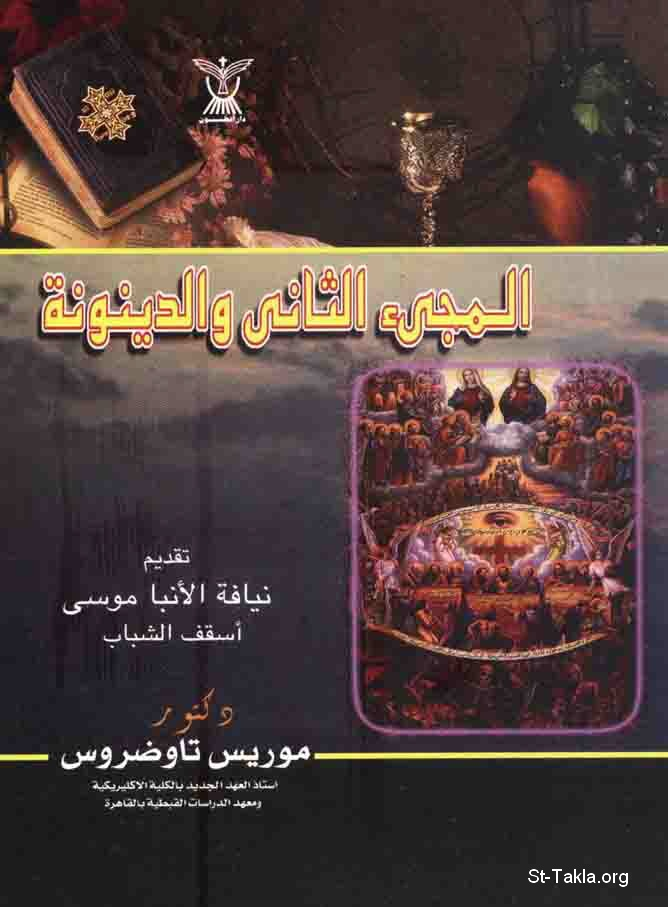

# المجيء الثاني والدينونة: علامات المجيء الثاني، طبيعة الأجساد بعد القيامة، الحياة المغبوطة

**المؤلف / Author:** موريس تواضروس
**المصدر / Source:** [st-takla.org](https://st-takla.org/books/maurice-tawadrous/second-coming-judgement-day/index.html)
**الموضوعات / Topics:** —

📘 **[Download EPUB / تحميل الكتاب](second-coming-judgement-day.epub)**

## نبذة

نشكر د. موريس تواضروس وأسرته على السماح لنا في موقع الأنبا تكلا هيمانوت بوضع هذا الكتاب هنا. ويوجد في العنوان الداخلي باقي العنوان كالتالي: "علامات المجيء الثاني، طبيعة الأجساد بعد القيامة، الحياة المغبوطة".

## الفصول / Chapters (12)

1. [مقدمة - كتاب المجيء الثاني والدينونة](chapters/01-introduction/)
2. [المجيء الثاني والدينونة - كتاب المجيء الثاني والدينونة](chapters/02-2nd-coming-judgment/)
3. [الكرازة بالإنجيل في جميع الأمم: من علامات المجيء الثاني - كتاب المجيء الثاني والدينونة](chapters/03-preaching-the-gospel/)
4. [إيمان اليهود في شكل جماعي بالسيد المسيح: من علامات المجيء الثاني - كتاب المجيء الثاني والدينونة](chapters/04-belief-of-jews/)
5. [مجي إيليا وأخنوخ (أو موسي) في أواخر الأيام: من علامات المجيء الثاني - كتاب المجيء الثاني والدينونة](chapters/05-elijah-enoch-moses/)
6. [مجيء ضد المسيح: من علامات المجيء الثاني - كتاب المجيء الثاني والدينونة](chapters/06-antichrist/)
7. [ضلال الكثيرون وخداع الأنبياء الكذبة، دمار الطبيعة، الحروب: من علامات المجيء الثاني - كتاب المجيء الثاني والدينونة](chapters/07-false-prophets-wars/)
8. [طبيعة الأجساد بعد القيامة - كتاب المجيء الثاني والدينونة](chapters/08-bodies-after-resurrection/)
9. [آراء بعض اللاهوتيين السريان حول جسد القيامة - كتاب المجيء الثاني والدينونة](chapters/09-body-of-resurrection/)
10. [الحياة المغبوطة التي تنتظر الأبرار - كتاب المجيء الثاني والدينونة](chapters/10-blessed-life-awaits/)
11. [أقوال القديس مكاريوس المصري في الحياة المغبوطة - كتاب المجيء الثاني والدينونة](chapters/11-st-macarius-of-egypt/)
12. [هذا الكتاب: الغلاف الخلفي - كتاب المجيء الثاني والدينونة](chapters/12-back-cover/)

---
*هذا الكتاب مجاني للنشر والتوزيع لخلاص كل نفس. This book is free to share and distribute for the salvation of every soul.*
