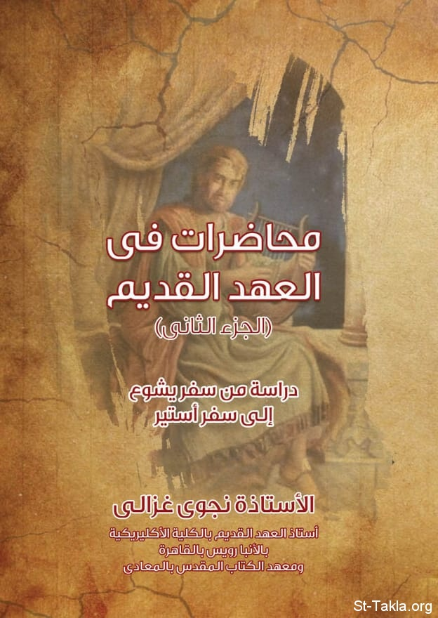

# محاضرات في العهد القديم (الجزء الثاني)

**المؤلف / Author:** أ. نجوى غزالي
**المصدر / Source:** [st-takla.org](https://st-takla.org/books/nagwa-ghazaly/old-testament-2/index.html)
**الموضوعات / Topics:** —

📘 **[Download EPUB / تحميل الكتاب](old-testament-2.epub)**

## نبذة

نشكر أ. نجوى غزالي على السماح لنا في موقع الأنبا تكلا هيمانوت بوضع هذا الكتاب هنا.

## الفصول / Chapters (11)

1. [مقدمة: هذا الكتاب](chapters/01-introduction/)
2. [سفر يشوع](chapters/02-joshua-book/)
3. [سفر القضاة](chapters/03-book-of-judges/)
4. [سفر راعوث](chapters/04-book-of-ruth/)
5. [سفر صموئيل الأول والثاني](chapters/05-book-of-1-2-samuel/)
6. [سفري الملوك الأول والثاني](chapters/06-book-of-1-2-kings/)
7. [سفر أخبار الأيام الأول والثاني](chapters/07-books-1-2-chronicles/)
8. [سفر عزرا](chapters/08-book-of-ezra/)
9. [سفر نحميا](chapters/09-book-of-nehemiah/)
10. [سفر أستير](chapters/10-book-of-esther/)
11. [بعض المراجع](chapters/11-references/)

---
*هذا الكتاب مجاني للنشر والتوزيع لخلاص كل نفس. This book is free to share and distribute for the salvation of every soul.*
