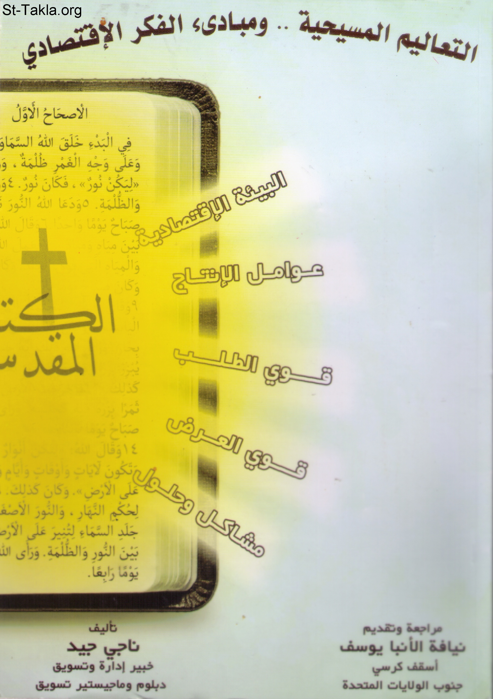

# التعاليم المسيحية.. ومبادئ الفكر الاقتصادي

**المؤلف / Author:** أ. ناجي جيد
**المصدر / Source:** [st-takla.org](https://st-takla.org/books/nagy-gayed/christian-economics/index.html)
**الموضوعات / Topics:** —

📘 **[Download EPUB / تحميل الكتاب](christian-economics.epub)**

## نبذة

نشكر الأستاذ ناجي جيد على السماح لنا في موقع الأنبا تكلا هيمانوت بوضع هذا الكتاب هنا.

## الفصول / Chapters (57)

1. [إهداء](chapters/01-dedication/)
2. [تقديم](chapters/02-preface/)
3. [كلمة شكر](chapters/03-thanks/)
4. [مقدمة عامة](chapters/04-general-introduction/)
5. [المدخل الكتابي والفكر الاقتصادي](chapters/05-chapter-1/)
6. [مقدمة فصل المدخل الكتابي والفكر الاقتصادي](chapters/06-chapter-1-intro/)
7. [الفلسفة المسيحية الاقتصادية](chapters/07-philosophy/)
8. [التعاليم المسيحية وأبعاد الفكر الاقتصادي](chapters/08-economic/)
9. [عناصر المنظومة الاقتصادية](chapters/09-elements/)
10. [التعاليم المسيحية وعوامل الإنتاج](chapters/10-production/)
11. [المسيحية والبيئة الاقتصادية](chapters/11-chapter-2/)
12. [مقدمة فصل المسيحية والبيئة الاقتصادية](chapters/12-chapter-2-intro/)
13. [رؤية كتابية لمشكلة الندرة](chapters/13-rarity/)
14. [أهمية علم الاقتصاد](chapters/14-importance/)
15. [مدارس الفكر الاقتصادي: المسيحية أمام الرأسمالية، الاشتراكية](chapters/15-schools/)
16. [المسيحية وعوامل الإنتاج الملموسة وغير الملموسة](chapters/16-chapter-3/)
17. [مقدمة فصل المسيحية وعوامل الإنتاج الملموسة وغير الملموسة](chapters/17-chapter-3-intro/)
18. [عوامل الإنتاج الملموسة](chapters/18-tangible/)
19. [الأرض من عوامل الإنتاج الملموسة](chapters/19-land/)
20. [العنصر البشري من عوامل الإنتاج الملموسة](chapters/20-human-resources/)
21. [عنصر رأس المال من عوامل الإنتاج الملموسة](chapters/21-capital/)
22. [عنصر التكنولوجيا المُستخدمة من عوامل الإنتاج الملموسة](chapters/22-technology/)
23. [عوامل الإنتاج غير الملموسة](chapters/23-intangible/)
24. [المسيحية وقوى الطلب](chapters/24-chapter-4/)
25. [مقدمة فصل المسيحية وقوى الطلب](chapters/25-chapter-4-intro/)
26. [مفهوم المنفعة والقيمة](chapters/26-use/)
27. [قانون تناقص المنفعة الحدية](chapters/27-law/)
28. [جدول ومنحنى الطلب](chapters/28-table/)
29. [المسيحية.. ومفهوم المنفعة](chapters/29-concept/)
30. [المسيحية.. وتناقص المنفعة](chapters/30-decrease/)
31. [المسيحية.. وحاجات الإنسان الروحية والجسدية](chapters/31-needs/)
32. [المسيحية.. والاستهلاك](chapters/32-consumption/)
33. [المسيحية وقوى العرض](chapters/33-chapter-5/)
34. [مقدمة فصل المسيحية وقوى العرض](chapters/34-chapter-5-intro/)
35. [نظرية العرض](chapters/35-supply/)
36. [نظرية الغلة المتناقصة](chapters/36-return/)
37. [المسيحية وقانون تناقص الغلة](chapters/37-return-decrease/)
38. [المسيحية والعوائد غير المنظورة](chapters/38-revenues/)
39. [المسيحية والاستثمار](chapters/39-investment/)
40. [المسيحية والجودة](chapters/40-quality/)
41. [توازن قوى الطلب والعرض](chapters/41-chapter-6/)
42. [مقدمة فصل توازن قوى الطلب والعرض](chapters/42-chapter-6-intro/)
43. [محددات الطلب والعرض](chapters/43-supply-demand/)
44. [توازن الطلب والعرض](chapters/44-supply-demand-balance/)
45. [التسعير في الواقع العملي](chapters/45-pricing/)
46. [المسيحية.. والعلاقة بين البائع والمشترى](chapters/46-relationship/)
47. [رؤية مسيحية ومواجهة بعض القضايا الاقتصادية](chapters/47-chapter-7/)
48. [مقدمة فصل رؤية مسيحية ومواجهة بعض القضايا الاقتصادية](chapters/48-chapter-7-intro/)
49. [التعاليم المسيحية وعلاج بعض المشاكل الحياتية](chapters/49-issues/)
50. [المسيحية.. ومشكلة الفقر](chapters/50-poverty/)
51. [المسحية.. وقضية الدعم](chapters/51-subsidization/)
52. [المسيحية.. وقضية الأجور](chapters/52-salaries/)
53. [الضوابط والمعايير المسيحية وبعض القضايا الاقتصادية](chapters/53-standards/)
54. [المسيحية.. والرقابة على الاستهلاك](chapters/54-supervision-consumpton/)
55. [المسيحية.. والرقابة على الإنتاج](chapters/55-supervision-production/)
56. [المسيحية والرقابة على الاستثمار](chapters/56-supervision-investment/)
57. [المراجع](chapters/57-references/)

---
*هذا الكتاب مجاني للنشر والتوزيع لخلاص كل نفس. This book is free to share and distribute for the salvation of every soul.*
