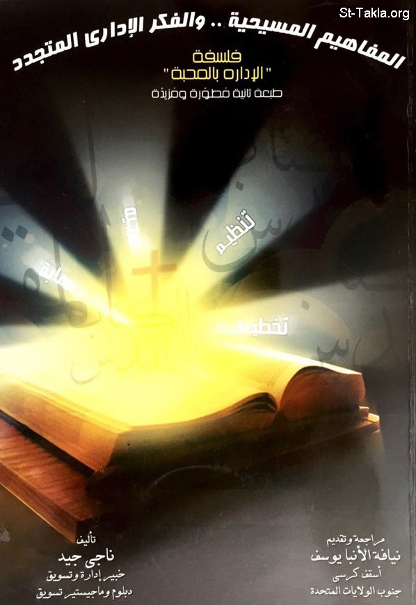

# المفاهيم المسيحية.. والفكر الإداري المتجدد: فلسفة "الإدارة بالمحبة"

**المؤلف / Author:** أ. ناجي جيد
**المصدر / Source:** [st-takla.org](https://st-takla.org/books/nagy-gayed/christian-management/index.html)
**الموضوعات / Topics:** —

📘 **[Download EPUB / تحميل الكتاب](christian-management.epub)**

## نبذة

نشكر الأستاذ ناجي جيد على السماح لنا في موقع الأنبا تكلا هيمانوت بوضع هذا الكتاب هنا.

## الفصول / Chapters (43)

1. [تقديم](chapters/01-introduction/)
2. [كلمة شكر](chapters/02-acknowledgment/)
3. [مقدمة عامة للكتاب](chapters/03-preface/)
4. [الفصل الأول: المدخل الكتابي لعلم الإدارة](chapters/04-chapter1/)
5. [مقدمة فصل: المدخل الكتابي لعلم الإدارة](chapters/05-biblical/)
6. [المحبة فلسفة الإدارة](chapters/06-love/)
7. [بعض المبادئ المسيحية كمدخل إداري](chapters/07-principles/)
8. [ما هي الإدارة؟](chapters/08-administration/)
9. [أبعاد النشاط الإداري](chapters/09-activity/)
10. [الفصل الثاني: التعاليم المسيحية.. والتخطيط](chapters/10-chapter2/)
11. [مفاهيم عامة: التخطيط، الرؤية، الرسالة](chapters/11-concepts/)
12. [عناصر خطة عمل المنظمة](chapters/12-planning/)
13. [الفصل الثالث: التعاليم المسيحية.. والتنظيم](chapters/13-chapter3/)
14. [مقدمة فصل: التعاليم المسيحية.. والتنظيم](chapters/14-organizing/)
15. [للمبيعات](chapters/15-theories/)
16. [أهم عناصر التنظيم شيوعًا](chapters/16-organization/)
17. [الفصل الرابع: التوجيه والقيادة كمفهوم مسيحي](chapters/17-chapter4/)
18. [مقدمة فصل: التوجيه والقيادة كمفهوم مسيحي: ماذا تعني وظيفة التوجيه؟](chapters/18-direction/)
19. [وظيفة القيادة](chapters/19-director/)
20. [رفع الروح المعنوية وشحذ همم المرؤوسين](chapters/20-spirit/)
21. [تكوين قيم وقناعات مسيحية جديدة](chapters/21-values/)
22. [الفصل الخامس: المتابعة والرقابة كمفهوم مسيحي](chapters/22-chapter5/)
23. [مقدمة فصل: المتابعة والرقابة كمفهوم مسيحي](chapters/23-follow-up/)
24. [الفلسفة المسيحية ومفهوم المتابعة والتقييم](chapters/24-evaluation/)
25. [بعض المقاييس الكمية الرقابية المقترحة](chapters/25-quantitative/)
26. [الفصل السادس: دعوة لتبني أفكارًا إدارية.. بوجهة نظر مسيحية](chapters/26-chapter6/)
27. [مقدمة فصل: دعوة لتبني أفكارًا إدارية.. بوجهة نظر مسيحية](chapters/27-ideas/)
28. [المسيحية.. ومدرج ماسلو للحاجات](chapters/28-maslo/)
29. [المسيحية.. ومفهوم (الجودة والرضا)](chapters/29-quality/)
30. [المسيحية.. ومفهوم البركة](chapters/30-bliss/)
31. [المسيحية.. ومبدأ الكل في واحد](chapters/31-one/)
32. [المسيحية.. ومفهوم التنافس والتسابق التجاري](chapters/32-competition/)
33. [المسيحية ومبدأ المعاملة بالمثل](chapters/33-norm-of-reciprocity/)
34. [المسيحية.. والقرار الإداري](chapters/34-decision/)
35. [المسيحية.. وظاهرة الفساد الإداري والمالي](chapters/35-corruption/)
36. [الفصل السابع: بعض النماذج الإدارية الكتابية](chapters/36-chapter7/)
37. [مقدمة فصل: بعض النماذج الإدارية الكتابية](chapters/37-examples/)
38. [معجزة إشباع الخمسة آلاف رجُل](chapters/38-feeding-multitude/)
39. [معجزة شفاء المفلوج](chapters/39-healing-paralytic/)
40. [مَثَل الوزنات للأفراد الثلاثة](chapters/40-talents/)
41. [مَثَل التينة التي أعُطيت فرصة أخرى](chapters/41-fig-tree/)
42. [قصة أول مَجمع في الكنيسة بأورشليم](chapters/42-council/)
43. [الكتب والمراجع](chapters/43-references/)

---
*هذا الكتاب مجاني للنشر والتوزيع لخلاص كل نفس. This book is free to share and distribute for the salvation of every soul.*
