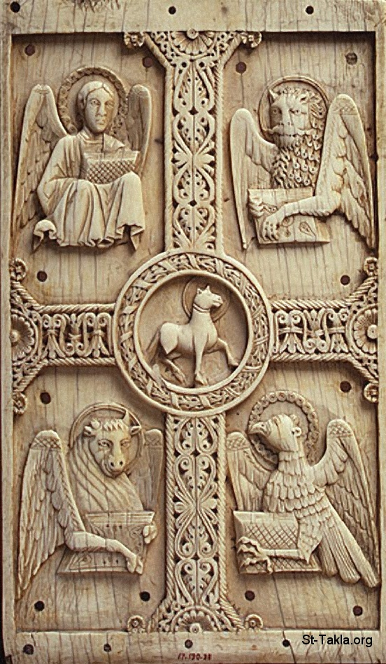

# بحث عن الكائنات الأربعة غير المتجسدة على مرّ العصور

**المؤلف / Author:** الباحثة بولين تودري
**المصدر / Source:** [st-takla.org](https://st-takla.org/Full-Free-Coptic-Books/FreeCopticBooks-030-Pauline-Todary/001-Al-Hayawanat-Al-Arba3a/The-Four-Creatures-00-index.html)
**الموضوعات / Topics:** —

📘 **[Download EPUB / تحميل الكتاب](al-hayawanat-al-arba3a.epub)**

## نبذة

نشكر الأستاذة الباحثة بولين تودري على السماح لنا في موقع الأنبا تكلا بوضع هذا البحث هنا.

## الفصول / Chapters (5)

1. [مقدمة عن خيمة الاجتماع - كتاب الكائنات الأربعة غير المتجسدة](chapters/01-The-Four-Creatures-01-Tabernacle/)
2. [كنيسة العهد الجديد - كتاب الكائنات الأربعة غير المتجسدة](chapters/02-The-Four-Creatures-02-New-Testament/)
3. [تصميم الكنيسة وتزيينها - كتاب الكائنات الأربعة غير المتجسدة](chapters/03-The-Four-Creatures-03-Church/)
4. [كرامتهم وعملهم - كتاب الكائنات الأربعة غير المتجسدة](chapters/04-The-Four-Creatures-04-Honor/)
5. [بعض النماذج من رسوماتهم في الأديرة والكنائس القبطية - كتاب الكائنات الأربعة غير المتجسدة](chapters/05-The-Four-Creatures-05-Icons-1/)

---
*هذا الكتاب مجاني للنشر والتوزيع لخلاص كل نفس. This book is free to share and distribute for the salvation of every soul.*
