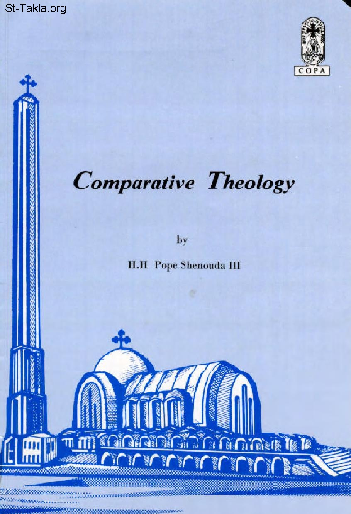

# Comparative Theology
### Comparative Theology

**المؤلف / Author:** H. H. Pope Shenouda III
**المصدر / Source:** [st-takla.org](https://st-takla.org/books/en/pope-shenouda-iii/comparative-theology/index.html)
**الموضوعات / Topics:** —

📘 **[Download EPUB / تحميل الكتاب](comparative-theology.epub)**

## نبذة

The disagreements between us Orthodox and the Protestants regarding Baptism

## الفصول / Chapters (75)

1. [Forward](chapters/01-forward/)
2. [One Faith and Sound Doctrine](chapters/02-one-faith/)
3. [The disagreements between us Orthodox and the Protestants regarding Baptism](chapters/03-protestants/)
4. [The Efficacious of Baptism](chapters/04-baptism/)
5. [Baptism is the Task of the Clergymen](chapters/05-clergymen/)
6. [The Necessity of Baptism Ever Since the Establishment of the Church](chapters/06-necessity/)
7. [Baptism by Immersion](chapters/07-immersion/)
8. [Paedobaptism (Infant Baptism)](chapters/08-paedobaptism/)
9. [If baptism is renewal of life, why do we sin after being baptised?](chapters/09-why-sin/)
10. [Does baptism still carry its efficacious if the clergyman who administers it is a malefactor?](chapters/10-malefactor/)
11. [How was the Penitent Thief saved without baptism?](chapters/11-penitent-thief/)
12. [Baptism and the verse: Believe on the Lord Jesus Christ, and you will be saved](chapters/12-believe/)
13. [If baptism is so important. were the prophets of the Old Testament baptised?](chapters/13-ot-prophets/)
14. [Is salvation through the word and not through water?](chapters/14-salvation/)
15. [What is the position of water in salvation and the second birth?](chapters/15-water/)
16. [The importance of water and its symbols in the Holy Bible](chapters/16-water-importance/)
17. [Water and Blood](chapters/17-water-blood/)
18. [Does water have all these efficacious?](chapters/18-water-efficacious/)
19. [Would it not be better if we say that baptism is rising with Christ and not dying with Him because death is harmful and not beneficial whereas rising is beneficial?](chapters/19-death/)
20. [Why is there death in baptism? And what is its importance?](chapters/20-baptism-death/)
21. [Why should a person whose parents were baptised and saved from Adam's sin, be baptised as well?](chapters/21-baptism-parents/)
22. [Seniority of Tradition](chapters/22-tradition/)
23. [The Holy Bible does not mention everything](chapters/23-bible-everything/)
24. [Tradition is taken from the teachings of the Apostles](chapters/24-teachings-of-apostles/)
25. [Benefits of Tradition](chapters/25-tradition-benefits/)
26. [Valid and invalid Tradition](chapters/26-tradition-valid/)
27. [Church Authority in Teaching and Legislation](chapters/27-legislation/)
28. [Conditions of sound Tradition](chapters/28-tradition-conditions/)
29. [The Apostles commanded that Tradition be preserved](chapters/29-tradition-apostles/)
30. [Protestants have their own Tradition](chapters/30-tradition-protestant/)
31. [Difference between the Mediation of the Lord Jesus Christ and the Intercessions of the Saints](chapters/31-mediation-intercession/)
32. [Examples of Intercession](chapters/32-intercession/)
33. [Do angels and saints know our condition on earth?](chapters/33-intercession-saints/)
34. [The saints' favour with the Lord](chapters/34-saints-favour/)
35. [The spirituality of asking the prayers of the saints](chapters/35-asking-saints/)
36. [The Veneration of St. Mary the Virgin](chapters/36-veneration-mary/)
37. [Venerating the Virgin Mary](chapters/37-venerating-mary/)
38. [Titles of Virgin Mary](chapters/38-mary-titles/)
39. [The Virgin’s Feasts](chapters/39-mary-feasts/)
40. [The Virgin Is the True Vine](chapters/40-mary-true-vine/)
41. [The Virgin Is the Gate of Life and the Gate of Salvation](chapters/41-mary-gate/)
42. [Is It Correct to Pray to the Virgin?](chapters/42-pray-mary/)
43. [The Perpetual Virginity of the Virgin Mary](chapters/43-perpetual-virginity/)
44. [The phrase “her firstborn Son”](chapters/44-firstborn-son/)
45. [The phrase “your wife”](chapters/45-your-wife/)
46. [Before they came together, she was found with child](chapters/46-came-together/)
47. [Did not know her till she had brought forth her firstborn Son](chapters/47-know-her/)
48. [The phrase ‘His brothers’](chapters/48-his-brothers/)
49. [The disagreements between us Orthodox and the Protestants regarding Fasting](chapters/49-fasting/)
50. [Reply to the objection concerning fasting in secret](chapters/50-fasting-secret/)
51. [Reply to the objection: Is communal fasting a Biblical doctrine or not?](chapters/51-fasting-biblical/)
52. [Reply to the objection of fasting in set times](chapters/52-fasting-times/)
53. [Reply to the phrase "...let no one judge you"](chapters/53-fasting-judge/)
54. [Reply to the subject of vegetarian food](chapters/54-fasting-food/)
55. [Reply to the objection concerning abstaining from certain foods](chapters/55-fasting-abstaine/)
56. [Church authority in organizing worship](chapters/56-church-authority/)
57. [The Spiritual Gifts and the Gift of Tongues](chapters/57-spiritual-gifts/)
58. [The Pentecostal Movement and the Gift of Speaking in Tongues](chapters/58-pentecostal-movement/)
59. [Speaking in tongues](chapters/59-speaking-in-tongues/)
60. [Repentance is a sacrament](chapters/60-repentance-sacrament/)
61. [Repentance and confession](chapters/61-repentance-confession/)
62. [Repentance and the Church](chapters/62-repentance-church/)
63. [Repentance and salvation](chapters/63-repentance-salvation/)
64. [Repentance and the work of Grace](chapters/64-repentance-grace/)
65. [Repentance and experiences](chapters/65-repentance-experiences/)
66. [Repentance, joy and contrition](chapters/66-repentance-joy/)
67. [Repentance and newness of life](chapters/67-repentance-newness/)
68. [Repentance precedes all other sacraments](chapters/68-repentance-first/)
69. [Repentance, conduct and deeds](chapters/69-repentance-deeds/)
70. [Veneration of the Cross](chapters/70-cross/)
71. [Facing the East](chapters/71-east/)
72. [The Sanctuary and the Altar](chapters/72-altar/)
73. [Incense](chapters/73-incense/)
74. [Lights and Candles](chapters/74-lights/)
75. [Pictures and Icons](chapters/75-icons/)

---
*هذا الكتاب مجاني للنشر والتوزيع لخلاص كل نفس. This book is free to share and distribute for the salvation of every soul.*
