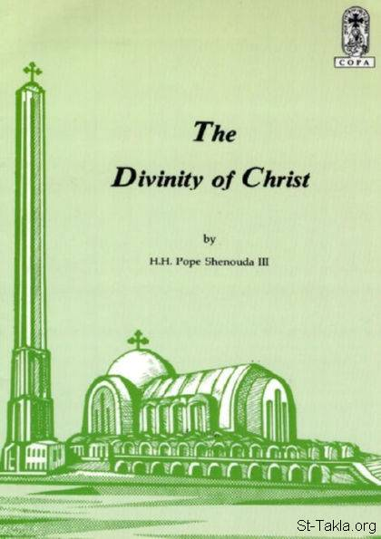

# The Divinity of Christ
### The Divinity of Christ

**المؤلف / Author:** H. H. Pope Shenouda III
**المصدر / Source:** [st-takla.org](https://st-takla.org/books/en/pope-shenouda-iii/divinity-of-christ/index.html)
**الموضوعات / Topics:** —

📘 **[Download EPUB / تحميل الكتاب](divinity-of-christ.epub)**

## الفصول / Chapters (46)

1. [Introduction - Divinity of Christ](chapters/01-introduction/)
2. [Explicit Verses on the Divinity of Christ - Divinity of Christ](chapters/02-verses/)
3. [Christ Is a God - Divinity of Christ](chapters/03-christ-is-a-god/)
4. [There is only One God - Divinity of Christ](chapters/04-one-god/)
5. [Jesus is the Logos (The Word) - Divinity of Christ](chapters/05-logos/)
6. [Jesus is the Creator - Divinity of Christ](chapters/06-creator/)
7. [Jesus Sending the Holy Spirit - Divinity of Christ](chapters/07-sending-holy-spirit/)
8. [Jesus' Relations with the Holy Spirit - Divinity of Christ](chapters/08-holy-spirit/)
9. [Jesus' Descent from Heaven - Divinity of Christ](chapters/09-descent/)
10. [Jesus is the Lord - Divinity of Christ](chapters/10-lord/)
11. [We are the Sons of God - Divinity of Christ](chapters/11-sons-of-god/)
12. [Jesus is the Son of God - Divinity of Christ](chapters/12-son-of-god/)
13. [The Son - Divinity of Christ](chapters/13-the-son/)
14. [Jesus is the Only Son of God - Divinity of Christ](chapters/14-only-son/)
15. [Belief in Christ - Divinity of Christ](chapters/15-belief-in-christ/)
16. [God alone is The Savior and the Redeemer - Divinity of Christ](chapters/16-god-savior-redeemer/)
17. [The Theological Basis of Salvation and Redemption - Divinity of Christ](chapters/17-salvation-redemption/)
18. [Christ is The Savior and the Redeemer - Divinity of Christ](chapters/18-christ-is-savior/)
19. [Christ Is God - Divinity of Christ](chapters/19-christ-is-god/)
20. [Christ's Relation with the Father - Divinity of Christ](chapters/20-father/)
21. [Christ's sitting down at the right hand of the Father on high - Divinity of Christ](chapters/21-right-hand/)
22. [Christ is Beyond Time - Divinity of Christ](chapters/22-beyond-time/)
23. [God is the First and the Last - Divinity of Christ](chapters/23-god-first-last/)
24. [The Lord Jesus Christ Is the First and the Last - Divinity of Christ](chapters/24-christ-first-last/)
25. [God Is Present Everywhere - Divinity of Christ](chapters/25-present-everywhere/)
26. [Christ is Omnipresent - Divinity of Christ](chapters/26-omnipresent/)
27. [God is the Judge - Divinity of Christ](chapters/27-god-judge/)
28. [Jesus is the Judge - Divinity of Christ](chapters/28-jesus-judge/)
29. [God Alone Is the Examiner of Hearts and Thoughts - Divinity of Christ](chapters/29-examiner/)
30. [The Lord Jesus Christ Examines the Heart and Knows the Thought - Divinity of Christ](chapters/30-thought/)
31. [No one is good but One, that is, God - Divinity of Christ](chapters/31-good-god/)
32. [Christ Is Good and Holy - Divinity of Christ](chapters/32-christ-is-good/)
33. [God Is the One Who Forgives Sins - Divinity of Christ](chapters/33-sins/)
34. [Christ the Lord Forgave Sins - Divinity of Christ](chapters/34-forgives-sins/)
35. [Christ Accepting Worship and Prayer - Divinity of Christ](chapters/35-accepting-worship/)
36. [Christ is the Giver of Life - Divinity of Christ](chapters/36-giver-of-life/)
37. [Christ's Authority over Everything - Divinity of Christ](chapters/37-everything/)
38. [Christ's Authority over Nature - Divinity of Christ](chapters/38-nature/)
39. [Christ's Authority over Angels - Divinity of Christ](chapters/39-angels/)
40. [The Kingdom Belongs to Christ - Divinity of Christ](chapters/40-kingdom/)
41. [Christ's Authority over Life and Death - Divinity of Christ](chapters/41-life-and-death/)
42. [Christ's Authority over the Law - Divinity of Christ](chapters/42-law/)
43. [Christ's Authority over Himself - Divinity of Christ](chapters/43-himself/)
44. [Christ's Authority over Demons - Divinity of Christ](chapters/44-demons/)
45. [Glory and Power Belongs to Christ - Divinity of Christ](chapters/45-glory-and-power/)
46. [Miracles of Christ Testify to Him - Divinity of Christ](chapters/46-miracles/)

---
*هذا الكتاب مجاني للنشر والتوزيع لخلاص كل نفس. This book is free to share and distribute for the salvation of every soul.*
