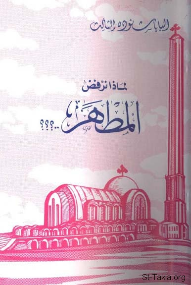

# لماذا نرفض المطهر؟ لقداسة البابا شنودة الثالث

**المؤلف / Author:** البابا شنودة الثالث
**المصدر / Source:** [st-takla.org](https://st-takla.org/Full-Free-Coptic-Books/His-Holiness-Pope-Shenouda-III-Books-Online/36-El-Mathar/Reject-Purgatory__00-index.html)
**الموضوعات / Topics:** —

📘 **[Download EPUB / تحميل الكتاب](el-mathar.epub)**

## نبذة

← بيانات الكتاب: الطبعة الأولى، أكتوبر 1988 م.، القاهرة، مطبعة الأنبا رويس (الأوفست) بالعباسية.

## الفصول / Chapters (39)

1. [لماذا نرفض المطهر؟](chapters/01-Reject-Purgatory__01-Intro/)
2. [ما هو المطهر؟ - كتاب لماذا نرفض المطهر؟](chapters/02-Reject-Purgatory__02-What/)
3. [المطهر عقوبة وتكفير - كتاب لماذا نرفض المطهر؟](chapters/03-Reject-Purgatory__03-Punishment/)
4. [المطهر نار - كتاب لماذا نرفض المطهر؟](chapters/04-Reject-Purgatory__04-Fire/)
5. [المطهر عذاب - كتاب لماذا نرفض المطهر؟](chapters/05-Reject-Purgatory__05-Torment/)
6. [المطهر لمن؟! - كتاب لماذا نرفض المطهر؟](chapters/06-Reject-Purgatory__06-Who/)
7. [مكان المطهر - كتاب لماذا نرفض المطهر؟](chapters/07-Reject-Purgatory__07-Place/)
8. [المطهر سجن واعتقال - كتاب لماذا نرفض المطهر؟](chapters/08-Reject-Purgatory__08-Prison/)
9. [تاريخ المطهر - كتاب لماذا نرفض المطهر؟](chapters/09-Reject-Purgatory__09-History/)
10. [نهاية المطهر - كتاب لماذا نرفض المطهر؟](chapters/10-Reject-Purgatory__10-End/)
11. [معونة للنفوس في المطهر - كتاب لماذا نرفض المطهر؟](chapters/11-Reject-Purgatory__11-Relief/)
12. [المطهر عند الكاثوليك - كتاب لماذا نرفض المطهر؟](chapters/12-Reject-Purgatory__12-Catholics/)
13. [المطهر ضد الكفارة والفداء - كتاب لماذا نرفض المطهر؟](chapters/13-Reject-Purgatory__13-Redemption/)
14. [المطهر ضد عقيدة الخلاص - كتاب لماذا نرفض المطهر؟](chapters/14-Reject-Purgatory__14-Salvation/)
15. [المطهر يتناقض مع بشرى الخلاص المفرحة - كتاب لماذا نرفض المطهر؟](chapters/15-Reject-Purgatory__15-News/)
16. [المطهر ضد التوبة، وضد الكهنوت والمغفرة - كتاب لماذا نرفض المطهر؟](chapters/16-Reject-Purgatory__16-Redemption/)
17. [المطهر ضد عدل الله ورحمته - كتاب لماذا نرفض المطهر؟](chapters/17-Reject-Purgatory__17-Justice/)
18. [المطهر ضد وعود الله - كتاب لماذا نرفض المطهر؟](chapters/18-Reject-Purgatory__18-Promises/)
19. [تفسير آية يخلص كما بنار - كتاب لماذا نرفض المطهر؟](chapters/19-Reject-Purgatory__19-Like-Fire/)
20. [المطهر ليس هو.. - كتاب لماذا نرفض المطهر؟](chapters/20-Reject-Purgatory__20-Not/)
21. [تفسير آية لا تُغفَر له في العالم، ولا في الدهر الآتي - كتاب لماذا نرفض المطهر؟](chapters/21-Reject-Purgatory__21-No-Forgiveness/)
22. [تفسير آية تجثو كل ركبة من تحت الأرض - كتاب لماذا نرفض المطهر؟](chapters/22-Reject-Purgatory__22-Knee/)
23. [حروب يهوذا المكابي والصلاة على الموتى - كتاب لماذا نرفض المطهر؟](chapters/23-Reject-Purgatory__23-Maccabees/)
24. [تفسير الصديق يسقط سبع مرات ويقوم - كتاب لماذا نرفض المطهر؟](chapters/24-Reject-Purgatory__24-Fall-Down/)
25. [تفسير آية حتى يوفي الفِلس الأخير - كتاب لماذا نرفض المطهر؟](chapters/25-Reject-Purgatory__25-Penny/)
26. [الذين يعاصرون القيامة - كتاب لماذا نرفض المطهر؟](chapters/26-Reject-Purgatory__26-Resurrection/)
27. [مشكلة الجسد والروح - كتاب لماذا نرفض المطهر؟](chapters/27-Reject-Purgatory__27-Body-VS-Spirit/)
28. [قديسو العهد القديم - كتاب لماذا نرفض المطهر؟](chapters/28-Reject-Purgatory__28-Old-Testament/)
29. [ما فائدة الصلوات؟! - كتاب لماذا نرفض المطهر؟](chapters/29-Reject-Purgatory__29-Prayers/)
30. [المطهر تطهير أم تكفير؟! - كتاب لماذا نرفض المطهر؟](chapters/30-Reject-Purgatory__30-Which/)
31. [أمثلة الغفرانات الكاثوليكية - كتاب لماذا نرفض المطهر؟](chapters/31-Reject-Purgatory__31-Examples/)
32. [الغفرانات عند الكاثوليك - كتاب لماذا نرفض المطهر؟](chapters/32-Reject-Purgatory__32-Indulgence/)
33. [زوائد القديسين](chapters/33-Reject-Purgatory__33-Extras/)
34. [مشاركة المسيح في عملية التكفير عند الكاثوليك - كتاب لماذا نرفض المطهر؟](chapters/34-Reject-Purgatory__34-Sharing-How-1/)
35. [شركة آلام المسيح - كتاب لماذا نرفض المطهر؟](chapters/35-Reject-Purgatory__35-Sharing-How-2/)
36. [العقوبات الكنسيّة - كتاب لماذا نرفض المطهر؟](chapters/36-Reject-Purgatory__36-Penalties/)
37. [الصلاة على المنتقلين - كتاب لماذا نرفض المطهر؟](chapters/37-Reject-Purgatory__37-Dead-People/)
38. [الدينونة العامة - كتاب لماذا نرفض المطهر؟](chapters/38-Reject-Purgatory__38-Judgment/)
39. [قصة الغني ولعازر - كتاب لماذا نرفض المطهر؟](chapters/39-Reject-Purgatory__39-Story/)

---
*هذا الكتاب مجاني للنشر والتوزيع لخلاص كل نفس. This book is free to share and distribute for the salvation of every soul.*
