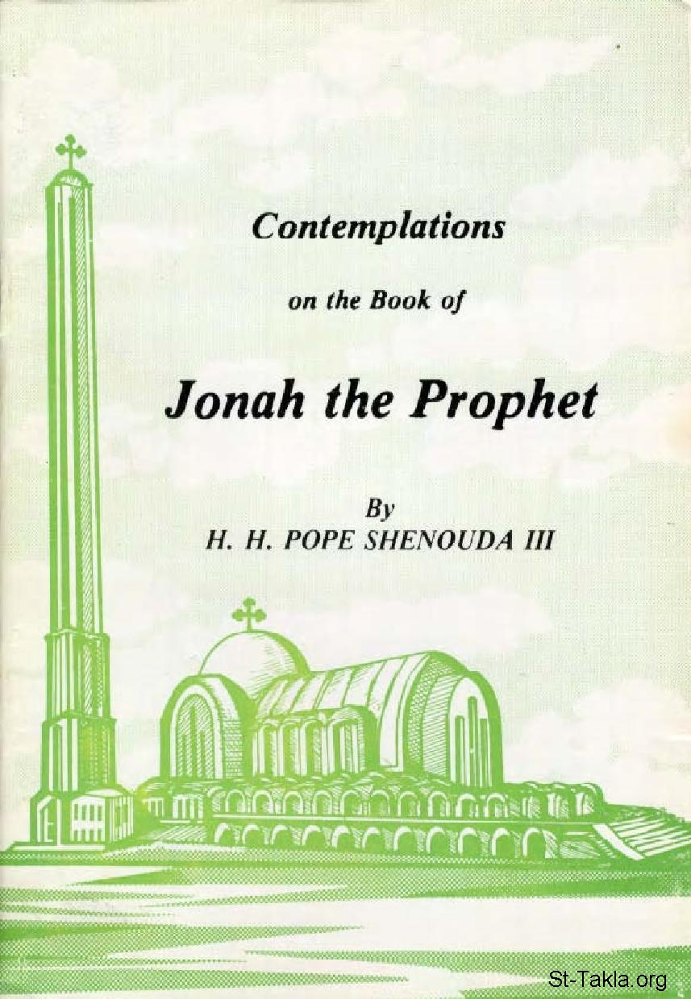

# Contemplations on the Book of Jonah by Pope Shenouda III

**المؤلف / Author:** by Pope Shenouda III
**المصدر / Source:** [st-takla.org](https://st-takla.org/Full-Free-Coptic-Books/His-Holiness-Pope-Shenouda-III-Books-Online/05-Contemplations-On-The-Book-Of-Jonah-The-Prophet/En/Contemplations-Jonah-00-index.html)
**الموضوعات / Topics:** —

📘 **[Download EPUB / تحميل الكتاب](en.epub)**

## الفصول / Chapters (21)

1. [Introduction on The Book of Jonah](chapters/01-Contemplations-Jonah-01-Intro/)
2. [Jonah's Problem - The Book of Jonah](chapters/02-Contemplations-Jonah-02-Jonah-s-Problem/)
3. [Falls in Jonah's Fleeing - The Book of Jonah](chapters/03-Contemplations-Jonah-03-Falls-in-Jonahs-Fleeing/)
4. [God Uses All - The Book of Jonah](chapters/04-Contemplations-Jonah-04-God-Uses-All/)
5. [The Obedience of the Irrational Creatures - The Book of Jonah](chapters/05-Contemplations-Jonah-05-Obedience-of-Irrational-Creatures/)
6. [Gentile Mariners Are Better Than Jonah - The Book of Jonah](chapters/06-Contemplations-Jonah-06-Gentile-Mariners-Better-Than-Jonah/)
7. [The Mariners' Virtues - The Book of Jonah](chapters/07-Contemplations-Jonah-07-Mariners-Virtues/)
8. [Jonah In The Belly Of The Fish - The Book of Jonah](chapters/08-Contemplations-Jonah-08-Jonah-In-The-Belly-Of-The-Fish/)
9. [Nineveh - The Book of Jonah](chapters/09-Contemplations-Jonah-09-Nineveh/)
10. [Nineveh The Great City - The Book of Jonah](chapters/10-Contemplations-Jonah-10-Nineveh-The-Great-City/)
11. [Nineveh's Greatness in Repentance - The Book of Jonah](chapters/11-Contemplations-Jonah-11-Ninevehs-Greatness-in-Repentance/)
12. [Jonah's Preaching - The Book of Jonah](chapters/12-Contemplations-Jonah-12-Jonah-s-Preaching/)
13. [Saving Jonah From His Obduracy And Pride - The Book of Jonah](chapters/13-Contemplations-Jonah-13-Saving-Jonah/)
14. [God In The Book Of Jonah - The Book of Jonah](chapters/14-Contemplations-Jonah-14-God-In-The-Book/)
15. [God Searches For Man - The Book of Jonah](chapters/15-Contemplations-Jonah-15-God-Searches-For-Man/)
16. [God Can Use Punishment - The Book of Jonah](chapters/16-Contemplations-Jonah-16-Use-of-Punishment/)
17. [God Is Prepared to Relent - The Book of Jonah](chapters/17-Contemplations-Jonah-17-God-Is-Prepared-to-Relent/)
18. [God's Long Suffering - The Book of Jonah](chapters/18-Contemplations-Jonah-18-God-s-Long-suffering/)
19. [God For All People - The Book of Jonah](chapters/19-Contemplations-Jonah-19-God-For-All-People/)
20. [God Likes Reasoning with Humans - The Book of Jonah](chapters/20-Contemplations-Jonah-20-God-Likes-Reasoning-with-Humans/)
21. [All God's Dispositions Are Successful - The Book of Jonah](chapters/21-Contemplations-Jonah-21-All-Gods-Dispositions-Are-Successful/)

---
*هذا الكتاب مجاني للنشر والتوزيع لخلاص كل نفس. This book is free to share and distribute for the salvation of every soul.*
