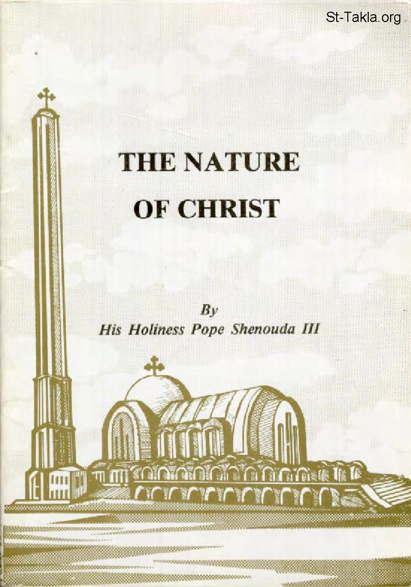

# The Nature of Christ
### The Nature of Christ

**المؤلف / Author:** H. H. Pope Shenouda III
**المصدر / Source:** [st-takla.org](https://st-takla.org/books/en/pope-shenouda-iii/nature-of-christ/index.html)
**الموضوعات / Topics:** —

📘 **[Download EPUB / تحميل الكتاب](nature-of-christ.epub)**

## نبذة

Widely Known Heresies Concerning the Nature of Christ: 1: The Heresy of Arius (Arianism)

## الفصول / Chapters (21)

1. [Introduction - Nature of Christ](chapters/01-introduction/)
2. [The Orthodox Concept regarding the Nature of Christ - Nature of Christ](chapters/02-orthodox-concept/)
3. [Which of the two natures the Church of Alexandria denies? - Nature of Christ](chapters/03-two-natures/)
4. [The Heresy of Arius (Arianism) - Nature of Christ](chapters/04-arianism/)
5. [The Heresy of Apollinarius - Nature of Christ](chapters/05-apollinarius/)
6. [The Heresy of Nestorus (Nestorianism) - Nature of Christ](chapters/06-nestorianism/)
7. [The Heresy of Eutyches (Eutychianism) - Nature of Christ](chapters/07-eutychianism/)
8. [The Council of Chaicedon - Nature of Christ](chapters/08-council-of-chaicedon/)
9. [The Nature of the Union: Union Without Mingling, Confusion, Alteration or Transmutation: - Nature of Christ](chapters/09-union/)
10. [The Example of the Union Between Iron and Fire - Nature of Christ](chapters/10-iron-and-fire/)
11. [The Example of the Union Between the Soul and the Body - Nature of Christ](chapters/11-soul-body/)
12. [One Nature and the Two Natures - Nature of Christ](chapters/12-one-nature/)
13. [The Unity of Nature and the Birth of Christ - Nature of Christ](chapters/13-unity-of-nature/)
14. [Possibility of Such Unity - Nature of Christ](chapters/14-possibility-of-such-unity/)
15. [The One Nature of the Incarnate Logos - Nature of Christ](chapters/15-incarnate-logos/)
16. [The Importance of the "One Nature" for Propitiation and Redemption - Nature of Christ](chapters/16-propitiation-and-redemption/)
17. [The One Nature and the Suffering - Nature of Christ](chapters/17-suffering/)
18. [The Term "Son of Man" - Nature of Christ](chapters/18-son-of-man/)
19. [Evidences from the Bible - Nature of Christ](chapters/19-evidences-from-the-bible/)
20. [The One Will and the One Act - Nature of Christ](chapters/20-one-will-one-act/)
21. [Agreed Statement on Christology with the Catholic Church - Nature of Christ](chapters/21-agreed-statement/)

---
*هذا الكتاب مجاني للنشر والتوزيع لخلاص كل نفس. This book is free to share and distribute for the salvation of every soul.*
