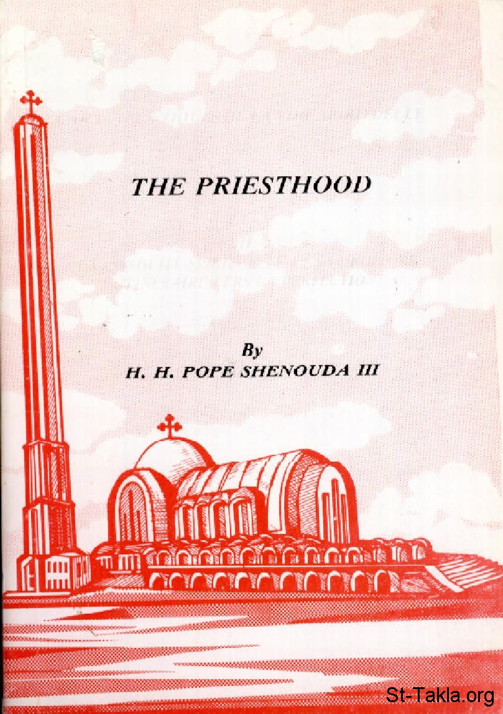

# The Priesthood
### The Priesthood

**المؤلف / Author:** H. H. Pope Shenouda III
**المصدر / Source:** [st-takla.org](https://st-takla.org/books/en/pope-shenouda-iii/priesthood/index.html)
**الموضوعات / Topics:** —

📘 **[Download EPUB / تحميل الكتاب](priesthood.epub)**

## الفصول / Chapters (125)

1. [The Story of this Book - Priesthood](chapters/01-story/)
2. [Denying the role of priesthood and attempts to seize it - Priesthood](chapters/02-denying/)
3. [Biblical References for those who deny Priesthood - Priesthood](chapters/03-biblical-references/)
4. [The spiritual meaning of priesthood - Priesthood](chapters/04-spiritual-meaning/)
5. [Denting Prieshood is an old but aborted attempt - Priesthood](chapters/05-denting/)
6. [God has no variation or shadow of turning - Priesthood](chapters/06-no-variation/)
7. [The commandment to observe the Sabbath now - Priesthood](chapters/07-sabbath/)
8. [The commandment of male circumcision in the Old and New Testaments - Priesthood](chapters/08-male-circumcision/)
9. [The festivals between the Old and New Testaments - Priesthood](chapters/09-festivals/)
10. [Sacrifices and the Priesthood in the Old and New Testaments - Priesthood](chapters/10-sacrifices/)
11. [Has the Priesthood came to an End?! - Priesthood](chapters/11-end/)
12. [Saint Paul as a true priest - Priesthood](chapters/12-saint-paul/)
13. [What does ‘high priest’ mean? - Priesthood](chapters/13-high-priest/)
14. [The priesthood for gentiles - Priesthood](chapters/14-gentiles/)
15. [Priesthood is a calling, a consecration and an anointment - Priesthood](chapters/15-consecration/)
16. [Priesthood is a calling and a mission - Priesthood](chapters/16-mission/)
17. [Priesthood is a specific calling - Priesthood](chapters/17-calling/)
18. [The holy breath - Priesthood](chapters/18-holy-breath/)
19. [The laying on of hands - Priesthood](chapters/19-laying-on-of-hands/)
20. [The Apostolic succession and the laying on of hands - Priesthood](chapters/20-apostolic-succession/)
21. [Does priesthood contradict equality among the faithful? - Priesthood](chapters/21-equality/)
22. [Equality In Sonship Allows For Authority And Variations In Roles - Priesthood](chapters/22-sonship/)
23. [All are not equal - Priesthood](chapters/23-all-are-not-equal/)
24. [The Clergy Are Selected Men Assigned Special Tasks - Priesthood](chapters/24-clergy/)
25. [Assigned To Them The Authority To Teach And To Baptise - Priesthood](chapters/25-authority/)
26. [Singled Them Out and Gave Them The Authority to Absolve And Bind - Priesthood](chapters/26-absolve-and-bind/)
27. [Authority To Carry Out The Sacrament Of The Eucharist - Priesthood](chapters/27-eucharist/)
28. [Singled Out To Carry Out The Ministry Of Laying On Of Hands And To Appoint Servants - Priesthood](chapters/28-appoint-servants/)
29. [The Holy Spirit Was Only Given Through The Laying On Of Their Hands - Priesthood](chapters/29-holy-spirit/)
30. [The Apostles Were Singled Out For Rulers and Guidance - Priesthood](chapters/30-apostles/)
31. [Special Requirements For Bishops, Priests And Deacons - Priesthood](chapters/31-special-requirements/)
32. [The Laying On Of Hands, Prayers, Fasting And Holy Utterance - Priesthood](chapters/32-holy-utterance/)
33. [Priesthood for a Special Group - Priesthood](chapters/33-special-group/)
34. [Christian Priesthood - Priesthood](chapters/34-christian/)
35. [Responsibilities, titles and ranks of the priesthood - Priesthood](chapters/35-responsibilities/)
36. [Vicars](chapters/36-vicars-stewards/)
37. [Ambassadors - Priesthood](chapters/37-ambassadors/)
38. [Angels & messengers - Priesthood](chapters/38-angels-messengers/)
39. [Shepherds - Priesthood](chapters/39-shepherds/)
40. [Fathers - Priesthood](chapters/40-fathers/)
41. [Teachers - Priesthood](chapters/41-teachers/)
42. [Guides and Rulers - Priesthood](chapters/42-guides-rulers/)
43. [Priests - Priesthood](chapters/43-priests/)
44. [Samples of the methods of translation of the word priests - Priesthood](chapters/44-translation/)
45. [Protestants between the words: Priest, Elder, Pontiff - Priesthood](chapters/45-priest-elder-pontiff/)
46. [The grades of priesthood - Priesthood](chapters/46-grades/)
47. [Bishops - Priesthood](chapters/47-bishops/)
48. [Priests - Priesthood](chapters/48-priest/)
49. [The differences between bishops and priests - Priesthood](chapters/49-bishops-vs-priests/)
50. [Deacons - Priesthood](chapters/50-deacons/)
51. [Priesthood is fatherhood - Priesthood](chapters/51-fatherhood/)
52. [Spiritual Fatherhood Existed In The Old Testament - Priesthood](chapters/52-spiritual-fatherhood/)
53. [Fatherhood in the New Testament - Priesthood](chapters/53-fatherhood-new-testament/)
54. [We are all brethren - Priesthood](chapters/54-brethren/)
55. [Are all brethren equal? - Priesthood](chapters/55-are-all-brethren-equal/)
56. [Does brotherhood cancels the hierarchy? - Priesthood](chapters/56-hierarchy/)
57. [Priesthood and serving the altar - Priesthood](chapters/57-serving-the-altar/)
58. [The presence of the New Testament altar - Priesthood](chapters/58-new-testament-altar/)
59. [The Christian holy sacrifice - Priesthood](chapters/59-christian-holy-sacrifice/)
60. [The Lord Himself Established This Sacrament - Priesthood](chapters/60-lord-himself/)
61. [The Lord Commanded Us To persevere and practice This Sacrament - Priesthood](chapters/61-lord-commanded/)
62. [How Long Should We Continue Offering This Sacrament? - Priesthood](chapters/62-offering-sacrament/)
63. [The Lord Handed Down This Sacrament To His Disciples - Priesthood](chapters/63-handed-down-sacrament/)
64. [Eucharist Sacrament Is A Not Mere Bread - Priesthood](chapters/64-eucharist-sacrament/)
65. [This Bread Is The Body Of The Lord - Priesthood](chapters/65-body/)
66. [This Is My Body - This Is My Blood - Priesthood](chapters/66-blood/)
67. [The Benefits And Blessings Of Communion - Priesthood](chapters/67-blessings-of-communion/)
68. [Reserved Punishment For Unworthy Partakers - Priesthood](chapters/68-punishment/)
69. [Losses Incurred By People Who Do Not Partake - Priesthood](chapters/69-partake/)
70. [Shedding Of Blood Constitutes A Sacrifice - Priesthood](chapters/70-shedding-of-blood/)
71. [Shedding Of Blood As The Only Means To Forgive Sin - Priesthood](chapters/71-forgive-sin/)
72. [Connection Between Eucharist Sacrament And The Eternal Life - Priesthood](chapters/72-eternal-life/)
73. [Eucharist Sacrament Is Also A Reminder Of The Priesthood Of Melchizedek - Priesthood](chapters/73-melchizedek/)
74. [Do this to remember Me: How can Something Commemorate Itself - Priesthood](chapters/74-commemorate/)
75. [How can something physical in the Eucharist Be A Spiritual Food? - Priesthood](chapters/75-physical/)
76. [Some Object That Christ’s Sacrifice can not Be Repeated - Priesthood](chapters/76-object/)
77. [The Importance of Eucharist as noted in the Holy Bible - Priesthood](chapters/77-importance-of-eucharist/)
78. [Priesthood and the authority to absolve and retain - Priesthood](chapters/78-authority-absolve-retain/)
79. [The Four Types of Confession - Priesthood](chapters/79-confession-types/)
80. [Confession to a priest as a scriptural principal in the Old Testament - Priesthood](chapters/80-confession-old-testament/)
81. [Confession to a priest as a scriptural principal in the New Testament - Priesthood](chapters/81-confession-new-testament/)
82. [How Dare The Priest Grant Absolution In The Presence Of God, While Forgiveness Is A Divine Right - Priesthood](chapters/82-forgiveness/)
83. [Examples of the power to absolve and retain - Priesthood](chapters/83-power-to-absolve-and-retain/)
84. [How can a priest forgives sin - Priesthood](chapters/84-priest-forgives-sin/)
85. [The Holy Spirit Is The Source Of The Power Of Forgiveness in Priesthood - Priesthood](chapters/85-source-of-the-power/)
86. [The power of absolution and forgiveness - Priesthood](chapters/86-power-of-absolution-and-forgiveness/)
87. [Mistaken & unwarranted jealousy of those who deny Priesthood - Priesthood](chapters/87-jealousy/)
88. [Christ’s titles given to his disciples - Priesthood](chapters/88-titles-given/)
89. [Christ’s Designation As The Shepherds - Priesthood](chapters/89-designation-as-shepherds/)
90. [Christ Is Our Teacher - Priesthood](chapters/90-our-teacher/)
91. [The Designation of the “Son Of God” - Priesthood](chapters/91-son-of-god/)
92. [Christ is “The Light” - Priesthood](chapters/92-the-light/)
93. [Christ is the Bishop And the Overseer - Priesthood](chapters/93-bishop-overseer/)
94. [Christ is the Priest - Priesthood](chapters/94-christ-is-the-priest/)
95. [The lord glorifies His creation - Priesthood](chapters/95-glorifies-his-creation/)
96. [The Lord exalts his creation - Priesthood](chapters/96-exalts-his-creation/)
97. [The meaning of: And My glory I will not give to another - Priesthood](chapters/97-my-glory/)
98. [Priesthood is a service - Priesthood](chapters/98-a-service/)
99. [The priesthood is a service for God - Priesthood](chapters/99-service-for-god/)
100. [Priests and The Service Of The Altar - Priesthood](chapters/100-service-of-the-altar/)
101. [Priests are Servants Of The Scriptures - Priesthood](chapters/101-servants-of-the-scriptures/)
102. [Priests and the Service Of Reconciliation - Priesthood](chapters/102-service-of-reconciliation/)
103. [The Services of Christ, angels, and Apostles - Priesthood](chapters/103-services-of-christ/)
104. [Vicars and servants - Priesthood](chapters/104-vicars-servants/)
105. [Priesthood and Imparting Blessings to Others - Priesthood](chapters/105-imparting-blessings/)
106. [Blessings of the Old Testament Patriarchs - Priesthood](chapters/106-old-testament-patriarchs/)
107. [The Blessing Of The priesthood - Priesthood](chapters/107-blessing/)
108. [The blessings of the prophets and the righteous men - Priesthood](chapters/108-blessings-of-the-prophets/)
109. [Other blessings - Priesthood](chapters/109-other-blessings/)
110. [Why Address The Clergy “my lord’ - Priesthood](chapters/110-my-lord/)
111. [Is Prostration Only For Worship Or Could It Also Express Respect? - Priesthood](chapters/111-prostration/)
112. [Holy Men Of God Prostrating Before Humans - Priesthood](chapters/112-prostrating-before-humans/)
113. [Holy Men Of God Prostrating Before Angels - Priesthood](chapters/113-prostrating-before-angels/)
114. [Prophets Who Accepted Prostration - Priesthood](chapters/114-prophets-who-accepted-prostration/)
115. [Prostration is a command from God - Priesthood](chapters/115-prostration-is-a-command/)
116. [Other Types Of Prostration - Priesthood](chapters/116-other-types-of-prostration/)
117. [Was The Apostolic Authority Specific Only to them and their Era? - Priesthood](chapters/117-apostolic-authority/)
118. [Priests and Teaching - Priesthood](chapters/118-priests-and-teaching/)
119. [Priests and The Thanksgiving “Communion” - Priesthood](chapters/119-priests-and-the-thanksgiving/)
120. [Priests and Baptism - Priesthood](chapters/120-priests-and-baptism/)
121. [Priests and Granting The Holy Spirit - Priesthood](chapters/121-priests-and-granting-the-holy-spirit/)
122. [Priests The Authority To Absolve And To Guide - Priesthood](chapters/122-priests-authority/)
123. [Priests The Laying On Of Hands - Priesthood](chapters/123-priests-laying-hands/)
124. [The Apostles Are The Foundation - Priesthood](chapters/124-apostles-are-the-foundation/)
125. [Woe is me if I do not preach the gospel - Priesthood](chapters/125-preach/)

---
*هذا الكتاب مجاني للنشر والتوزيع لخلاص كل نفس. This book is free to share and distribute for the salvation of every soul.*
