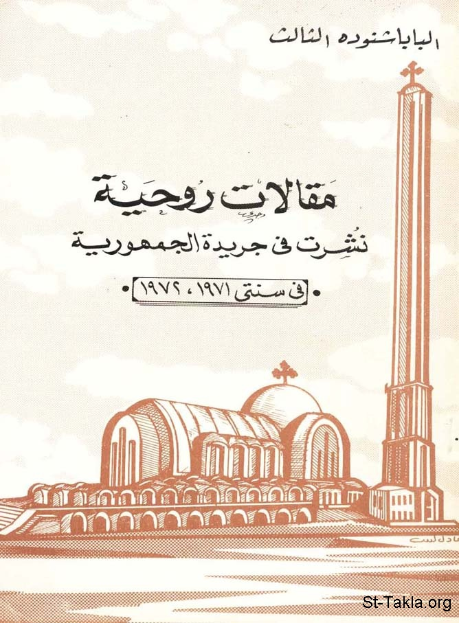

# مقالات روحية نُشِرَت في جريدة الجمهورية في سنتي 1971، 1972

**المؤلف / Author:** البابا شنودة الثالث
**المصدر / Source:** [st-takla.org](https://st-takla.org/Full-Free-Coptic-Books/His-Holiness-Pope-Shenouda-III-Books-Online/02-Spiritual-Articles/00-Makalat-Rohia-Pope-Shenoda-Third-index.html)
**الموضوعات / Topics:** —

📘 **[Download EPUB / تحميل الكتاب](spiritual-articles.epub)**

## نبذة

← بيانات الكتاب: الطبعة الأولى، نوفمبر 1985 م.، القاهرة، مطبعة الأنبا رويس (الأوفست) بالعباسية، رقم الإيداع بدار الكتب: 7200/1985 م.

## الفصول / Chapters (33)

1. [قصة هذا الكتاب - كتاب مقالات روحية نشرت في جريدة الجمهورية](chapters/01-introduction/)
2. [ما هو الخير؟ - كتاب مقالات روحية نشرت في جريدة الجمهورية](chapters/02-01-Ma-Howa-Al-Keir__What-Is-Good/)
3. [الإنسان الخير - كتاب مقالات روحية نشرت في جريدة الجمهورية](chapters/03-02-Al-Insan-Al-Khayer__Good-Human/)
4. [كلمة أخرى عن الخير - كتاب مقالات روحية نشرت في جريدة الجمهورية](chapters/04-03-Kelma-Okhra-3an-Al-Kheer__Another-Word-About-Good/)
5. [مقياس الطول ومقياس العمق](chapters/05-04-Mekias-El-Toul-Wa-Mekias-Al-3omk__Measures-Height-Depth/)
6. [بين السرعة والبطء - كتاب مقالات روحية نشرت في جريدة الجمهورية](chapters/06-05-Bein-El-Sor3a-Wal-Bot2__Between-Speed-And-Slackening/)
7. [أنصاف الحقائق - كتاب مقالات روحية نشرت في جريدة الجمهورية](chapters/07-06-Ansaf-El-7aka2ek__Half-Truths/)
8. [رحلة الخبر إلى أذنيك - كتاب مقالات روحية نشرت في جريدة الجمهورية](chapters/08-07-Re7let-El-Khabar-Ila-Othoneik__News-Trip-To-Your-Ears/)
9. [القلب الكبير - كتاب مقالات روحية نشرت في جريدة الجمهورية](chapters/09-08-Al-Alb-El-Kabir__The-Big-Heart/)
10. [القلب الحنون - كتاب مقالات روحية نشرت في جريدة الجمهورية](chapters/10-09-Alkalb-Al-Hanoun__The-Compassionate-Heart/)
11. [الذين يعطون - كتاب مقالات روحية نشرت في جريدة الجمهورية](chapters/11-10-Allathin-Yo3toon__Those-Who-Give/)
12. [القلب المطمئن المملوء بالسلام - كتاب مقالات روحية نشرت في جريدة الجمهورية](chapters/12-11-AlAlb-Al-Motma2en__Reassuring-Heart/)
13. [جحيم الرغبات - كتاب مقالات روحية نشرت في جريدة الجمهورية](chapters/13-12-Ga7im-El-Raghabat__Hell-Of-Desires/)
14. [يعيش خارج نفسه - كتاب مقالات روحية نشرت في جريدة الجمهورية](chapters/14-13-Ya3ish-Khareg-Nafso__Living-Outside-One-s-Self/)
15. [المحبة هي قمة الفضائل جميعا - كتاب مقالات روحية نشرت في جريدة الجمهورية](chapters/15-14-Al-Mahaba-Heya-Kemat-Al-Fada2el__Love-Peak-Of-Virtues/)
16. [كيف تحب الناس ويحبك الناس؟ - كتاب مقالات روحية نشرت في جريدة الجمهورية](chapters/16-15-Kaifa-To7eb-Al-Nas-Wa-Yohebak-Al-Nas__How-2-Love/)
17. [الأسرة السعيدة يجمعها الفهم والحب - كتاب مقالات روحية نشرت في جريدة الجمهورية](chapters/17-16-Al-Osra-Al-Sa3ida-Yagma3ha-Al-Fahm-Wal-Hob__Happy-Family/)
18. [فلسفة الأخذ والعطاء - كتاب مقالات روحية نشرت في جريدة الجمهورية](chapters/18-17-Falsafat-Al-Akhth-Wal-3ata2__Philosophy-Of-Give-And-Take/)
19. [الذاتية و إنكار الذات - كتاب مقالات روحية نشرت في جريدة الجمهورية](chapters/19-18-Al-Thateya-Wa-Enkar-Althat__Self-Denial-And-Self/)
20. [التواضع هو الفضيلة الأولى](chapters/20-19-Altawado3-Heya-Al-Fadila-Al-Oula_Modesty-1st-Virtue/)
21. [محبة المديح و الكرامة - كتاب مقالات روحية نشرت في جريدة الجمهورية](chapters/21-20-Mahabet-Al-Madih-Wal-Karama__Love-Praise-And-Dignity/)
22. [ما هي الصلاة و كيف تكون الصلاه؟ - كتاب مقالات روحية نشرت في جريدة الجمهورية](chapters/22-21-Ma-Heya-Al-Salah-Wa-Kifa-Takon__Prayer-And-How-To-Be/)
23. [الإيمان العملي - كتاب مقالات روحية نشرت في جريدة الجمهورية](chapters/23-22-Al-Eman-Al-3amaly__Belief-And-Practice/)
24. [التوبة - كتاب مقالات روحية نشرت في جريدة الجمهورية](chapters/24-23-Al-Tooba__Repentance/)
25. [محاسبة النفس - كتاب مقالات روحية نشرت في جريدة الجمهورية](chapters/25-24-Mohasabat-Al-Nafs__Self-Assessment/)
26. [لا تغط أخطائك بالأعذار - كتاب مقالات روحية نشرت في جريدة الجمهورية](chapters/26-25-La-Toghaty-Akhta2ak-Bel-A3thar__Covering-Mistakes-Excuses/)
27. [ثياب الحملان - كتاب مقالات روحية نشرت في جريدة الجمهورية](chapters/27-26-Thiab-Al-Hemlan_Sheep-s-Clothing/)
28. [نقاوة الأفكار - كتاب مقالات روحية نشرت في جريدة الجمهورية](chapters/28-27-Nakawat-Al-Afkar__Purity-Of-Thoughts/)
29. [الشهوة والخوف - كتاب مقالات روحية نشرت في جريدة الجمهورية](chapters/29-28-Al-Shahwa-Wal-Khawf__Lust-And-Fear/)
30. [التداريب الروحية - كتاب مقالات روحية نشرت في جريدة الجمهورية](chapters/30-29-Al-Tadareeb-Al-Rohia__Spiritual-Exercises/)
31. [بين الصمت والكلام - كتاب مقالات روحية نشرت في جريدة الجمهورية](chapters/31-30-Bein-Al-Samt-Wal-Kalam__Silence-VS-Talking/)
32. [فوائد النسيان - كتاب مقالات روحية نشرت في جريدة الجمهورية](chapters/32-31-Fawa2ed-Al-Nesian__Benefits-Of-Forgetfulness/)
33. [المجد أم الألم؟! (الاحتفال بأحد الشعانين) - كتاب مقالات روحية نشرت في جريدة الجمهورية](chapters/33-32-Al-Magd-Am-Al-Alam__Glory-Or-Pain/)

---
*هذا الكتاب مجاني للنشر والتوزيع لخلاص كل نفس. This book is free to share and distribute for the salvation of every soul.*
