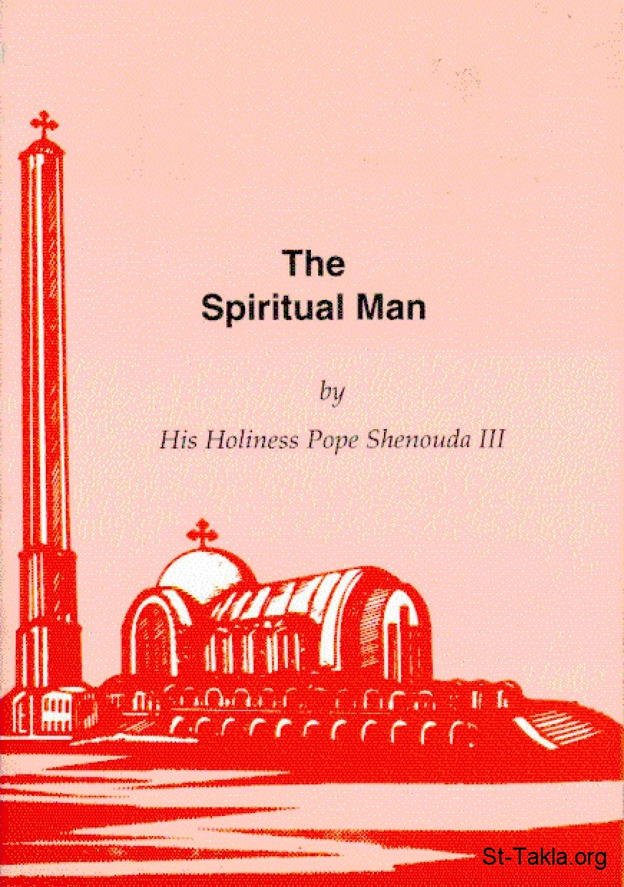

# The Spiritual Man
### The Spiritual Man

**المؤلف / Author:** H. H. Pope Shenouda III
**المصدر / Source:** [st-takla.org](https://st-takla.org/books/en/pope-shenouda-iii/spiritual-man/index.html)
**الموضوعات / Topics:** —

📘 **[Download EPUB / تحميل الكتاب](spiritual-man.epub)**

## نبذة

Chapter 2: The spiritual man Puts God first in all His concerns

## الفصول / Chapters (75)

1. [Introduction](chapters/01-introduction/)
2. [The image of God](chapters/02-image-of-god/)
3. [The spiritual man Puts God first in all His concerns](chapters/03-god-first/)
4. [Depth in prayer](chapters/04-depth-in-prayer/)
5. [The importance of depth](chapters/05-importance-of-depth/)
6. [The depth in giving](chapters/06-depth-in-giving/)
7. [The depth in preaching](chapters/07-depth-in-preaching/)
8. [The depth in the service](chapters/08-depth-in-the-service/)
9. [The depth in worship](chapters/09-depth-in-worship/)
10. [The depth of repentance](chapters/10-depth-of-repentance/)
11. [The depth of faith](chapters/11-depth-of-faith/)
12. [The depth in friendship and love](chapters/12-depth-in-friendship-love/)
13. [The depth of personality](chapters/13-depth-of-personality/)
14. [His heart is with God](chapters/14-heart-with-god/)
15. [A strong man](chapters/15-strong/)
16. [Sources of the spiritual strength and its reasons, aspects and elements](chapters/16-strength/)
17. [Sources of strength](chapters/17-sources-of-strength/)
18. [Elements of strength](chapters/18-elements-of-strength/)
19. [Types of weakness: causes and remedies](chapters/19-types-of-weakness-causes/)
20. [Types of weakness](chapters/20-weakness/)
21. [Our Stand From the Weak](chapters/21-the-weak/)
22. [Remedies for weakness](chapters/22-remedies-for-weakness/)
23. [Does not depend On his human hand](chapters/23-human-hand/)
24. [There are many types of rest](chapters/24-types-of-rest/)
25. [Do not make your comfort at the expense of others](chapters/25-your-comfort/)
26. [What is the meaning of rest?](chapters/26-meaning-of-rest/)
27. [Holy labour and rest By giving rest to others](chapters/27-holy-labour/)
28. [Lives by the spirit, Not by the letter](chapters/28-spirit-vs-letter/)
29. [Fasting](chapters/29-fasting/)
30. [Prostrations (metanias)](chapters/30-prostrations/)
31. [Prayer](chapters/31-prayer/)
32. [The Holy Kiss](chapters/32-holy-kiss/)
33. [Giving](chapters/33-giving/)
34. [The service](chapters/34-service/)
35. [The day of the lord](chapters/35-day-of-the-lord/)
36. [The rites](chapters/36-rites/)
37. [The dogma](chapters/37-dogma/)
38. [Between the spirit, The soul and the flesh](chapters/38-spirit-soul-flesh/)
39. [The spiritual level compared to the sensual and carnal levels](chapters/39-levels/)
40. [Examples of the three levels](chapters/40-three-levels/)
41. [Lust](chapters/41-lust/)
42. [Joy](chapters/42-joy/)
43. [Among his qualities: Self-control](chapters/43-self-control/)
44. [Tongue-control](chapters/44-tongue-control/)
45. [Thought-control](chapters/45-thought-contro/)
46. [Sense-control](chapters/46-sense-control/)
47. [Controlling eating and drinking](chapters/47-eating-drinking/)
48. [Concerning anger](chapters/48-anger/)
49. [In dogma and teaching](chapters/49-dogma-teaching/)
50. [In obedience and commitment](chapters/50-obedience-commitment/)
51. [In ambition and superiority](chapters/51-ambition-superiority/)
52. [In the whole life](chapters/52-whole-life/)
53. [Lives: above the level of what is seen](chapters/53-level-of-what-is-seen/)
54. [The Importance Of Being Integral](chapters/54-being-integral/)
55. [Simplicity and wisdom](chapters/55-simplicity-wisdom/)
56. [Kindness and strength](chapters/56-kindness-strength/)
57. [Love and firmness](chapters/57-love-firmness/)
58. [Gentleness and courage](chapters/58-gentleness-courage/)
59. [Love and fear](chapters/59-love-fear/)
60. [Service and contemplation](chapters/60-service-contemplation/)
61. [Talk and silence](chapters/61-talk-silence/)
62. [Tears and cheerfulness](chapters/62-tears-cheerfulness/)
63. [Mercy and justice](chapters/63-mercy-justice/)
64. [The danger of the one virtue](chapters/64-one-virtue/)
65. [The Importance Of Prosperity and its Qualities](chapters/65-prosperity/)
66. [The beginning and the end](chapters/66-beginning-end/)
67. [The problem of the prosperity of the wicked](chapters/67-prosperity-of-the-wicked/)
68. [Elements of success](chapters/68-success/)
69. [Lives according to the principle: “if we live, We live to the lord”](chapters/69-we-live-to-the-lord/)
70. [Sinful aims](chapters/70-sinful-aims/)
71. [Why do we live to the lord?](chapters/71-live-to-the-lord/)
72. [How do we live to the lord?](chapters/72-live-to-the-lord-how/)
73. [What is the meaning of: “we die to the lord”?](chapters/73-we-die-to-the-lord/)
74. [The life of victory and triumph](chapters/74-victory-triumph/)
75. [The life of victory.. And the war is for God](chapters/75-war-is-for-god/)

---
*هذا الكتاب مجاني للنشر والتوزيع لخلاص كل نفس. This book is free to share and distribute for the salvation of every soul.*
