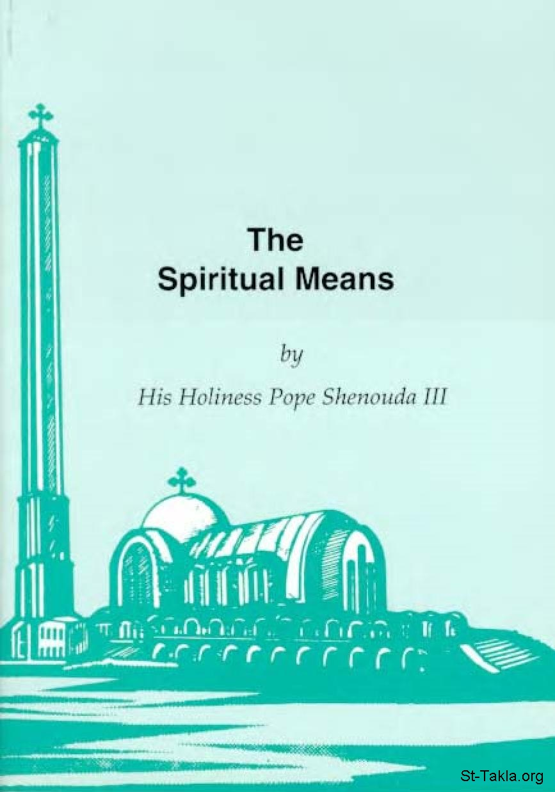

# The Spiritual Means
### The Spiritual Means

**المؤلف / Author:** H. H. Pope Shenouda III
**المصدر / Source:** [st-takla.org](https://st-takla.org/books/en/pope-shenouda-iii/spiritual-means/index.html)
**الموضوعات / Topics:** —

📘 **[Download EPUB / تحميل الكتاب](spiritual-means.epub)**

## نبذة

“For as many as are led by the Spirit of God, these are sons of God” (Rom 8:14).

## الفصول / Chapters (45)

1. [Prayer: What is it? And how should it be?](chapters/01-prayer/)
2. [Conditions of the acceptable prayer](chapters/02-prayer-acceptable/)
3. [Exercises in prayer](chapters/03-prayer-exercises/)
4. [The Importance of the Holy Bible](chapters/04-bible/)
5. [The Importance of the Holy Bible in the Church](chapters/05-bible-church/)
6. [Your relationship with the Holy Bible](chapters/06-bible-you/)
7. [The Effect of the Holy Bible](chapters/07-bible-effects/)
8. [The Work of the Holy Bible in You](chapters/08-bible-work/)
9. [Your Use off the Bible](chapters/09-bible-use/)
10. [The Bible in your house](chapters/10-bible-house/)
11. [Reading the lives of the saints](chapters/11-hagiography/)
12. [Contemplation](chapters/12-contemplation/)
13. [Contemplation on the Holy Bible](chapters/13-contemplation-bible/)
14. [Contemplating on Nature](chapters/14-contemplation-nature/)
15. [Contemplating on Events](chapters/15-contemplation-events/)
16. [Contemplating on Prayer](chapters/16-contemplation-prayer/)
17. [Contemplating on death and judgment](chapters/17-contemplation-death/)
18. [Contemplating on God’s attributes](chapters/18-contemplation-god/)
19. [Other Subjects For Contemplation](chapters/19-contemplation-subjects/)
20. [Benefits of spiritual training](chapters/20-training/)
21. [Remarks Concerning Spiritual Training](chapters/21-training-remarks/)
22. [The importance of giving account of oneself](chapters/22-account-of-oneself/)
23. [How to give account of yourself](chapters/23-account-of-yourself/)
24. [When does giving an account of oneself take place](chapters/24-account/)
25. [Confession and its Elements](chapters/25-confession/)
26. [Feelings of the Confessor](chapters/26-confessor/)
27. [Confession and the Blood of Christ](chapters/27-blood-of-christ/)
28. [Advices for Confessors](chapters/28-advices-for-confessors/)
29. [The Importance of Holy Communion and its Benefits](chapters/29-holy-communion/)
30. [Preparation for Holy Communion](chapters/30-holy-communion-preparation/)
31. [The benefits and the importance of fasting](chapters/31-fasting/)
32. [The acceptable spiritual fasting](chapters/32-fasting-acceptable/)
33. [Mixing fasting with virtues](chapters/33-fasting-virtues/)
34. [Blessing the act of giving](chapters/34-giving/)
35. [How do you give?](chapters/35-how-do-you-give/)
36. [God’s sharing in your possessions](chapters/36-possessions-and-god/)
37. [The tithes](chapters/37-tithes/)
38. [The firstlings](chapters/38-firstlings/)
39. [The vows](chapters/39-vows/)
40. [The oblations](chapters/40-oblations/)
41. [The importance of the service and its generality](chapters/41-service/)
42. [Types of service](chapters/42-service-types/)
43. [The spiritual benefits of the service](chapters/43-service-benefits/)
44. [Unseen service](chapters/44-service-unseen/)
45. [Conditions of the successful service](chapters/45-service-conditions/)

---
*هذا الكتاب مجاني للنشر والتوزيع لخلاص كل نفس. This book is free to share and distribute for the salvation of every soul.*
