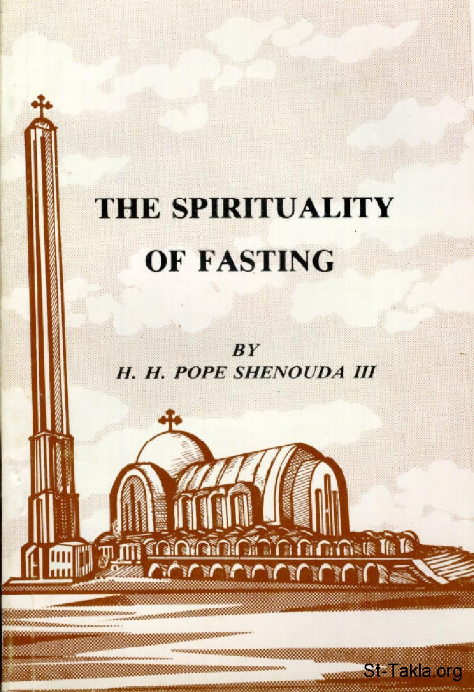

# The Spirituality of Fasting
### The Spirituality of Fasting

**المؤلف / Author:** H. H. Pope Shenouda III
**المصدر / Source:** [st-takla.org](https://st-takla.org/books/en/pope-shenouda-iii/spirituality-of-fasting/index.html)
**الموضوعات / Topics:** —

📘 **[Download EPUB / تحميل الكتاب](spirituality-of-fasting.epub)**

## الفصول / Chapters (49)

1. [Introduction](chapters/01-introduction/)
2. [On The Mount of Transfiguration](chapters/02-mount-of-transfiguration/)
3. [Fasting is the earliest commandment](chapters/03-earliest-commandment/)
4. [Thus did Prophets fast](chapters/04-prophets/)
5. [The Apostles also fasted](chapters/05-apostles/)
6. [Fasting of the whole nations](chapters/06-whole-nations/)
7. [Nations also fasted](chapters/07-nations/)
8. [Fasting is a gift](chapters/08-gift/)
9. [Fasting precedes every grace and service](chapters/09-precedes-every-grace-and-service/)
10. [Fasting precedes the Church sacraments](chapters/10-precedes-the-church-sacraments/)
11. [Through fasting, God intervenes](chapters/11-god-intervenes/)
12. [Joy of Fasting](chapters/12-joy/)
13. [A way of life](chapters/13-a-way-of-life/)
14. [Fasting and Martyrdom](chapters/14-martyrdom/)
15. [Definition of fasting](chapters/15-definition/)
16. [Period of Abstinence](chapters/16-period-of-abstinence/)
17. [The Element of Hunger](chapters/17-element-of-hunger/)
18. [Fasting and Wakefulness](chapters/18-wakefulness/)
19. [Kind of Food](chapters/19-kind-of-food/)
20. [Vegetarian Food](chapters/20-vegetarian-food/)
21. [The Benefits of Fasting to the Body](chapters/21-benefits-to-body/)
22. [Fasting is not a Mere Bodily Virtue](chapters/22-not-a-mere-bodily-virtue/)
23. [Care not for the Body](chapters/23-care-not-for-the-body/)
24. [The Meaning of “Consecrate a Fast”](chapters/24-consecrate-a-fast/)
25. [Is the Lord the Aim of your Fast?](chapters/25-the-lord-the-aim-of-your-fast/)
26. [Erroneous and Rejected Fasts](chapters/26-erroneous-and-rejected-fasts/)
27. [What is the Relationship between God and your Fast?](chapters/27-god-and-your-fast/)
28. [The Great Lent](chapters/28-great-lent/)
29. [Virtues Accompany Fasting](chapters/29-virtues-accompany/)
30. [Fasting Accompanies Repentance](chapters/30-accompanies-repentance/)
31. [Fasting Accompanies Prayer and Worship](chapters/31-accompanies-prayer-and-worship/)
32. [Fasting is Accompanied by Self-abasement and Weeping](chapters/32-self-abasement-and-weeping/)
33. [Fasting Accompanies Seclusion and Stillness](chapters/33-seclusion-and-stillness/)
34. [Fasting of the Tongue, Thought, and Heart](chapters/34-tongue--thought--and-heart/)
35. [Fasting Accompanies Self-control](chapters/35-self-control/)
36. [Vanquishing the body](chapters/36-vanquishing-the-body/)
37. [Asceticism](chapters/37-asceticism/)
38. [Fasting Accompanies Charity](chapters/38-charity/)
39. [Fasting is Accompanied by Prostration](chapters/39-prostration/)
40. [Drills while Fasting](chapters/40-drills/)
41. [Drills Pertaining to Fasting](chapters/41-pertaining-to-fasting/)
42. [Drills Pertaining to Repentance](chapters/42-repentance/)
43. [Solitude and Silence Drills](chapters/43-solitude-and-silence-drills/)
44. [Avoiding Lost Time](chapters/44-avoiding-lost-time/)
45. [Penitence and Self-abasement Drills](chapters/45-penitence-and-self-abasement-drills/)
46. [Memorisation Drills](chapters/46-memorisation-drills/)
47. [Prayer Drills](chapters/47-prayer-drills/)
48. [Other Spiritual Drills](chapters/48-other-spiritual-drills/)
49. [Drills in certain virtues](chapters/49-drills-in-certain-virtues/)

---
*هذا الكتاب مجاني للنشر والتوزيع لخلاص كل نفس. This book is free to share and distribute for the salvation of every soul.*
