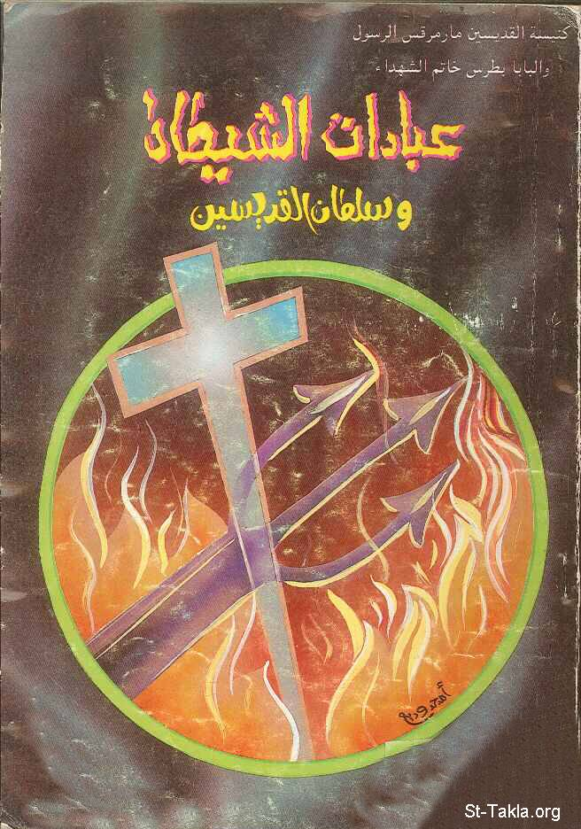

# عبادات الشياطين وسلطان القديسين

**المؤلف / Author:** حلمي القمص يعقوب
**المصدر / Source:** [st-takla.org](https://st-takla.org/Full-Free-Coptic-Books/FreeCopticBooks-021-Sts-Church-Sidi-Beshr/003-3ebadat-Al-Shaitan/Satanism-000-index.html)
**الموضوعات / Topics:** —

📘 **[Download EPUB / تحميل الكتاب](3ebadat-al-shaitan.epub)**

## نبذة

نشكر الأستاذ حلمي القمص يعقوب على السماح لنا في موقع الأنبا تكلا هيمانوت بوضع هذا الكتاب هنا. وهو أحد كتب سلسلة اقرأ وأفهم استقامة كنيستنا .

## الفصول / Chapters (102)

1. [عبادة الشيطان - كتاب عبادات الشيطان وسلطان القديسين](chapters/01-Satanism-001-Intro/)
2. [لماذا خلق الله الشيطان؟ - كتاب عبادات الشيطان وسلطان القديسين](chapters/02-Satanism-002-Why/)
3. [لماذا يغوينا الشيطان؟ ولماذا لم يفنى؟ - كتاب عبادات الشيطان وسلطان القديسين](chapters/03-Satanism-003-Die/)
4. [ما هي ألقاب الشيطان؟ - كتاب عبادات الشيطان وسلطان القديسين](chapters/04-Satanism-004-Names/)
5. [ما هي الممارسات الشيطانية؟ - كتاب عبادات الشيطان وسلطان القديسين](chapters/05-Satanism-005-What/)
6. [السحر - كتاب عبادات الشيطان وسلطان القديسين](chapters/06-Satanism-006-Magic/)
7. [العرافة - كتاب عبادات الشيطان وسلطان القديسين](chapters/07-Satanism-007-Divination/)
8. [تحضير الأرواح - كتاب عبادات الشيطان وسلطان القديسين](chapters/08-Satanism-008-Spirits/)
9. [مخاطر تحضير الأرواح - كتاب عبادات الشيطان وسلطان القديسين](chapters/09-Satanism-009-Dangers/)
10. [استشارة الموتى](chapters/10-Satanism-010-Dead/)
11. [الزار - كتاب عبادات الشيطان وسلطان القديسين](chapters/11-Satanism-011-Zaar/)
12. [الفودو - كتاب عبادات الشيطان وسلطان القديسين](chapters/12-Satanism-012-Voodoo/)
13. [التنجيم - كتاب عبادات الشيطان وسلطان القديسين](chapters/13-Satanism-013-Tangim/)
14. [قراءة الطالع - كتاب عبادات الشيطان وسلطان القديسين](chapters/14-Satanism-014-Tale3/)
15. [التنويم المغناطيسي - كتاب عبادات الشيطان وسلطان القديسين](chapters/15-Satanism-015-Tanweem/)
16. [الألعاب السحرية - كتاب عبادات الشيطان وسلطان القديسين](chapters/16-Satanism-016-Al3ab/)
17. [التخاطب - كتاب عبادات الشيطان وسلطان القديسين](chapters/17-Satanism-017-Takahtor/)
18. [اليوجا - كتاب عبادات الشيطان وسلطان القديسين](chapters/18-Satanism-018-Youga/)
19. [ما هي العبادات الشيطانية؟ - كتاب عبادات الشيطان وسلطان القديسين](chapters/19-Satanism-019-Adoring/)
20. [الماسونية - كتاب عبادات الشيطان وسلطان القديسين](chapters/20-Satanism-020-Masonic/)
21. [البهائية](chapters/21-Satanism-021-Bahaii/)
22. [كنيسة العلم المسيحي - كتاب عبادات الشيطان وسلطان القديسين](chapters/22-Satanism-022-Christian-Science/)
23. [الثيؤصوفية - كتاب عبادات الشيطان وسلطان القديسين](chapters/23-Satanism-023-Theosophy/)
24. [كنيسة الله في كل أنحاء العالم - كتاب عبادات الشيطان وسلطان القديسين](chapters/24-Satanism-024-Church/)
25. [منهج الطريق - كتاب عبادات الشيطان وسلطان القديسين](chapters/25-Satanism-025-Road/)
26. [جماعة أطفال الرب - كتاب عبادات الشيطان وسلطان القديسين](chapters/26-Satanism-026-Children/)
27. [المونيز - كتاب عبادات الشيطان وسلطان القديسين](chapters/27-Satanism-027-Moniz/)
28. [الشامانية - كتاب عبادات الشيطان وسلطان القديسين](chapters/28-Satanism-028-Shamany/)
29. [السانتيريا - كتاب عبادات الشيطان وسلطان القديسين](chapters/29-Satanism-029-Santira/)
30. [البوذية - كتاب عبادات الشيطان وسلطان القديسين](chapters/30-Satanism-030-Bozzy/)
31. [الفيدية - كتاب عبادات الشيطان وسلطان القديسين](chapters/31-Satanism-031-Vidia/)
32. [البرهمية - كتاب عبادات الشيطان وسلطان القديسين](chapters/32-Satanism-032-Brahmia/)
33. [الجينية - كتاب عبادات الشيطان وسلطان القديسين](chapters/33-Satanism-033-Ginia/)
34. [السامكيهية - كتاب عبادات الشيطان وسلطان القديسين](chapters/34-Satanism-034-Samkihia/)
35. [مهير بابا - كتاب عبادات الشيطان وسلطان القديسين](chapters/35-Satanism-035-Mahir-Baba/)
36. [التأمل الذي يفوق الخبرة البشرية - كتاب عبادات الشيطان وسلطان القديسين](chapters/36-Satanism-036-Contemplation/)
37. [كريشنا - كتاب عبادات الشيطان وسلطان القديسين](chapters/37-Satanism-037-Chrishna/)
38. [جماعة التنوير الروحي - كتاب عبادات الشيطان وسلطان القديسين](chapters/38-Satanism-038-Tanwir/)
39. [جماعة معبد الشعب - كتاب عبادات الشيطان وسلطان القديسين](chapters/39-Satanism-039-People/)
40. [الأهراميون - كتاب عبادات الشيطان وسلطان القديسين](chapters/40-Satanism-040-Pyramids/)
41. [المورمون](chapters/41-Satanism-041-Mormon-01/)
42. [جوزيف سميث مؤسس المورمون - كتاب عبادات الشيطان وسلطان القديسين](chapters/42-Satanism-042-Joseph-Smith/)
43. [تأسيس كنيسة يسوع المسيح لقديسي الأيام الأخيرة - كتاب عبادات الشيطان وسلطان القديسين](chapters/43-Satanism-043-Last-Days/)
44. [بنود إيمان جماعة مورمون - كتاب عبادات الشيطان وسلطان القديسين](chapters/44-Satanism-044-Mormon-02-Fatih/)
45. [معتقدات المرمون - كتاب عبادات الشيطان وسلطان القديسين](chapters/45-Satanism-045-Mormon-03-Creed/)
46. [اكتشاف كتاب مورمون - كتاب عبادات الشيطان وسلطان القديسين](chapters/46-Satanism-046-Mormon-07-Book-1/)
47. [المورمون - كتاب عبادات الشيطان وسلطان القديسين](chapters/47-Satanism-047-Mormon-08-Book-2/)
48. [خطورة الممارسات والعبادات الشيطانية - كتاب عبادات الشيطان وسلطان القديسين](chapters/48-Satanism-048-Problems/)
49. [علاقة العبادة الوثنية بالممارسات الشيطانية - كتاب عبادات الشيطان وسلطان القديسين](chapters/49-Satanism-049-Relation/)
50. [لماذا انجرف العالم نحو الممارسات الشيطانية - كتاب عبادات الشيطان وسلطان القديسين](chapters/50-Satanism-050-World/)
51. [51- خدعة البداية المريحة في الممارسات الشيطانية - كتاب عبادات الشيطان وسلطان القديسين](chapters/51-Satanism-051-Nice/)
52. [هل من سعادة في الممارسة الشيطانية](chapters/52-Satanism-052-Happiness/)
53. [الساحر أم الشيطان - كتاب عبادات الشيطان وسلطان القديسين](chapters/53-Satanism-053-Magician/)
54. [خطورة السلوك في الممارسات الشيطانية - كتاب عبادات الشيطان وسلطان القديسين](chapters/54-Satanism-054-Staying/)
55. [انهيار القيم الإنسانية للمجتمع - كتاب عبادات الشيطان وسلطان القديسين](chapters/55-Satanism-055-Falling/)
56. [كيف وصلت عبادة الشيطان إلى مصر؟ - كتاب عبادات الشيطان وسلطان القديسين](chapters/56-Satanism-056-Egypt/)
57. [لماذا يعبدون الشيطان؟ - كتاب عبادات الشيطان وسلطان القديسين](chapters/57-Satanism-057-Adore/)
58. [ما هي سمات عبدة الشيطان؟ - كتاب عبادات الشيطان وسلطان القديسين](chapters/58-Satanism-058-Marks/)
59. [شرب الدماء](chapters/59-Satanism-059-Blood/)
60. [نذر الشيطان](chapters/60-Satanism-060-666/)
61. [ما هي علاقة عبادة الشيطان بالجنس الجماعي؟ - كتاب عبادات الشيطان وسلطان القديسين](chapters/61-Satanism-061-Sex/)
62. [انتهاك حرمة القبور - كتاب عبادات الشيطان وسلطان القديسين](chapters/62-Satanism-062-Tombs-1/)
63. [عبادات الشيطان والعنف - كتاب عبادات الشيطان وسلطان القديسين](chapters/63-Satanism-063-Violence/)
64. [الشيطان المظلوم الشهيد! - كتاب عبادات الشيطان وسلطان القديسين](chapters/64-Satanism-064-Tawfik-El-Hakim/)
65. [قصة قصر البارون - كتاب عبادات الشيطان وسلطان القديسين](chapters/65-Satanism-065-Kasr-El-Baroun/)
66. [التحقيق في قضية عبد الشيطان في مصر - كتاب عبادات الشيطان وسلطان القديسين](chapters/66-Satanism-066-Case/)
67. [تقرير نيابة أمن الدولة حول عبدة الشيطان المصريين - كتاب عبادات الشيطان وسلطان القديسين](chapters/67-Satanism-067-Amn-El-Dawla/)
68. [أسباب السقوط في الممارسات والعبادات الشيطانية - كتاب عبادات الشيطان وسلطان القديسين](chapters/68-Satanism-068-Reasons/)
69. [الفراغ - كتاب عبادات الشيطان وسلطان القديسين](chapters/69-Satanism-069-Sparetime/)
70. [غياب الوعي الأسري - كتاب عبادات الشيطان وسلطان القديسين](chapters/70-Satanism-070-Family/)
71. [الشهوات الجامحة - كتاب عبادات الشيطان وسلطان القديسين](chapters/71-Satanism-071-Lust/)
72. [التقليد الأعمى - كتاب عبادات الشيطان وسلطان القديسين](chapters/72-Satanism-072-Copycat/)
73. [الوسط المنحرف - كتاب عبادات الشيطان وسلطان القديسين](chapters/73-Satanism-073-Around/)
74. [إغراء الموسيقى الشيطانية - كتاب عبادات الشيطان وسلطان القديسين](chapters/74-Satanism-074-Music/)
75. [طلب الشهرة - كتاب عبادات الشيطان وسلطان القديسين](chapters/75-Satanism-075-Fame/)
76. [محاولة تحقيق الذات - كتاب عبادات الشيطان وسلطان القديسين](chapters/76-Satanism-076-Ego/)
77. [ما هي جذور عبادة الشيطان في التاريخ؟ - كتاب عبادات الشيطان وسلطان القديسين](chapters/77-Satanism-077-History/)
78. [ما مدى تأثر العالم بعبادة الشيطان اليوم؟ - كتاب عبادات الشيطان وسلطان القديسين](chapters/78-Satanism-078-Today/)
79. [لماذا لا نحب الشيطان ونصادقه حتى نأمن شرّه؟! - كتاب عبادات الشيطان وسلطان القديسين](chapters/79-Satanism-079-Befriend/)
80. [هل ظلم الله الشيطان؟! - كتاب عبادات الشيطان وسلطان القديسين](chapters/80-Satanism-080-Injustice/)
81. [هل العقد مع الشيطان حقيقة؟ - كتاب عبادات الشيطان وسلطان القديسين](chapters/81-Satanism-081-Contract/)
82. [أنطوان ليفي مؤسس كنيسة الشيطان - كتاب عبادات الشيطان وسلطان القديسين](chapters/82-Satanism-082-Anton-Levy/)
83. [كنيسة الشيطان](chapters/83-Satanism-083-Church-of-Satan/)
84. [وصف مبنى كنيسة الشيطان في سان فرانسيسكو - كتاب عبادات الشيطان وسلطان القديسين](chapters/84-Satanism-084-Building/)
85. [طقوس عبادة الشيطان - كتاب عبادات الشيطان وسلطان القديسين](chapters/85-Satanism-085-Rites-1/)
86. [المفاتيح السبعة - كتاب عبادات الشيطان وسلطان القديسين](chapters/86-Satanism-086-Keys/)
87. [إنجيل الشيطان](chapters/87-Satanism-087-Satans-Bible/)
88. [القداس الأسود](chapters/88-Satanism-088-Black-Mass/)
89. [قداس الروح القدس](chapters/89-Satanism-089-Liturgy/)
90. [طقوس الانضمام لجماعة عبدة الشيطان - كتاب عبادات الشيطان وسلطان القديسين](chapters/90-Satanism-090-Rituals-2/)
91. [علاقة عبادة الشيطان بنبش القبور - كتاب عبادات الشيطان وسلطان القديسين](chapters/91-Satanism-091-Tombs-2/)
92. [الفسق والفجور في عبادة الشيطان - كتاب عبادات الشيطان وسلطان القديسين](chapters/92-Satanism-092-Debauchery/)
93. [الدم والذبائح البشرية في عبادة الشيطان - كتاب عبادات الشيطان وسلطان القديسين](chapters/93-Satanism-093-Human-Sacrifice/)
94. [الأفلام السينمائية الشيطانية](chapters/94-Satanism-094-Movies/)
95. [جزاء المرتدين عن جماعة عبدة الشيطان - كتاب عبادات الشيطان وسلطان القديسين](chapters/95-Satanism-095-Apostate/)
96. [سلطان القديسين على الشيطان - كتاب عبادات الشيطان وسلطان القديسين](chapters/96-Satanism-096-Power/)
97. [هل للشيطان سلطان على جميع البشر؟ - كتاب عبادات الشيطان وسلطان القديسين](chapters/97-Satanism-097-All/)
98. [مصدر السلطان للقديسين على الشيطان - كتاب عبادات الشيطان وسلطان القديسين](chapters/98-Satanism-098-Saints/)
99. [أمثلة لسلطان القديسين على الشيطان - كتاب عبادات الشيطان وسلطان القديسين](chapters/99-Satanism-099-Examples/)
100. [منع الكنيسة من التعامل مع السحرة والعرافين - كتاب عبادات الشيطان وسلطان القديسين](chapters/100-Satanism-100-Forbid/)
101. [الخلاص لمن سقط في الممارسات الشيطانية وعبادة الشيطان](chapters/101-Satanism-101-Salvation/)
102. [مقتطفات من مهاجمة الأنبا شنوده رئيس المتوحدين للشيطان](chapters/102-Satanism-102-St-Shenouda/)

---
*هذا الكتاب مجاني للنشر والتوزيع لخلاص كل نفس. This book is free to share and distribute for the salvation of every soul.*
