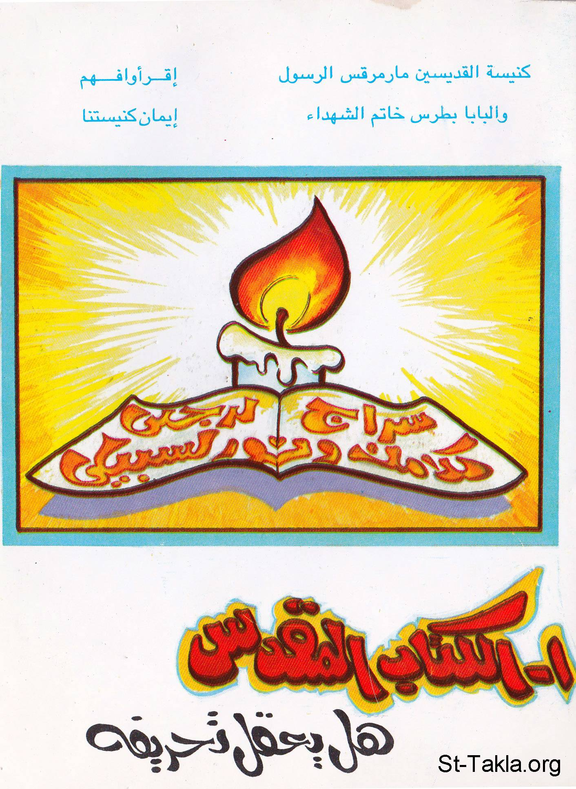

# الكتاب المقدس: هل يُعقَل تحريفه؟!

**المؤلف / Author:** كنيسة القديسين بسيدي بشر بالإسكندرية
**المصدر / Source:** [st-takla.org](https://st-takla.org/Full-Free-Coptic-Books/FreeCopticBooks-021-Sts-Church-Sidi-Beshr/001-Al-Ketab-Al-Mokaddas-Hal-Yo3kal-Ta7rifo/Distortion-of-the-Holy-Bible-Is-It-Possible__00-index.html)
**الموضوعات / Topics:** —

📘 **[Download EPUB / تحميل الكتاب](al-ketab-al-mokaddas-hal-yo3kal-ta7rifo.epub)**

## نبذة

أولًا، نشكر الأستاذ حلمي القمص يعقوب الأخ الخادم بكنيسة القديسين بسيدي بشر بالإسكندرية كاتب هذا البحث على السماح لموقع الأنبا تكلا بوضعه هنا.. وهو أحد كتب سلسلة " أقرأ وافهم إيمان كنيستنا ".

## الفصول / Chapters (51)

1. [الحبل المثلوث لا ينقطع سريعًا - كتاب الكتاب المقدس: هل يُعقَل تحريفه؟](chapters/01-Distortion-of-the-Holy-Bible-Is-It-Possible__01-Friends/)
2. [إلى دير الملاك - كتاب الكتاب المقدس: هل يُعقَل تحريفه؟](chapters/02-Distortion-of-the-Holy-Bible-Is-It-Possible__02-Monastery/)
3. [جلسة هادئة - كتاب الكتاب المقدس: هل يُعقَل تحريفه؟](chapters/03-Distortion-of-the-Holy-Bible-Is-It-Possible__03-Meeting-1/)
4. [زمان كتابة الكتاب المقدس - كتاب الكتاب المقدس: هل يُعقَل تحريفه؟](chapters/04-Distortion-of-the-Holy-Bible-Is-It-Possible__04-Time/)
5. [أماكن كتابة الكتاب المقدس - كتاب الكتاب المقدس: هل يُعقَل تحريفه؟](chapters/05-Distortion-of-the-Holy-Bible-Is-It-Possible__05-Places/)
6. [كُتَّاب الكتاب المقدس - كتاب الكتاب المقدس: هل يُعقَل تحريفه؟](chapters/06-Distortion-of-the-Holy-Bible-Is-It-Possible__06-Writers/)
7. [أسفار الكتاب المقدس - كتاب الكتاب المقدس: هل يُعقَل تحريفه؟](chapters/07-Distortion-of-the-Holy-Bible-Is-It-Possible__07-Books/)
8. [التدرج في معاملات الله مع البشرية - كتاب الكتاب المقدس: هل يُعقَل تحريفه؟](chapters/08-Distortion-of-the-Holy-Bible-Is-It-Possible__08-Steps-1/)
9. [التدرج: الزنا - الطلاق - شريعة الزوجة الواحدة - كتاب الكتاب المقدس: هل يُعقَل تحريفه؟](chapters/09-Distortion-of-the-Holy-Bible-Is-It-Possible__09-Steps-2-Sex/)
10. [التدرج في التسامح بين العهد القديم والجديد - كتاب الكتاب المقدس: هل يُعقَل تحريفه؟](chapters/10-Distortion-of-the-Holy-Bible-Is-It-Possible__10-Steps-3-Tolerance/)
11. [انتشار الكتاب المقدس - كتاب الكتاب المقدس: هل يُعقَل تحريفه؟](chapters/11-Distortion-of-the-Holy-Bible-Is-It-Possible__11-Spreading/)
12. [12- تأثير الكتاب المقدس - كتاب الكتاب المقدس: هل يُعقَل تحريفه؟](chapters/12-Distortion-of-the-Holy-Bible-Is-It-Possible__12-Effect/)
13. [صمود الكتاب المقدس ضد كل هجمات الشيطان - كتاب الكتاب المقدس: هل يُعقَل تحريفه؟](chapters/13-Distortion-of-the-Holy-Bible-Is-It-Possible__13-Perseverance/)
14. [الشهيد الشماس تيموثاوس زوج الشهيدة مورة - كتاب الكتاب المقدس: هل يُعقَل تحريفه؟](chapters/14-Distortion-of-the-Holy-Bible-Is-It-Possible__14-Martyr-Temothawos/)
15. [جلسة تأمل - كتاب الكتاب المقدس: هل يُعقَل تحريفه؟](chapters/15-Distortion-of-the-Holy-Bible-Is-It-Possible__15-Meeting-2/)
16. [شهادة الكتاب المقدس لنفسه من حيث صحة النبوات - كتاب الكتاب المقدس: هل يُعقَل تحريفه؟](chapters/16-Distortion-of-the-Holy-Bible-Is-It-Possible__16-Prophecies/)
17. [شهادة التاريخ لكتابنا المقدس - كتاب الكتاب المقدس: هل يُعقَل تحريفه؟](chapters/17-Distortion-of-the-Holy-Bible-Is-It-Possible__17-History/)
18. [النسخة الفاتيكانية - كتاب الكتاب المقدس: هل يُعقَل تحريفه؟](chapters/18-Distortion-of-the-Holy-Bible-Is-It-Possible__18-Manuscripts-Vatican/)
19. [النسخة السينائية - كتاب الكتاب المقدس: هل يُعقَل تحريفه؟](chapters/19-Distortion-of-the-Holy-Bible-Is-It-Possible__19-Manuscripts-Sinai/)
20. [النسخة الإسكندرية - كتاب الكتاب المقدس: هل يُعقَل تحريفه؟](chapters/20-Distortion-of-the-Holy-Bible-Is-It-Possible__20-Manuscripts-Alexandria/)
21. [النسخة الإفرامية](chapters/21-Distortion-of-the-Holy-Bible-Is-It-Possible__21-Manuscripts-Ephram-Akhmim/)
22. [مخطوطة جون رايلاند](chapters/22-Distortion-of-the-Holy-Bible-Is-It-Possible__22-John-Rayland-Bahnasa-Bise/)
23. [طائفة الكتبة في دير الأنبا بيشوي - كتاب الكتاب المقدس: هل يُعقَل تحريفه؟](chapters/23-Distortion-of-the-Holy-Bible-Is-It-Possible__23-Scribes/)
24. [جداول الكتاب المقدس](chapters/24-Distortion-of-the-Holy-Bible-Is-It-Possible__24-Diatessaron/)
25. [الهكسابلا](chapters/25-Distortion-of-the-Holy-Bible-Is-It-Possible__25-Hexapla/)
26. [اقتباسات الآباء الأول - كتاب الكتاب المقدس: هل يُعقَل تحريفه؟](chapters/26-Distortion-of-the-Holy-Bible-Is-It-Possible__26-Quotations/)
27. [شهادة مشاهير التاريخ - كتاب الكتاب المقدس: هل يُعقَل تحريفه؟](chapters/27-Distortion-of-the-Holy-Bible-Is-It-Possible__27-Celebrities/)
28. [هل في فمك بشرى يا بشرى؟! - كتاب الكتاب المقدس: هل يُعقَل تحريفه؟](chapters/28-Distortion-of-the-Holy-Bible-Is-It-Possible__28-News/)
29. [في مسكن النساك - كتاب الكتاب المقدس: هل يُعقَل تحريفه؟](chapters/29-Distortion-of-the-Holy-Bible-Is-It-Possible__29-Home/)
30. [هل الديانة المسيحية ألغت الديانة اليهودية؟! - كتاب الكتاب المقدس: هل يُعقَل تحريفه؟](chapters/30-Distortion-of-the-Holy-Bible-Is-It-Possible__30-Christianity-VS-Judaism/)
31. [اختلاف أسلوب الكتابة - كتاب الكتاب المقدس: هل يُعقَل تحريفه؟](chapters/31-Distortion-of-the-Holy-Bible-Is-It-Possible__31-Style/)
32. [أربعة أناجيل أم إنجيل واحد؟ - كتاب الكتاب المقدس: هل يُعقَل تحريفه؟](chapters/32-Distortion-of-the-Holy-Bible-Is-It-Possible__32-Four-VS-One/)
33. [ألم يحدث أخطاء خلال النسخ والترجمة؟! - كتاب الكتاب المقدس: هل يُعقَل تحريفه؟](chapters/33-Distortion-of-the-Holy-Bible-Is-It-Possible__33-Errors/)
34. [سفر ياشر](chapters/34-Distortion-of-the-Holy-Bible-Is-It-Possible__34-Are-these-Books/)
35. [الحقائق العلمية في الكتاب المقدس - كتاب الكتاب المقدس: هل يُعقَل تحريفه؟](chapters/35-Distortion-of-the-Holy-Bible-Is-It-Possible__35-Truths/)
36. [هل تنبأ المسيح عن مجيء نبي عظيم](chapters/36-Distortion-of-the-Holy-Bible-Is-It-Possible__36-Mahmoud/)
37. [صحة الأسفار القانونية الثانية](chapters/37-Distortion-of-the-Holy-Bible-Is-It-Possible__37-Asfar-Kanonia-Tanya/)
38. [دعوى التحريف! - كتاب الكتاب المقدس: هل يُعقَل تحريفه؟](chapters/38-Distortion-of-the-Holy-Bible-Is-It-Possible__38-Ta7reef/)
39. [نصرة المسيحية - كتاب الكتاب المقدس: هل يُعقَل تحريفه؟](chapters/39-Distortion-of-the-Holy-Bible-Is-It-Possible__39-El-Masi7eya/)
40. [دماء الشهداء والمعجزات تُكَذِّب دعوى التحريف - كتاب الكتاب المقدس: هل يُعقَل تحريفه؟](chapters/40-Distortion-of-the-Holy-Bible-Is-It-Possible__40-Martyrs/)
41. [أسئلة منطقية وإدعاءات لاعقلانية!! - كتاب الكتاب المقدس: هل يُعقَل تحريفه؟](chapters/41-Distortion-of-the-Holy-Bible-Is-It-Possible__41-Funny-Questions/)
42. [أين هي البيِّنة التي يثبتها المسلمون في ادعاء تحريف الكتاب؟! - كتاب الكتاب المقدس: هل يُعقَل تحريفه؟](chapters/42-Distortion-of-the-Holy-Bible-Is-It-Possible__42-Proof/)
43. [جوهر العقيدة المسيحية - كتاب الكتاب المقدس: هل يُعقَل تحريفه؟](chapters/43-Distortion-of-the-Holy-Bible-Is-It-Possible__43-Core/)
44. [الفن المسيحي - كتاب الكتاب المقدس: هل يُعقَل تحريفه؟](chapters/44-Distortion-of-the-Holy-Bible-Is-It-Possible__44-Art/)
45. [الأمانة في كتاب الله - كتاب الكتاب المقدس: هل يُعقَل تحريفه؟](chapters/45-Distortion-of-the-Holy-Bible-Is-It-Possible__45-Fidelity/)
46. [وصف القرآن التوراة والإنجيل بأنهما كلام الله ونور وهدى للناس - كتاب الكتاب المقدس: هل يُعقَل تحريفه؟](chapters/46-Distortion-of-the-Holy-Bible-Is-It-Possible__46-Quran-Bible/)
47. [القرآن يؤكد عدم تحريف كلام الله - كتاب الكتاب المقدس: هل يُعقَل تحريفه؟](chapters/47-Distortion-of-the-Holy-Bible-Is-It-Possible__47-Koran-Tahreef/)
48. [القرآن يدعو للعمل بأحكام الإنجيل والتوراة - كتاب الكتاب المقدس: هل يُعقَل تحريفه؟](chapters/48-Distortion-of-the-Holy-Bible-Is-It-Possible__48-Kuran-Command/)
49. [القرآن يشهد لأهل التوراة والأنجيل - كتاب الكتاب المقدس: هل يُعقَل تحريفه؟](chapters/49-Distortion-of-the-Holy-Bible-Is-It-Possible__49-Qoran-Testimony/)
50. [تأمل: يا جبل الله.. الكتاب الوحيد.. - كتاب الكتاب المقدس: هل يُعقَل تحريفه؟](chapters/50-Distortion-of-the-Holy-Bible-Is-It-Possible__50-Contemplation/)
51. [الحواشي وبعض المراجع - كتاب الكتاب المقدس: هل يُعقَل تحريفه؟](chapters/51-Distortion-of-the-Holy-Bible-Is-It-Possible__51-References/)

---
*هذا الكتاب مجاني للنشر والتوزيع لخلاص كل نفس. This book is free to share and distribute for the salvation of every soul.*
