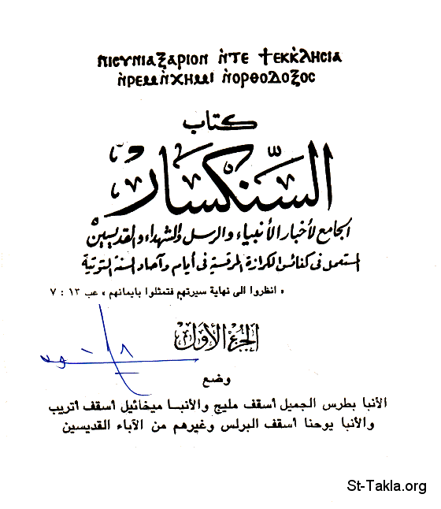

# السنكسار

**المؤلف / Author:** Synaxarium Or Synaxarion
**المصدر / Source:** [st-takla.org](https://st-takla.org/Full-Free-Coptic-Books/Synaxarium-or-Synaxarion/Synexarium-or-Synexarion-index.html)
**الموضوعات / Topics:** —

📘 **[Download EPUB / تحميل الكتاب](synexarium-or-synexarion-index.epub)**

## نبذة

السنكسار cuna[arion هو كتاب يحوي سير الآباء القديسين و الشهداء (السنكسارات)، وتذكارات الأعياد، وأيام الصوم، مرتبة حسب أيام السنة، ويُقرأ منه في الصلوات اليومية.. وهو يستخدم التقويم القبطي والشهور القبطية (ثلاثة عشر شهرًا)، وكل شهر فيها 30 يوم، والشهر الأخير المكمل هو شهر نسيء يُطلق عليه الشهر الصغير. والتقويم القبطي هو تقويم نجمي يتبع دورة نجم الشعري اليمانية. اضغط هنا للسنة القبطية الحالية التي تبدأ من يوم 12 سبتمبر.

## الفصول / Chapters (13)

1. [توت](chapters/01-El-Seneksar-or-Sanaksar-01-Tout/)
2. [بابة (شهر بابه: شهر قبطي 2) - فهرس الأعياد القبطية - كتاب سنكسار الكنيسة القبطية الأرثوذكسية](chapters/02-El-Seneksar-or-Sanaksar-02-Baba/)
3. [هاتور (شهر هاتور: شهر قبطي 3) - فهرس الأعياد القبطية - كتاب سنكسار الكنيسة القبطية الأرثوذكسية](chapters/03-El-Seneksar-or-Sanaksar-03-Hatour/)
4. [كيهك (شهر كيهك: شهر قبطي 4) - فهرس الأعياد القبطية - كتاب سنكسار الكنيسة القبطية الأرثوذكسية](chapters/04-El-Seneksar-or-Sanaksar-04-Keiahk/)
5. [طوبة (شهر طوبه: شهر قبطي 5) - فهرس الأعياد القبطية - كتاب سنكسار الكنيسة القبطية الأرثوذكسية](chapters/05-El-Seneksar-or-Sanaksar-05-Toba/)
6. [أمشير (شهر امشير: شهر قبطي 6) - فهرس الأعياد القبطية - كتاب سنكسار الكنيسة القبطية الأرثوذكسية](chapters/06-El-Seneksar-or-Sanaksar-06-Amshir/)
7. [برمهات (شهر برمهات: شهر قبطي 7) - فهرس الأعياد القبطية - كتاب سنكسار الكنيسة القبطية الأرثوذكسية](chapters/07-El-Seneksar-or-Sanaksar-07-Bramhat/)
8. [برمودة (شهر برموده: شهر قبطي 8) - فهرس الأعياد القبطية - كتاب سنكسار الكنيسة القبطية الأرثوذكسية](chapters/08-El-Seneksar-or-Sanaksar-08-Bermouda/)
9. [بشنس (شهر بشنس: شهر قبطي 9) - فهرس الأعياد القبطية - كتاب سنكسار الكنيسة القبطية الأرثوذكسية](chapters/09-El-Seneksar-or-Sanaksar-09-Bachans/)
10. [بؤونة (شهر بؤونه: شهر قبطي 10) - فهرس الأعياد القبطية - كتاب سنكسار الكنيسة القبطية الأرثوذكسية](chapters/10-El-Seneksar-or-Sanaksar-10-Baounah/)
11. [أبيب (شهر ابيب: شهر قبطي 11) - فهرس الأعياد القبطية - كتاب سنكسار الكنيسة القبطية الأرثوذكسية](chapters/11-El-Seneksar-or-Sanaksar-11-Abib/)
12. [مسرى (شهر مسري: شهر قبطي 12) - فهرس الأعياد القبطية - كتاب سنكسار الكنيسة القبطية الأرثوذكسية](chapters/12-El-Seneksar-or-Sanaksar-12-Mesra/)
13. [نسيء (شهر النسيء: شهر قبطي 13) - فهرس الأعياد القبطية - كتاب سنكسار الكنيسة القبطية الأرثوذكسية](chapters/13-El-Seneksar-or-Sanaksar-13-Nasiea/)

---
*هذا الكتاب مجاني للنشر والتوزيع لخلاص كل نفس. This book is free to share and distribute for the salvation of every soul.*
