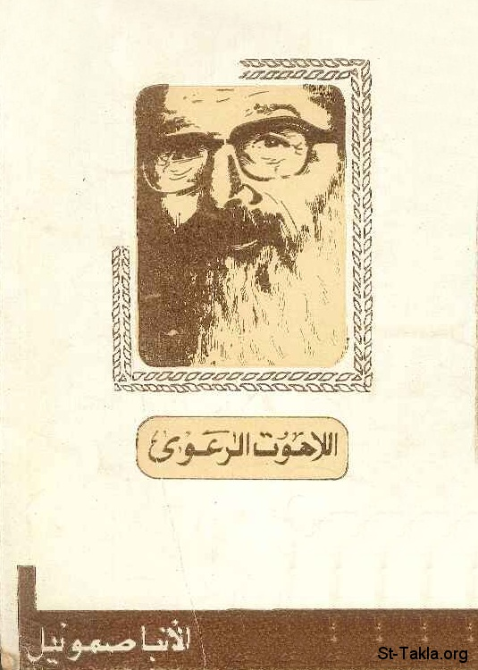

# مذكرات في علم اللاهوت الرعوي

**المؤلف / Author:** الأنبا صموئيل
**المصدر / Source:** [st-takla.org](https://st-takla.org/Full-Free-Coptic-Books/FreeCopticBooks-014-Various-Authors/006-3elm-El-Lahoot-El-Ra3awy/Pastoral-Theology-00-index.html)
**الموضوعات / Topics:** —

📘 **[Download EPUB / تحميل الكتاب](3elm-el-lahoot-el-ra3awy.epub)**

## نبذة

نود أن نشكر مجموعة أصدقاء موقع الأنبا تكلا الذين قاموا بنسخ هذا الكتاب على الكمبيوتر typing ، وذلك من خلال ركن الخدمة على الإنترنت ، وهو للمتنيح الأنبا صموئيل أسقف الخدمات العامة والاجتماعية .

## الفصول / Chapters (37)

1. [مقدمة في علم اللاهوت الرعوي - كتاب مذكرات في اللاهوت الرعوي](chapters/01-Pastoral-Theology-01-Intro/)
2. [البيت القبطي - كتاب مذكرات في اللاهوت الرعوي](chapters/02-Pastoral-Theology-02-House/)
3. [الارتباط بالله والكنيسة - كتاب مذكرات في اللاهوت الرعوي](chapters/03-Pastoral-Theology-03-God/)
4. [المجتمع المتطور](chapters/04-Pastoral-Theology-04-Society/)
5. [كيف نتفادى بعض أسباب الشقاق العائلي - كتاب مذكرات في اللاهوت الرعوي](chapters/05-Pastoral-Theology-05-Avoid/)
6. [أهمية العناية بالأطفال وخدمات الكنيسة لهم - كتاب مذكرات في اللاهوت الرعوي](chapters/06-Pastoral-Theology-06-Children/)
7. [مسئوليات الكنيسة نحو الأطفال - كتاب مذكرات في اللاهوت الرعوي](chapters/07-Pastoral-Theology-07-Church/)
8. [واجبات الكنيسة نحو الأطفال](chapters/08-Pastoral-Theology-08-Sunday-School/)
9. [العناية بالأطفال في الظروف الغير عادية - كتاب مذكرات في اللاهوت الرعوي](chapters/09-Pastoral-Theology-09-Orphans/)
10. [مسئولية الكنيسة نحو الشباب](chapters/10-Pastoral-Theology-10-Youth/)
11. [النواحي الاجتماعية في حياة الشباب - كتاب مذكرات في اللاهوت الرعوي](chapters/11-Pastoral-Theology-11-Social/)
12. [دراسة المشكلات التي تجابه الشباب في المجتمع المعاصر - كتاب مذكرات في اللاهوت الرعوي](chapters/12-Pastoral-Theology-12-Study/)
13. [واجب الكنيسة نحو الشباب - كتاب مذكرات في اللاهوت الرعوي](chapters/13-Pastoral-Theology-13-Duty/)
14. [وسائل خدمة الشباب في الكنيسة - كتاب مذكرات في اللاهوت الرعوي](chapters/14-Pastoral-Theology-14-Service/)
15. [خدمة الكبار - كتاب مذكرات في اللاهوت الرعوي](chapters/15-Pastoral-Theology-15-Adults/)
16. [مجموعات عمل أو لجان خاصة لكبار السن - كتاب مذكرات في اللاهوت الرعوي](chapters/16-Pastoral-Theology-16-Groups/)
17. [مسئوليات الكنيسة نحو الكبار - كتاب مذكرات في اللاهوت الرعوي](chapters/17-Pastoral-Theology-17-Duties/)
18. [احتياجات كبار السن - كتاب مذكرات في اللاهوت الرعوي](chapters/18-Pastoral-Theology-18-Needs/)
19. [استمرار التربية الدينية والنمو الروحي وتكامل الشخصية للكبار - كتاب مذكرات في اللاهوت الرعوي](chapters/19-Pastoral-Theology-19-Continue/)
20. [مبادئ تساعد على تقوية الشخصية وتأثير التربية الدينية فيها - كتاب مذكرات في اللاهوت الرعوي](chapters/20-Pastoral-Theology-20-Principles/)
21. [فوائد الدراسة وسط جماعة - كتاب مذكرات في اللاهوت الرعوي](chapters/21-Pastoral-Theology-21-Use/)
22. [مَنْ هم الكبار؟ - كتاب مذكرات في اللاهوت الرعوي](chapters/22-Pastoral-Theology-22-Age/)
23. [سن تحمل المسئولية الأخلاقية - كتاب مذكرات في اللاهوت الرعوي](chapters/23-Pastoral-Theology-23-Who/)
24. [هل الكبار قابلون للتكيف والتطور؟ - كتاب مذكرات في اللاهوت الرعوي](chapters/24-Pastoral-Theology-24-Development/)
25. [كيف يتعلم الكبار؟ - كتاب مذكرات في اللاهوت الرعوي](chapters/25-Pastoral-Theology-25-How/)
26. [تعريف التعلم](chapters/26-Pastoral-Theology-26-Learn/)
27. [قوانين التعلم - كتاب مذكرات في اللاهوت الرعوي](chapters/27-Pastoral-Theology-27-Laws/)
28. [أهمية العواطف في التعلم - كتاب مذكرات في اللاهوت الرعوي](chapters/28-Pastoral-Theology-28-Importance/)
29. [أهمية العادات في التعلم - كتاب مذكرات في اللاهوت الرعوي](chapters/29-Pastoral-Theology-29-Habits/)
30. [بعض قواعد الصحة العقلية - كتاب مذكرات في اللاهوت الرعوي](chapters/30-Pastoral-Theology-30-Rules/)
31. [المسنون في الكنيسة - كتاب مذكرات في اللاهوت الرعوي](chapters/31-Pastoral-Theology-31-Elders/)
32. [خصائص المسنين - كتاب مذكرات في اللاهوت الرعوي](chapters/32-Pastoral-Theology-32-Characteristics/)
33. [الاحتياجات الروحية للمسنين، وكيف تقابلها الكنيسة - كتاب مذكرات في اللاهوت الرعوي](chapters/33-Pastoral-Theology-33-Spiritual/)
34. [وسائل الكنيسة للعناية بالقادرون على الحركة من المسنين - كتاب مذكرات في اللاهوت الرعوي](chapters/34-Pastoral-Theology-34-Move/)
35. [عناية الكنيسة بالمسنين المُقعدون في بيوتهم - كتاب مذكرات في اللاهوت الرعوي](chapters/35-Pastoral-Theology-35-Stay/)
36. [بيوت المسنين - كتاب مذكرات في اللاهوت الرعوي](chapters/36-Pastoral-Theology-36-Houses/)
37. [الإعداد السابق لاستقبال أيام الشيخوخة - كتاب مذكرات في اللاهوت الرعوي](chapters/37-Pastoral-Theology-37-Preparation/)

---
*هذا الكتاب مجاني للنشر والتوزيع لخلاص كل نفس. This book is free to share and distribute for the salvation of every soul.*
