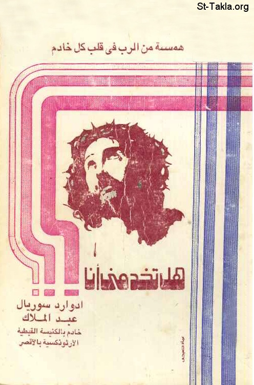

# هل تخدمني أنا؟!

**المؤلف / Author:** إدوارد سوريال عبد الملاك
**المصدر / Source:** [st-takla.org](https://st-takla.org/Full-Free-Coptic-Books/FreeCopticBooks-014-Various-Authors/002-Hal-Takhdemny-Ana/Do-You-Serve-Me-00-index.html)
**الموضوعات / Topics:** —

📘 **[Download EPUB / تحميل الكتاب](hal-takhdemny-ana.epub)**

## نبذة

نود أن نشكر مجموعة أصدقاء موقع الأنبا تكلا الذين قاموا بنسخ هذا الكتاب على الكمبيوتر typing ، وذلك من خلال ركن الخدمة على الإنترنت .

## الفصول / Chapters (66)

1. [مقدمة الأنبا أمونيوس - كتاب هل تخدمني أنا؟](chapters/01-Do-You-Serve-Me-01-Preface/)
2. [هل تخدمني أنا؟](chapters/02-Do-You-Serve-Me-02-Intro/)
3. [عبادات مختلفة في الخدمة - كتاب هل تخدمني أنا؟](chapters/03-Do-You-Serve-Me-03-Idols/)
4. [عبادة الذات في الخدمة - كتاب هل تخدمني أنا؟](chapters/04-Do-You-Serve-Me-04-Ego/)
5. [الأنا في الخدمة - كتاب هل تخدمني أنا؟](chapters/05-Do-You-Serve-Me-05-Ana/)
6. [استبداد القيادة بالرأي في الخدمة - كتاب هل تخدمني أنا؟](chapters/06-Do-You-Serve-Me-06-Opinion/)
7. [سيطرة العلم والمعرفة العالمية في الخدمة - كتاب هل تخدمني أنا؟](chapters/07-Do-You-Serve-Me-07-Knowledge/)
8. [عدم خلق صفوف أخرى في الخدمة - كتاب هل تخدمني أنا؟](chapters/08-Do-You-Serve-Me-08-Other/)
9. [عبادة الناس في الخدمة - كتاب هل تخدمني أنا؟](chapters/09-Do-You-Serve-Me-09-People/)
10. [سعادة الخادم في مدح الآخرين له - كتاب هل تخدمني أنا؟](chapters/10-Do-You-Serve-Me-10-Praise/)
11. [الاهتمام بخدمة العدد الكثير دون القليل - كتاب هل تخدمني أنا؟](chapters/11-Do-You-Serve-Me-11-Number/)
12. [الالتصاق الكثير بالقادة والمسئولين في الخدمة - كتاب هل تخدمني أنا؟](chapters/12-Do-You-Serve-Me-12-Leader/)
13. [التبعية للأشخاص في الخدمة - كتاب هل تخدمني أنا؟](chapters/13-Do-You-Serve-Me-13-Follow/)
14. [التبعية للأماكن في الخدمة - كتاب هل تخدمني أنا؟](chapters/14-Do-You-Serve-Me-14-Places/)
15. [المظهرية في الخدمة - كتاب هل تخدمني أنا؟](chapters/15-Do-You-Serve-Me-15-Appearances/)
16. [الرياء مع القيادات في الخدمة - كتاب هل تخدمني أنا؟](chapters/16-Do-You-Serve-Me-16-Hypocrisy/)
17. [عبادة الحرف في الخدمة - كتاب هل تخدمني أنا؟](chapters/17-Do-You-Serve-Me-17-Letter/)
18. [شكلية الخدمة - كتاب هل تخدمني أنا؟](chapters/18-Do-You-Serve-Me-18-Formal/)
19. [روتين الخدمة - كتاب هل تخدمني أنا؟](chapters/19-Do-You-Serve-Me-19-Routine/)
20. [التسلسل الإداري العقيم في الخدمة - كتاب هل تخدمني أنا؟](chapters/20-Do-You-Serve-Me-20-Pyramid/)
21. [المركزية في التنفيذ في الخدمة - كتاب هل تخدمني أنا؟](chapters/21-Do-You-Serve-Me-21-Centralism/)
22. [كثرة الاجتماعات والأفكار النظرية في الخدمة - كتاب هل تخدمني أنا؟](chapters/22-Do-You-Serve-Me-22-Meetings/)
23. [عبادة المادة في الخدمة - كتاب هل تخدمني أنا؟](chapters/23-Do-You-Serve-Me-23-Things/)
24. [الخدمة النفعية - كتاب هل تخدمني أنا؟](chapters/24-Do-You-Serve-Me-24-Use/)
25. [الخدمة الوظيفية - كتاب هل تخدمني أنا؟](chapters/25-Do-You-Serve-Me-25-Jobs/)
26. [الخدمة المقلدة وغير الطموحة - كتاب هل تخدمني أنا؟](chapters/26-Do-You-Serve-Me-26-Copied/)
27. [الخدمة غير الهادفة - كتاب هل تخدمني أنا؟](chapters/27-Do-You-Serve-Me-27-No-Aim/)
28. [الخدمة المتصارعة - كتاب هل تخدمني أنا؟](chapters/28-Do-You-Serve-Me-28-Conflicts/)
29. [الخدمة المادية - كتاب هل تخدمني أنا؟](chapters/29-Do-You-Serve-Me-29-Materially/)
30. [الخدمة وخلاص نفس الخادِم - كتاب هل تخدمني أنا؟](chapters/30-Do-You-Serve-Me-30-Soul/)
31. [اعرف نفسك - كتاب هل تخدمني أنا؟](chapters/31-Do-You-Serve-Me-31-Know-Thyself/)
32. [الحب من دوافع الخدمة - كتاب هل تخدمني أنا؟](chapters/32-Do-You-Serve-Me-32-Love/)
33. [الإحساس باحتياج الخدمة - كتاب هل تخدمني أنا؟](chapters/33-Do-You-Serve-Me-33-Need/)
34. [إحساس الغيرة لعمل الرب - كتاب هل تخدمني أنا؟](chapters/34-Do-You-Serve-Me-34-Zeal/)
35. [دوافع الخدمة المتطوعة - كتاب هل تخدمني أنا؟](chapters/35-Do-You-Serve-Me-35-Volunteer/)
36. [استغلال وقت الفراغ - كتاب هل تخدمني أنا؟](chapters/36-Do-You-Serve-Me-36-Leisure-Time/)
37. [الاستفادة وزيادة المعرفة - كتاب هل تخدمني أنا؟](chapters/37-Do-You-Serve-Me-37-Utilization/)
38. [المتاجرة بالوزنة في الخدمة - كتاب هل تخدمني أنا؟](chapters/38-Do-You-Serve-Me-38-Trade/)
39. [الخدمة كمساعد في حياة التوبة - كتاب هل تخدمني أنا؟](chapters/39-Do-You-Serve-Me-39-Repentance/)
40. [دوافع الخدمة المكرسة - كتاب هل تخدمني أنا؟](chapters/40-Do-You-Serve-Me-40-Consecrated/)
41. [الاستفادة من التفرغ للعمل - كتاب هل تخدمني أنا؟](chapters/41-Do-You-Serve-Me-41-Using/)
42. [التركيز في العمل الفردي - كتاب هل تخدمني أنا؟](chapters/42-Do-You-Serve-Me-42-OneSoul/)
43. [التطلع إلى أهداف أكبر - كتاب هل تخدمني أنا؟](chapters/43-Do-You-Serve-Me-43-Aim-High/)
44. [السعي لأجل سلامة التخطيط - كتاب هل تخدمني أنا؟](chapters/44-Do-You-Serve-Me-44-Planning/)
45. [تحقيق دقة المتابعة للعمل - كتاب هل تخدمني أنا؟](chapters/45-Do-You-Serve-Me-45-Follow-up/)
46. [كن قدوة حسنة، ومثلًا أعلى - كتاب هل تخدمني أنا؟](chapters/46-Do-You-Serve-Me-46-Example/)
47. [مؤشرات القدوة الحسنة في الخادم - كتاب هل تخدمني أنا؟](chapters/47-Do-You-Serve-Me-47-Indicator/)
48. [الإيمان العامل - كتاب هل تخدمني أنا؟](chapters/48-Do-You-Serve-Me-48-Faith/)
49. [حياة التدقيق - كتاب هل تخدمني أنا؟](chapters/49-Do-You-Serve-Me-49-Exactitude/)
50. [الشهادة للسيد المسيح - كتاب هل تخدمني أنا؟](chapters/50-Do-You-Serve-Me-50-Jesus/)
51. [احذر أن تفقد الأبدية - كتاب هل تخدمني أنا؟](chapters/51-Do-You-Serve-Me-51-Eternity/)
52. [الفتور والجفاف الروحي في الخدمة - كتاب هل تخدمني أنا؟](chapters/52-Do-You-Serve-Me-52-Lukewarmness/)
53. [تسلط فكر البر الذاتي - كتاب هل تخدمني أنا؟](chapters/53-Do-You-Serve-Me-53-Righteousness/)
54. [الانشغال بخدمة الغير عن خدمة النفس - كتاب هل تخدمني أنا؟](chapters/54-Do-You-Serve-Me-54-Busy/)
55. [نصائح للخادم الذي تشغله الخدمة عن حياته الروحية - كتاب هل تخدمني أنا؟](chapters/55-Do-You-Serve-Me-55-Tips/)
56. [حياة الخلوة - كتاب هل تخدمني أنا؟](chapters/56-Do-You-Serve-Me-56-Retreat/)
57. [مداومة الإرشاد الروحي من أب الاعتراف - كتاب هل تخدمني أنا؟](chapters/57-Do-You-Serve-Me-57-Confession/)
58. [الخدمة وتمجيد اسم الله - كتاب هل تخدمني أنا؟](chapters/58-Do-You-Serve-Me-58-Glory-to-God/)
59. [الخدمة هي كَرْم الرب - كتاب هل تخدمني أنا؟](chapters/59-Do-You-Serve-Me-59-Grapevine/)
60. [حياة الاختفاء وإنكار الذات في الخدمة - كتاب هل تخدمني أنا؟](chapters/60-Do-You-Serve-Me-60-Hiding/)
61. [تداريب حياة إنكار الذات والاختفاء في الخدمة - كتاب هل تخدمني أنا؟](chapters/61-Do-You-Serve-Me-61-Exercise/)
62. [العمل بصمت - كتاب هل تخدمني أنا؟](chapters/62-Do-You-Serve-Me-62-Silence/)
63. [إظهار فضل الآخرين في العمل - كتاب هل تخدمني أنا؟](chapters/63-Do-You-Serve-Me-63-Help/)
64. [النظر إلى الخدمات الناجحة الأخرى كمثل أعلى للعمل - كتاب هل تخدمني أنا؟](chapters/64-Do-You-Serve-Me-64-Looking-to-Others/)
65. [نسبة كل عمل إلى معونة السيد المسيح - كتاب هل تخدمني أنا؟](chapters/65-Do-You-Serve-Me-65-Christ/)
66. [دعوة السيد المسيح لك: اخدمني أنا.. - كتاب هل تخدمني أنا؟](chapters/66-Do-You-Serve-Me-66-Serve-Me/)

---
*هذا الكتاب مجاني للنشر والتوزيع لخلاص كل نفس. This book is free to share and distribute for the salvation of every soul.*
