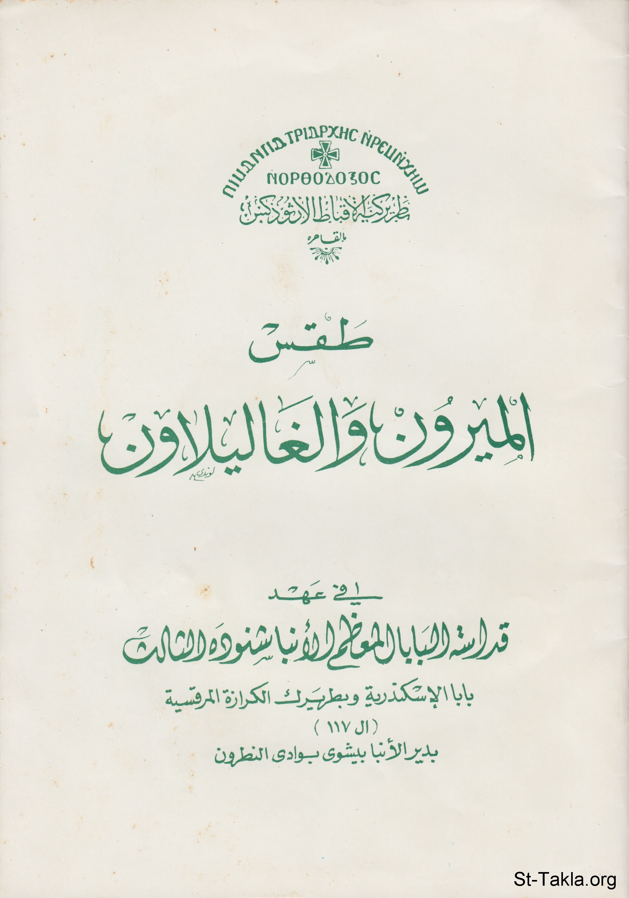

# عمل زيت الميرون والغاليلاون

**المؤلف / Author:** بطريركية الأقباط الأرثوذكس
**المصدر / Source:** [st-takla.org](https://st-takla.org/books/various/chrism/index.html)
**الموضوعات / Topics:** —

📘 **[Download EPUB / تحميل الكتاب](chrism.epub)**

## نبذة

عنوان الكتاب الأصلي هو "طقس الميرون والغاليلاون - في عهد قداسة البابا المعظم الأنبا شنوده الثالث، بابا الإسكندرية وبطريرك الكرازة المرقسية (ال 117) بدير الأنبا بيشوي بوادي النطرون". وهو في الأغلب من إصدار الدير نفسه في إبريل 2005 تقريبًا. وفي الأغلب كذلك أن البابا شنوده الثالث هو الذي كتب مقدمة الكتاب (وهي صفحات أرقام 1-6 في الموقع، أو 3-8 في الكتاب نفسه). ووضعنا هنا في موقع الأنبا تكلاهيمانوت بعض الإضافات من مرجع آخر على بعض الصفحات لتكتمل الفائِدة، وكذلك قُمنا بِفَصْل صلوات "طقس الميرون والغاليلاون" في قسم الصلوات الطقسية المكتوبة بالموقع. كذلك نقوم تِباعًا بإضافة مقالات أخرى متعلقة بالموضوع

## الفصول / Chapters (28)

1. [مواد الميرون](chapters/01-components/)
2. [تاريخ الميرون](chapters/02-history/)
3. [استخدام المسحة المقدسة](chapters/03-use/)
4. [مسحة السيد المسيح](chapters/04-christ/)
5. [الروح القدس والمسحة](chapters/05-holy-spirit/)
6. [عمل الروح القدس بالمسحة](chapters/06-work/)
7. [أصل الميرون وموجز تاريخه](chapters/07-origin/)
8. [الزيوت المستخدمة في طقس المعمودية](chapters/08-oils/)
9. [كيف يُمْسَح المؤمن بزيت الميرون؟](chapters/09-unction/)
10. [قائمة مرات عمل الميرون وتقديسه في عهود بابوات الكنيسة القبطية الأرثوذكسية](chapters/10-times/)
11. [طريقة عمل الميرون المقدس](chapters/11-making/)
12. [مكونات الميرون بالجرام لكل 180 كجم زيت زيتون](chapters/12-ingredients/)
13. [معلومات عن بعض المواد المستخدمة في عمل الميرون](chapters/13-info/)
14. [عرق الطيب](chapters/14-lilium-elegans/)
15. [دار شيشعان](chapters/15-spiny-broom/)
16. [تين الفيل](chapters/16-black-amomum/)
17. [اللافندر](chapters/17-lavender/)
18. [قسط هندي](chapters/18-horse-chestnut/)
19. [مفردات الميرون وطبخه](chapters/19-cooking/)
20. [الطبخة الأولى لزيت الميرون](chapters/20-cook1/)
21. [الطبخة الثانية لزيت الميرون](chapters/21-cook2/)
22. [الطبخة الثالثة لزيت الميرون](chapters/22-cook3/)
23. [الطبخة الرابعة لزيت الميرون](chapters/23-cook4/)
24. [الدرور](chapters/24-drour/)
25. [طبخ الغاليلاون](chapters/25-hgalilawn/)
26. [قراءات وألحان الإعداد والطبخ للميرون والغاليلاون](chapters/26-readings/)
27. [بعض أقوال الآباء عن الميرون المقدس](chapters/27-quotes/)
28. [المراجع](chapters/28-references/)

---
*هذا الكتاب مجاني للنشر والتوزيع لخلاص كل نفس. This book is free to share and distribute for the salvation of every soul.*
