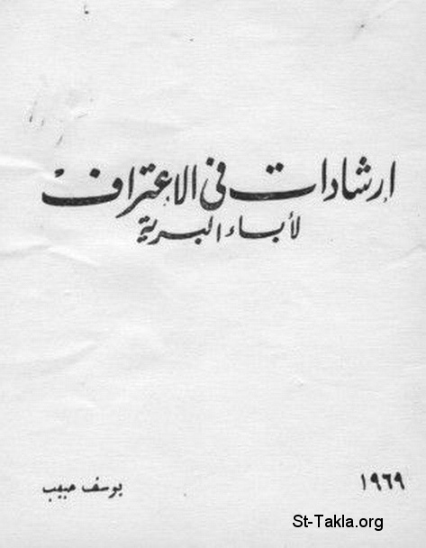

# إرشادات في الاعتراف، لآباء البرية

**المؤلف / Author:** يوسف حبيب
**المصدر / Source:** [st-takla.org](https://st-takla.org/books/youssef-habib/confession/index.html)
**الموضوعات / Topics:** —

📘 **[Download EPUB / تحميل الكتاب](confession.epub)**

## نبذة

نشكر أ. مليكة حبيب يوسف (شقيق أ. يوسف حبيب ) الذي سمح لنا في موقع الأنبا تكلا بوضع هذا الكتاب هنا.

## الفصول / Chapters (6)

1. [مقدمة الطبعة الأولى](chapters/01-intro/)
2. [الوصايا لا يمكن حفظها إلا بالتلمذة لمعلم مرشد](chapters/02-commandments/)
3. [الاعتراف هو الاتضاع](chapters/03-humble/)
4. [الاعتراف يخلص من العادات الشريرة](chapters/04-habits/)
5. [الاعتراف يفضح حيل الشيطان فيهرب](chapters/05-devil/)
6. [الفصل الخامس: الاعتراف يخلص من الحزن](chapters/06-sadness/)

---
*هذا الكتاب مجاني للنشر والتوزيع لخلاص كل نفس. This book is free to share and distribute for the salvation of every soul.*
