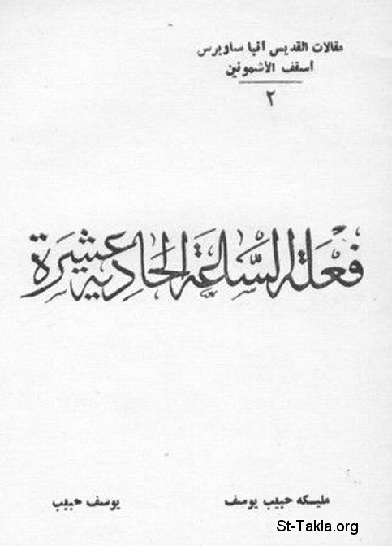

# فعلة الساعة الحادية عشرة (من سلسلة مقالات الأنبا ساويرس أسقف الأشمونين 2)

**المؤلف / Author:** مليكة حبيب يوسف، يوسف حبيب
**المصدر / Source:** [st-takla.org](https://st-takla.org/Full-Free-Coptic-Books/FreeCopticBooks-022-Yousef-Habeeb/006-Faalat-Al-Sa3a-11/Eleventh-Hour-Laborers-00-index.html)
**الموضوعات / Topics:** —

📘 **[Download EPUB / تحميل الكتاب](faalat-al-sa3a-11.epub)**

## نبذة

نشكر أ. مليكة حبيب يوسف (شقيق أ. يوسف حبيب ) الذي سمح لنا في موقع الأنبا تكلا بوضع هذا الكتاب هنا، وهو أحد سلسلة كتب مقالات القديس الأنبا ساويرس أسقف الأشمونين (رقم 2). كما نشكر مجموعة أصدقاء موقع الأنبا تكلا الذين قاموا بنسخ هذا الكتاب على الكمبيوتر typing ، وذلك من خلال ركن الخدمة على الإنترنت (1) .

## الفصول / Chapters (9)

1. [مقدمة - كتاب فعلة الساعة الحادية عشرة](chapters/01-Eleventh-Hour-Laborers-01-Intro/)
2. [عزاء المؤمنين وصبرهم على الأحزان - كتاب فعلة الساعة الحادية عشرة](chapters/02-Eleventh-Hour-Laborers-02-Consolation/)
3. [ناموس الله في الدنيا - كتاب فعلة الساعة الحادية عشرة](chapters/03-Eleventh-Hour-Laborers-03-Nomos/)
4. [تعب آدم ونوح وابراهيم وموسى في الجحيم - كتاب فعلة الساعة الحادية عشرة](chapters/04-Eleventh-Hour-Laborers-04-Hard/)
5. [نظر المسيح والشركة معه - كتاب فعلة الساعة الحادية عشرة](chapters/05-Eleventh-Hour-Laborers-05-Jesus/)
6. [نير المسيح - كتاب فعلة الساعة الحادية عشرة](chapters/06-Eleventh-Hour-Laborers-06-Yoke/)
7. [متاعب المؤمنين والصبر عليها - كتاب فعلة الساعة الحادية عشرة](chapters/07-Eleventh-Hour-Laborers-07-Faithfuls/)
8. [ضرورة احتمال الضيقات لننال النعيم - كتاب فعلة الساعة الحادية عشرة](chapters/08-Eleventh-Hour-Laborers-08-Bear/)
9. [الله يترك بغير عقاب في الدنيا لعقاب أبدي](chapters/09-Eleventh-Hour-Laborers-09-Leazar/)

---
*هذا الكتاب مجاني للنشر والتوزيع لخلاص كل نفس. This book is free to share and distribute for the salvation of every soul.*
