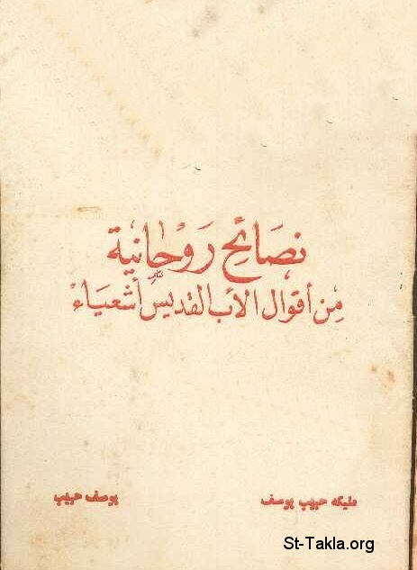

# نصائح روحية من أقوال الأب القديس أشعياء

**المؤلف / Author:** مليكة حبيب يوسف، يوسف حبيب
**المصدر / Source:** [st-takla.org](https://st-takla.org/Full-Free-Coptic-Books/FreeCopticBooks-022-Yousef-Habeeb/005-Nasaeh-Rouheya/Spiritual-Advice-00-index.html)
**الموضوعات / Topics:** —

📘 **[Download EPUB / تحميل الكتاب](nasaeh-rouheya.epub)**

## نبذة

نشكر أ. مليكة حبيب يوسف (شقيق أ. يوسف حبيب ) الذي سمح لنا في موقع الأنبا تكلا بوضع هذا الكتاب هنا. كما نشكر مجموعة أصدقاء موقع الأنبا تكلا الذين قاموا بنسخ هذا الكتاب على الكمبيوتر typing ، وذلك من خلال ركن الخدمة على الإنترنت .

## الفصول / Chapters (8)

1. [مقدمة](chapters/01-Spiritual-Advice-01-Intro/)
2. [الجزء الأول من النصائح](chapters/02-Spiritual-Advice-02/)
3. [الجزء الثاني من النصائح](chapters/03-Spiritual-Advice-03/)
4. [نصائح متنوعة 3](chapters/04-Spiritual-Advice-04/)
5. [النصائح 4](chapters/05-Spiritual-Advice-05/)
6. [أقوال الأنبا إشعياء 5](chapters/06-Spiritual-Advice-06/)
7. [أقوال الأنبا إشعياء 6](chapters/07-Spiritual-Advice-07/)
8. [أقوال الأنبا إشعياء 7](chapters/08-Spiritual-Advice-08/)

---
*هذا الكتاب مجاني للنشر والتوزيع لخلاص كل نفس. This book is free to share and distribute for the salvation of every soul.*
