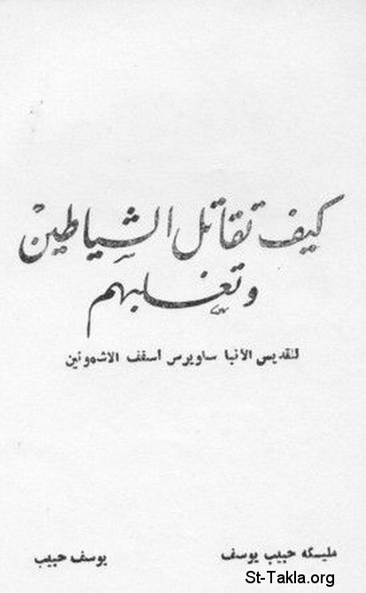

# كيف تقاتل الشياطين وتغلبهم (للقديس الأنبا ساويرس أسقف الأشمونين)

**المؤلف / Author:** مليكة حبيب يوسف، يوسف حبيب
**المصدر / Source:** [st-takla.org](https://st-takla.org/books/youssef-habib/severus-ashmunin-demons/index.html)
**الموضوعات / Topics:** —

📘 **[Download EPUB / تحميل الكتاب](severus-ashmunin-demons.epub)**

## نبذة

نشكر أ. مليكة حبيب يوسف (شقيق أ. يوسف حبيب ) الذي سمح لنا في موقع الأنبا تكلا بوضع هذا الكتاب هنا، وهو أحد سلسلة كتب مقالات القديس الأنبا ساويرس أسقف الأشمونين (رقم 1). كما نشكر مجموعة أصدقاء موقع الأنبا تكلا الذين قاموا بنسخ هذا الكتاب على الكمبيوتر typing ، وذلك من خلال ركن الخدمة على الإنترنت (1) .

## الفصول / Chapters (14)

1. [مقدمة](chapters/01-introduction/)
2. [المسيح يبذل نفسه ويعتق آدم وذريته بالمعمودية](chapters/02-christ/)
3. [خطاب القديس للوزير](chapters/03-address/)
4. [تسبيح الله وتقديسه](chapters/04-praising-god/)
5. [كيف يتصرف المؤمن في أوقاته](chapters/05-conduct-himself/)
6. [في لزوم الصلاة](chapters/06-necessity-of-prayer/)
7. [بركات التسبيح والتقديس](chapters/07-praise/)
8. [الروح القدس يطهر المؤمنين](chapters/08-holy-spirit-purifies/)
9. [الصلاة الربانية في القداس](chapters/09-lords-prayer/)
10. [بركة القداس](chapters/10-divine-liturgy/)
11. [عقوبة الخارجين قبل نهاية القداس](chapters/11-punishment/)
12. [وصايا الأنبا ساويرس للمؤمنين](chapters/12-commandments/)
13. [كيف يثبت الروح القدس في المؤمنين؟كيف يثبت الروح القدس في المؤمنين؟](chapters/13-abide-in-believers/)
14. [الصلوات السبع وكيفية ممارستها](chapters/14-seven-prayers/)

---
*هذا الكتاب مجاني للنشر والتوزيع لخلاص كل نفس. This book is free to share and distribute for the salvation of every soul.*
