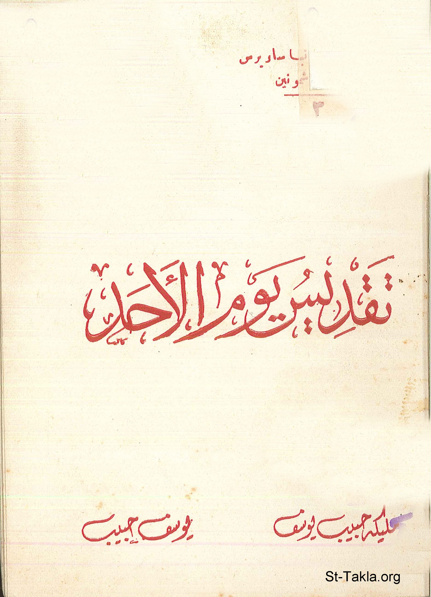

# تقديس يوم الأحد (للقديس الأنبا ساويرس أسقف الأشمونين)

**المؤلف / Author:** مليكة حبيب يوسف، يوسف حبيب
**المصدر / Source:** [st-takla.org](https://st-takla.org/books/youssef-habib/severus-ashmunin-sunday/index.html)
**الموضوعات / Topics:** —

📘 **[Download EPUB / تحميل الكتاب](severus-ashmunin-sunday.epub)**

## نبذة

نشكر أ. مليكة حبيب يوسف (شقيق أ. يوسف حبيب ) الذي سمح لنا في موقع الأنبا تكلا بوضع هذا الكتاب هنا، وهو أحد سلسلة كتب مقالات القديس الأنبا ساويرس أسقف الأشمونين (رقم 3). كما نشكر مجموعة أصدقاء موقع الأنبا تكلا الذين قاموا بنسخ هذا الكتاب على الكمبيوتر typing ، وذلك من خلال ركن الخدمة على الإنترنت (1) .

## الفصول / Chapters (7)

1. [مقدمة](chapters/01-introduction/)
2. [فضل يوم الأحد](chapters/02-sunday/)
3. [ما هو عمل الرب؟](chapters/03-lords-work/)
4. [يوم الرب قديمًا وحديثًا](chapters/04-lords-day/)
5. [التجسد والتأنس](chapters/05-incarnation/)
6. [معني الراحة يوم الأحد](chapters/06-rest/)
7. [العمل على تحرير الناس من الخطية](chapters/07-liberate-people/)

---
*هذا الكتاب مجاني للنشر والتوزيع لخلاص كل نفس. This book is free to share and distribute for the salvation of every soul.*
