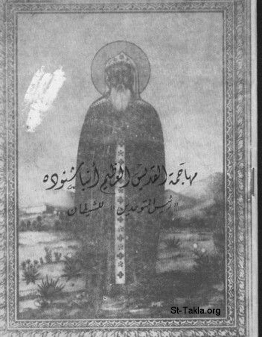

# مهاجمة القديس العظيم أنبا شنوده "رئيس المتوحدين" للشيطان

**المؤلف / Author:** يوسف حبيب
**المصدر / Source:** [st-takla.org](https://st-takla.org/books/youssef-habib/shenouda-vs-satan/index.html)
**الموضوعات / Topics:** —

📘 **[Download EPUB / تحميل الكتاب](shenouda-vs-satan.epub)**

## نبذة

نشكر أ. مليكة حبيب يوسف (شقيق أ. يوسف حبيب ) الذي سمح لنا في موقع الأنبا تكلا بوضع هذا الكتاب هنا. كما نشكر مجموعة أصدقاء موقع الأنبا تكلا الذين قاموا بنسخ هذا الكتاب على الكمبيوتر typing ، وذلك من خلال ركن الخدمة على الإنترنت (1) .

## الفصول / Chapters (5)

1. [الإهداء](chapters/01-dedication/)
2. [التعريف بالقديس أنبا شنودة](chapters/02-hagiography/)
3. [موجز مقدمة الناشر](chapters/03-publisher-s-introduction/)
4. [ترجمة المخطوط](chapters/04-manuscript/)
5. [أرواح الحق وأرواح الضلال](chapters/05-spirits-truth-vs-deceptio/)

---
*هذا الكتاب مجاني للنشر والتوزيع لخلاص كل نفس. This book is free to share and distribute for the salvation of every soul.*
