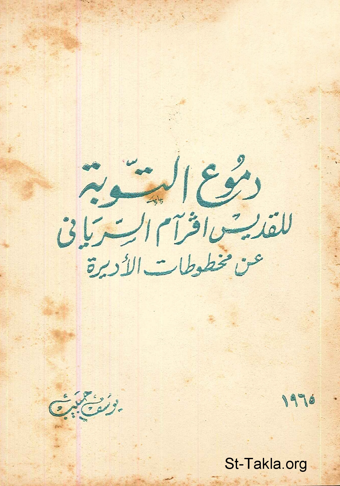

# دموع التوبة، للقديس أفرآم السرياني

**المؤلف / Author:** يوسف حبيب
**المصدر / Source:** [st-takla.org](https://st-takla.org/books/youssef-habib/tears-of-repentance/index.html)
**الموضوعات / Topics:** —

📘 **[Download EPUB / تحميل الكتاب](tears-of-repentance.epub)**

## نبذة

نشكر أ. مليكة حبيب يوسف (شقيق أ. يوسف حبيب ) الذي سمح لنا في موقع الأنبا تكلا بوضع هذا الكتاب هنا. كما نشكر مجموعة أصدقاء موقع الأنبا تكلا الذين قاموا بنسخ هذا الكتاب على الكمبيوتر typing ، وذلك من خلال ركن الخدمة على الإنترنت (1) .

## الفصول / Chapters (9)

1. [القديس مار إفرام السرياني](chapters/01-st-ephrem-the-syrian/)
2. [ميامر التوبة](chapters/02-sayings/)
3. [الميمر الأول: ما هي حياتكم. إنها بخار يظهر قليلًا ثم يضمحل](chapters/03-your-life/)
4. [الميمر الثاني: وإذا امرأة في المدينة كانت خاطئة](chapters/04-sinner-woman/)
5. [صلاة: اشفني يا رب فابرأ](chapters/05-heal-me/)
6. [الميمر الثالث: أميتوا أعضاءكم التي على الأرض](chapters/06-mortify-your-members/)
7. [صلاة: يا نفسي لم تتوانين](chapters/07-do-not-hesitate/)
8. [الميمر الرابع: كن ساهرًا وشدد ما بقي](chapters/08-be-vigilant/)
9. [طرح الفعلة: العجل سمين فلا يخرج أحد جائعًا](chapters/09-fat-calf/)

---
*هذا الكتاب مجاني للنشر والتوزيع لخلاص كل نفس. This book is free to share and distribute for the salvation of every soul.*
