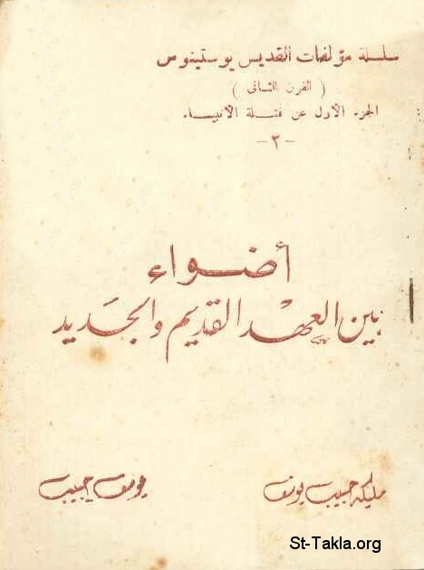

# أضواء بين العهد القديم والجديد، القديس يوستينوس

**المؤلف / Author:** مليكة حبيب يوسف، يوسف حبيب
**المصدر / Source:** [st-takla.org](https://st-takla.org/books/youssef-habib/testaments/index.html)
**الموضوعات / Topics:** —

📘 **[Download EPUB / تحميل الكتاب](testaments.epub)**

## نبذة

نشكر أ. مليكة حبيب يوسف (شقيق أ. يوسف حبيب ) الذي سمح لنا في موقع الأنبا تكلا بوضع هذا الكتاب هنا. كما نشكر مجموعة أصدقاء موقع الأنبا تكلا الذين قاموا بنسخ هذا الكتاب على الكمبيوتر typing ، وذلك من خلال ركن الخدمة على الإنترنت .

## الفصول / Chapters (8)

1. [فرائض العهد القديم - كتاب أضواء بين العهد القديم والجديد](chapters/01-obligations/)
2. [الذبائح - كتاب أضواء بين العهد القديم والجديد](chapters/02-sacrifices/)
3. [الختان - كتاب أضواء بين العهد القديم والجديد](chapters/03-circumcision/)
4. [بر الإيمان - كتاب أضواء بين العهد القديم والجديد](chapters/04-faith/)
5. [الصوم المقبول - كتاب أضواء بين العهد القديم والجديد](chapters/05-fast/)
6. [العهد الجديد - كتاب أضواء بين العهد القديم والجديد](chapters/06-new/)
7. [المعمودية - كتاب أضواء بين العهد القديم والجديد](chapters/07-baptism/)
8. [لذلك مات المسيح - كتاب أضواء بين العهد القديم والجديد](chapters/08-died/)

---
*هذا الكتاب مجاني للنشر والتوزيع لخلاص كل نفس. This book is free to share and distribute for the salvation of every soul.*
