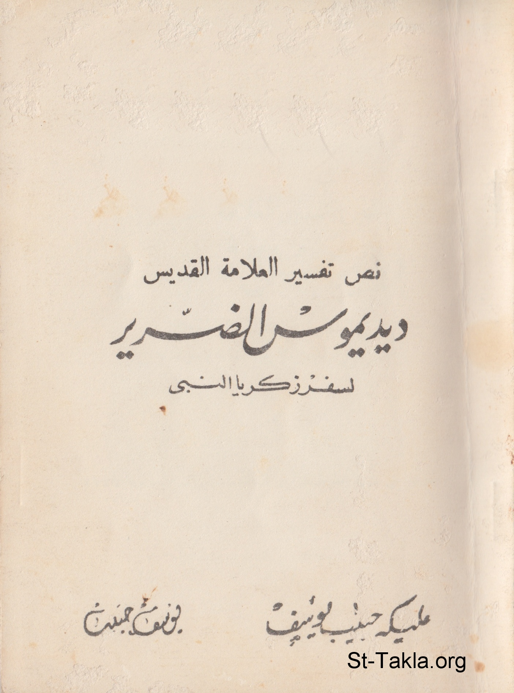

# نص تفسير العلامة القديس ديديموس الضرير لسفر زكريا النبي

**المؤلف / Author:** مليكة حبيب يوسف، يوسف حبيب
**المصدر / Source:** [st-takla.org](https://st-takla.org/books/youssef-habib/zakaria/index.html)
**الموضوعات / Topics:** —

📘 **[Download EPUB / تحميل الكتاب](zakaria.epub)**

## نبذة

نشكر أ. مليكة حبيب يوسف (شقيق أ. يوسف حبيب ) الذي سمح لنا في موقع الأنبا تكلا بوضع هذا الكتاب هنا. كما نشكر مجموعة أصدقاء موقع الأنبا تكلا الذين قاموا بنسخ هذا الكتاب على الكمبيوتر typing ، وذلك من خلال ركن الخدمة على الإنترنت .

## الفصول / Chapters (11)

1. [موجز عن حياة القديس ديديموس](chapters/01-didmous/)
2. [مقدمة](chapters/02-intro/)
3. [ترجمة النصوص، عرض وتحليل](chapters/03-translation/)
4. [مؤلفات القديس ديديموس الضرير](chapters/04-books/)
5. [معنى النور](chapters/05-light/)
6. [الفرح الروحي](chapters/06-joy/)
7. [تفسير الأصحاح الأول من سفر زكريا النبي](chapters/07-ch1/)
8. [تفسير الأصحاح الثاني من سفر زكريا النبي](chapters/08-ch2/)
9. [تفسير الأصحاح الثالث من سفر زكريا النبي](chapters/09-ch3/)
10. [تفسير الأصحاح الرابع من سفر زكريا النبي](chapters/10-ch4/)
11. [تفسير الأصحاح الخامس من سفر زكريا النبي](chapters/11-ch5/)

---
*هذا الكتاب مجاني للنشر والتوزيع لخلاص كل نفس. This book is free to share and distribute for the salvation of every soul.*
